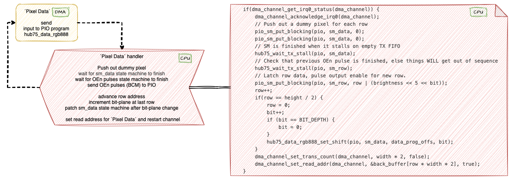
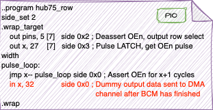
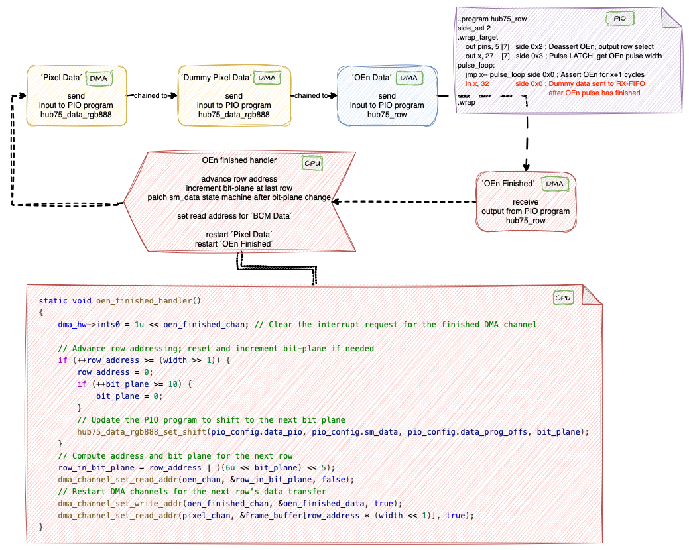
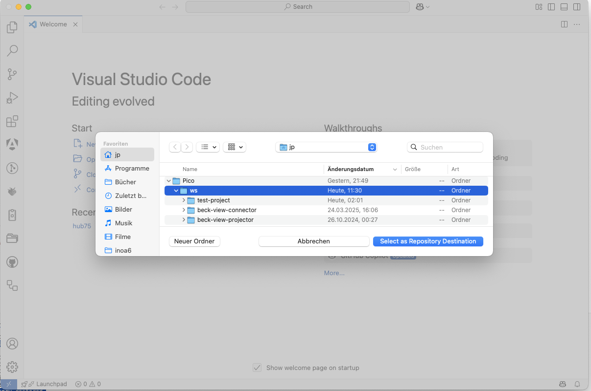
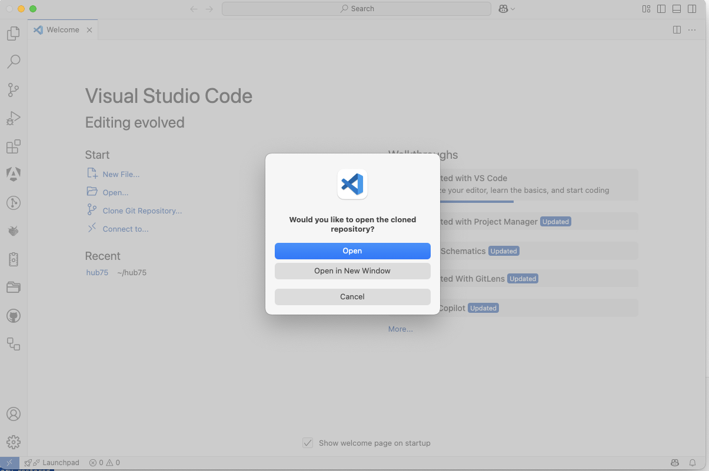
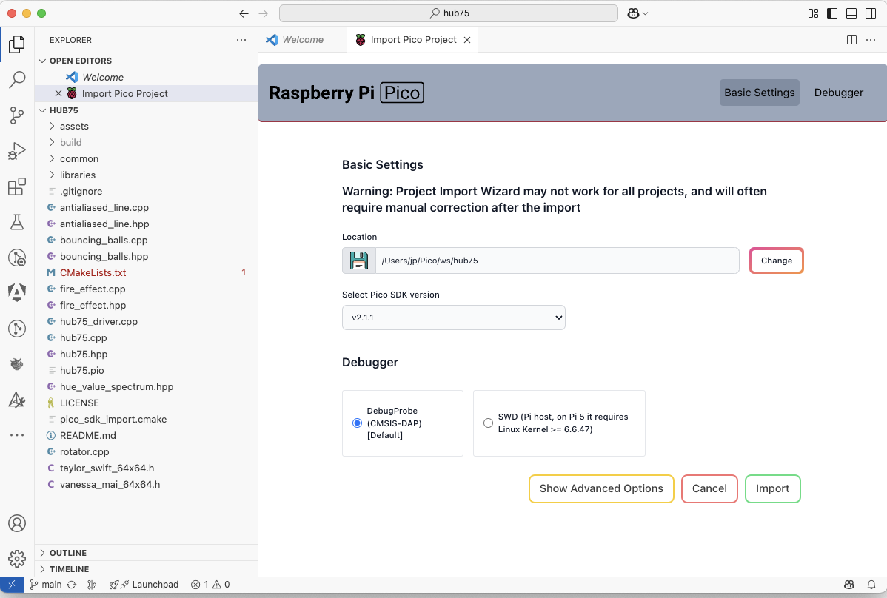
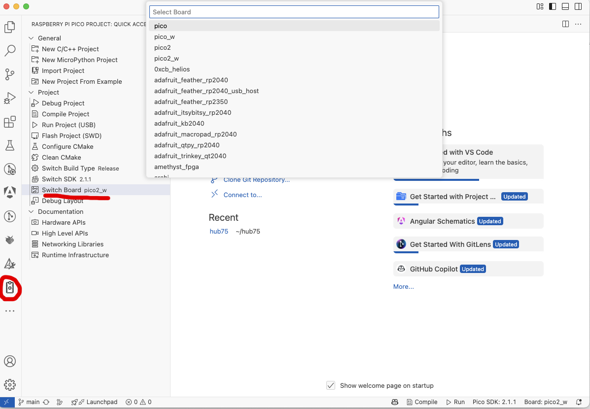
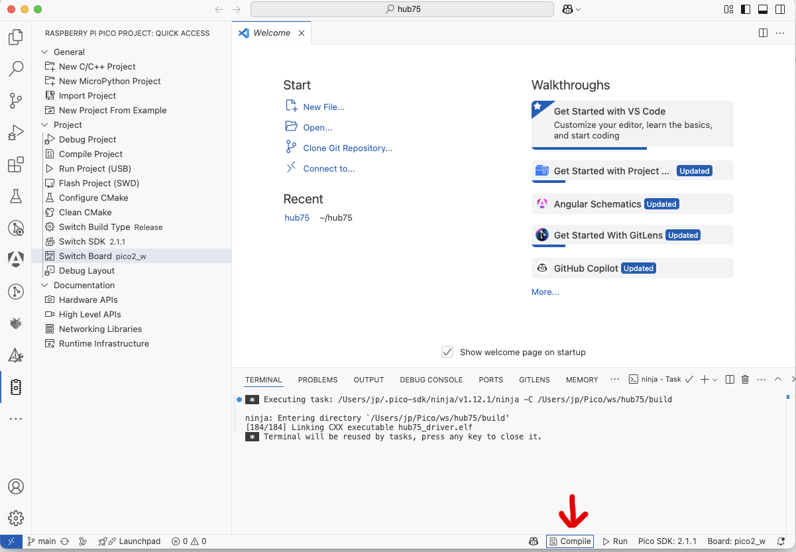
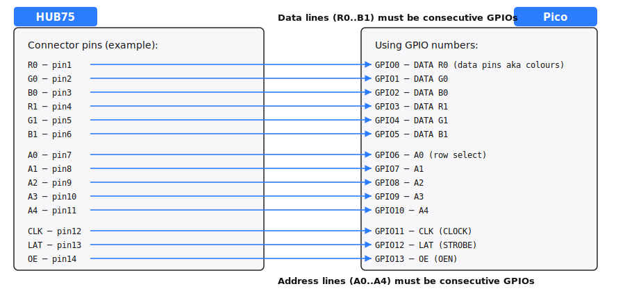

- [HUB75 DMA-Based Driver](#hub75-dma-based-driver)
  - [Documentation and References](#documentation-and-references)
  - [Achievements of the Revised Driver](#achievements-of-the-revised-driver)
  - [Motivation](#motivation)
  - [Evolution of Pico HUB75 Drivers](#evolution-of-pico-hub75-drivers)
    - [Raspberry Pi Pico HUB75 Example](#raspberry-pi-pico-hub75-example)
    - [Pimoroni HUB75 Driver](#pimoroni-hub75-driver)
  - [Eliminating `hub75_wait_tx_stall`](#eliminating-hub75_wait_tx_stall)
    - [Original `hub75_wait_tx_stall` Implementation](#original-hub75_wait_tx_stall-implementation)
    - [Alternative Approach](#alternative-approach)
  - [DMA Chains and PIO State Machines in the Revised HUB75 Driver](#dma-chains-and-pio-state-machines-in-the-revised-hub75-driver)
    - [Overview](#overview)
    - [Step-by-Step Breakdown](#step-by-step-breakdown)
    - [Refresh Rate Performance](#refresh-rate-performance)
    - [Key Benefits of this Approach](#key-benefits-of-this-approach)
  - [Conclusion](#conclusion)
  - [Demo Effects](#demo-effects)
  - [How to Use This Project in VSCode](#how-to-use-this-project-in-vscode)
  - [Next Steps](#next-steps)
- [Prerequisites for the Hub75 Driver](#prerequisites-for-the-hub75-driver)
  - [Wiring Details](#wiring-details)
    - [Color Data Pins](#color-data-pins)
    - [Address (Row Select) Pins](#address-row-select-pins)
    - [Control Pins](#control-pins)
    - [One Glance Mapping HUB75 Connector → Pico GPIOs](#one-glance-mapping-hub75-connector--pico-gpios)
  - [Allowed Deviations  ](#allowed-deviations--)
    - [Example: Custom Pin Mapping](#example-custom-pin-mapping)
  - [Brightness Control](#brightness-control)
    - [API Functions](#api-functions)
    - [How it Works](#how-it-works)
    - [Default Settings](#default-settings)
    - [Practical Notes](#practical-notes)

# HUB75 DMA-Based Driver


https://github.com/user-attachments/assets/7c41193c-c724-4fae-8823-af36d70fcedd

*Demo video: Colours are much brighter and more brilliant in reality*

## Documentation and References

This project is based on:
- [Raspberry Pi's pico-examples/pio/hub75](https://github.com/raspberrypi/pico-examples)
- [Pimoroni's HUB75 driver](https://github.com/pimoroni/pimoroni-pico/tree/main/drivers/hub75)

To understand how RGB matrix panels work, refer to the article **[Everything You Didn't Want to Know About RGB Matrix Panels](https://learn.adafruit.com/adafruit-gfx-graphics-library/what-is-the-gfx-library)**. 
For details on Binary Coded Modulation (BCM), see **[LED Dimming Using Binary Code Modulation](https://www.ti.com/lit/an/slva377a/slva377a.pdf)**.

---
## Achievements of the Revised Driver

The modifications to the Pimoroni HUB75 driver result in the following improvements:

- **Offloading Work**: Moves processing from the CPU to DMA and PIO co-processors.
- **Performance Boost**: Implements self-paced, interlinked DMA and PIO processes.
- **Eliminates Synchronization Delays**: No need for `hub75_wait_tx_stall`, removing blocking synchronization.
- **Optimized Interrupt Handling**: Reduces code complexity in the interrupt handler.

These enhancements lead to significant performance improvements. In tests up to a **250 MHz system clock**, no ghost images were observed.

---
## Motivation

As part of a private project, I sought to gain deeper knowledge of the Raspberry Pi Pico microcontroller. I highly recommend **[Raspberry Pi Pico Lectures 2022 by Hunter Adams](https://youtu.be/CAMTBzPd-WI?feature=shared)**—they provide excellent insights! 

If you are specifically interested in **PIO (Programmable Input/Output)**, start with [Lecture 14: Introducing PIO](https://youtu.be/BVdaw56Ln8s?feature=shared) and [Lecture 15: PIO Overview and Examples](https://youtu.be/wet9CYpKZOQ).

Inspired by Adams' discussion on **[DMA](https://youtu.be/TGjUHChO1kM?feature=shared&t=1475) and PIO co-processors**, I optimized the HUB75 driver as a self-assigned challenge.

😊 **[Raspberry Pi Pico Lectures 2025 by Hunter Adams](https://youtu.be/a4uLrfqHZQU?feature=shared")** is available now!

---
## Evolution of Pico HUB75 Drivers

### Raspberry Pi Pico HUB75 Example

The **Pico HUB75 example** demonstrates connecting an **HUB75 LED matrix panel** using PIO. This educational example prioritizes clarity and ease of understanding.

- The color palette is generated by modulating the **Output Enable (OE)** signal.
- **Binary Coded Modulation (BCM)** is applied row-by-row, modulating all color bits before advancing to the next row.
- Synchronization depends on `hub75_wait_tx_stall`.
- **No DMA is used**, leading to lower performance.

### Pimoroni HUB75 Driver

The **Pimoroni HUB75 driver** improves performance by:
- Switching from **row-wise** to **plane-wise** modulation handling.
- Using **DMA** to transfer pixel data to the PIO state machine.
- Still relying on `hub75_wait_tx_stall` for synchronization.



*Picture 1: Pimoroni's Hub75 Driver DMA Section*

---
## Eliminating `hub75_wait_tx_stall`

Both the **Raspberry Pi and Pimoroni** implementations use `hub75_wait_tx_stall`, which ensures:
- The state machine **stalls** on an empty TX FIFO.
- The system **waits** until the OEn pulse has finished.

However, this blocking method **prevents an efficient DMA-based approach**.

### Original `hub75_wait_tx_stall` Implementation
```c
static inline void hub75_wait_tx_stall(PIO pio, uint sm) {
    uint32_t txstall_mask = 1u << (PIO_FDEBUG_TXSTALL_LSB + sm);
    pio->fdebug = txstall_mask;
    while (!(pio->fdebug & txstall_mask)) {
        tight_loop_contents();
    }
}
```
### Alternative Approach
Instead of waiting for TX FIFO stalling, we can:
1. Modify the **PIO program** to emit a signal once the OEn pulse completes.
2. Set up a **DMA channel** to listen for this signal.
3. Establish an **interrupt handler** to trigger once the signal is received.

This approach allows fully **chained DMA execution** without CPU intervention.



*Picture 2: Modified hub75_row Program*

---
## DMA Chains and PIO State Machines in the Revised HUB75 Driver

### Overview

The following diagram illustrates the interactions between **DMA channels** and **PIO state machines**:

```
[ Pixel Data DMA ] -> [ hub75_data_rgb888 PIO ]
       |
       |--> [ Dummy Pixel Data DMA ] -> [ hub75_data_rgb888 PIO ]
                  |
                  |--> [ OEn Data DMA ] -> [ hub75_row PIO ]
                           |
                           |--> [ OEn Finished DMA ] (Triggers interrupt)
```
### Step-by-Step Breakdown

1. **Pixel Data Transfer**
   - Pixel data is streamed via **DMA** to the **hub75_rdata_gb888** PIO state machine.
   - This handles shifting pixel data into the LED matrix.

2. **Dummy Pixel Handling**
   - A secondary **dummy pixel DMA channel** adds additional pixel data.
   - This ensures correct clocking of the final piece of genuine data.

3. **OEn Pulse Generation**
   - The **OEn data DMA channel** sends 32-bit words - 5 bit address information (row select) and 27 bit puls width - to the **hub75_row** PIO state machine.
   - This output enable signal switches on those LEDs in the current row with bit set in the current bitplane for the specified number of cycles.

4. **Interrupt-Driven Synchronization**
   - A final **OEn finished DMA channel** listens for the end of the pulse.
   - An **interrupt handler** (`oen_finished_handler`) resets DMA for the next cycle.




*Picture 3: Chained DMA Channels and assigned PIOs*

---
### Refresh Rate Performance

With a **bit-depth of 10**, the HUB75 driver achieves the following refresh rates for a 64 x 64 matrix depending on the system clock:

| System Clock | Refresh Rate |
|--------------|---------------|
| 100 MHz      | 179 Hz        |
| 150 MHz      | 268 Hz        |
| 200 MHz      | 358 Hz        |
| 250 MHz      | 448 Hz        |

These results demonstrate stable operation and high-performance display rendering across a wide range of system clocks.

### Key Benefits of this Approach
✅ Fully **automated** data transfer using **chained DMA channels**.

✅ Eliminates **CPU-intensive** busy-waiting (`hub75_wait_tx_stall`).

✅ Ensures **precise timing** without unnecessary stalling.

---
## Conclusion

By offloading tasks to **DMA and PIO**, the revised HUB75 driver achieves **higher performance**, **simpler interrupt handling**, and **better synchronization**. This approach significantly reduces CPU overhead while eliminating artifacts like **ghosting** at high clock speeds.

If you're interested in optimizing **RGB matrix panel drivers**, this implementation serves as a valuable reference for efficient DMA-based rendering.

---

## Demo Effects

⚠️ The examples contained in hub75_lvgl.cpp have been tested with a Raspberry Pi Pico 2 microcontroller (RP2350). For a RP2040 processor you might have to comment out some demo effects due to minor memory capabilities. Ask if you need support 🙂.

## How to Use This Project in VSCode

You can easily use this project with VSCode, especially with the **Raspberry Pi Pico plugin** installed. Follow these steps:

1. **Open VSCode and start a new window**.
2. **Clone the repository**:
   - Press `Ctrl+Shift+P` and select `Git: Clone`.
   - Paste the URL: `https://github.com/JuPfu/hub75`

      

   - Choose a local directory to clone the repository into.

       


3. **Project Import Prompt**:
   - Consent to open the project.

       

   - When prompted, "Do you want to import this project as Raspberry Pi Pico project?", click **Yes** or wait a few seconds until the dialog prompt disappears by itself.

4. **Configure Pico SDK Settings**:
   - A settings page will open automatically.
   - Use the default settings unless you have a specific setup.

       

   - Click **Import** to finalize project setup.
   - Switch the board-type to your Pico model.

       

5. **Wait for Setup Completion**:
   - VSCode will download required tools, the Pico SDK, and any plugins.

6. **Connect the Hardware**:
   - Make sure the HUB75 LED matrix is properly connected to the Raspberry Pi Pico.
   - Attach the Rasberry Pi Pico USB cable to your computer

7. **Build and Upload**:
   - Compiling the project can be done without a Pico attached to the computer.

       

   - Click the **Run** button in the bottom taskbar.
   - VSCode will compile and upload the firmware to your Pico board.

> 💡 If everything is set up correctly, your matrix should come to life with the updated HUB75 DMA driver.

---

## Next Steps

- **Add another chained DMA channel** to further reduce calls to the oen_finished_handler, trading memory for reduced CPU load.

- **Investigate removing the hub75_data_rgb888_set_shift method**, potentially achieving a completely DMA- and PIO-based solution with no CPU involvement.

For any questions or discussions, feel free to contribute or open an issue!

# Prerequisites for the Hub75 Driver

This driver is designed for a **64×64 LED matrix panel**. It can be adapted for **64×32, 32×32**, or other HUB75-compatible panels.

The PIO implementation requires that **data pins (colours)** and **row-select pins** must be in **consecutive GPIO blocks**.

The default implementation looks like this (see hub75.cpp). An example of a valid alternative pin defintion is shown in [Allowed Deviations](#allowed_deviations_anchor) 

   ```cpp
   // Default wiring of HUB75 matrix to RP2350
   #define DATA_BASE_PIN    0   // first color data pin
   #define DATA_N_PINS      6   // number of color data pins (R0,G0,B0,R1,G1,B1)
   #define ROWSEL_BASE_PIN  6   // first row-select (address) pin
   #define ROWSEL_N_PINS    5   // number of row-select pins (A0–A4)
   #define CLK_PIN          11  // clock
   #define STROBE_PIN       12  // latch (LAT)
   #define OEN_PIN          13  // output enable (OE)
   ```

## Wiring Details
### Color Data Pins

+ `DATA_BASE_PIN` = **GPIO 0** (first in a consecutive block)
+ `DATA_N_PINS` = **6** (for R0, G0, B0, R1, G1, B1)


| Hub75 Colour Bit   | connected to      | Pico GPIO |
|:-------------------|-------------------|:-----:|
| R0                 |                   | 0    |
| G0                 |                   | 1    |
| B0                 |                   | 2    |
| R1                 |                   | 3    |
| G1                 |                   | 4    |
| B1                 |                   | 5    |

### Address (Row Select) Pins

- `ROWSEL_BASE_PIN` = **GPIO 6**
- `ROWSEL_N_PINS` = **5** (A0–A4)

- **Consecutiveness is required** by the PIO program.

| Address bit |  connected to      | Pico GPIO |
| ----------- |--------------------|:---------:|
| A0          |                    | 6    |
| A1          |                    | 7    |
| A2          |                    | 8    |
| A3          |                    | 9    |
| A4          |                    | 10   |

### Control Pins

- **CLK** (clock): GPIO 11
- **LAT** (strobe/latch): GPIO 12
- **OE** (output enable): GPIO 13

### One Glance Mapping HUB75 Connector → Pico GPIOs

The diagram shows the default mapping as defined in the hub75.cpp file.
  


## Allowed Deviations  <a id='allowed_deviations_anchor'></a>

The **only strict requirement** is that **data pins** and **row-select pins** must be in **consecutive GPIO blocks**.
Clock, Latch, and OE pins may be freely chosen.

### Example: Custom Pin Mapping

```cpp
// Row select pins moved to GPIO 15–19
#define ROWSEL_BASE_PIN  15

// Color data pins starting at GPIO 3
#define DATA_BASE_PIN    3

// Control pins assigned to arbitrarily GPIO pins
#define CLK_PIN          0
#define STROBE_PIN       1
#define OEN_PIN          2
```

## Brightness Control

The driver supports software-based brightness regulation in addition to the standard bitplane modulation.  
This allows you to easily adjust overall panel brightness without changing the hardware wiring.

### API Functions

```cpp
// Set the baseline brightness scaling factor (default = 6 value must be in range 1–255).
// Larger values increase the brightness of the led matrix panel.
// Be carefull - the value 2 doubles the OEn frequency, the value 3 triples the OEn frequency, ...
void setBasisBrightness(uint8_t factor);

// Set fine-grained brightness intensity as a floating-point fraction [0.0 – 1.0].
void setIntensity(float intensity);
```
### How it Works

- <code>setBasisBrightness(basis)</code>

  Defines the top brightness.

  Example: <code>setBasisBrightness(6)</code> → default brightness range for typical 64×64 panels. \
  Larger factors give more headroom for brightness but consume more **Binary Coded Modulation (BCM)** time slices.

- <code>setIntensity(intensity)</code>
  
  Fine-grained adjustment from 0.0 (dark/off) to 1.0 (full brightness).\
  This function scales the effective duty cycle within the current baseline brightness range.

```cpp
// Start with baseline factor 8 for a brighter panel
setBasisBrightness(8);

// Dim the panel to 50% of that range
setIntensity(0.5f);
```

This results in a panel brightness of roughly 50% of the maximum possible with factor 8.

### Default Settings

- <code>basis_factor = 6u</code>
- <code>intensity = 1.0f</code>
  (full brightness within the baseline)

This corresponds to the same brightness as earlier driver revisions without adjustment.

### Practical Notes

- Increasing the basis factor may increase peak current consumption.
- For indoor use, values between 4–8 are usually sufficient.
- For dimmer environments, you can keep the baseline factor low (e.g. 4) and rely on setIntensity() for smooth runtime control.
- Both functions are non-blocking and can be called during normal operation.