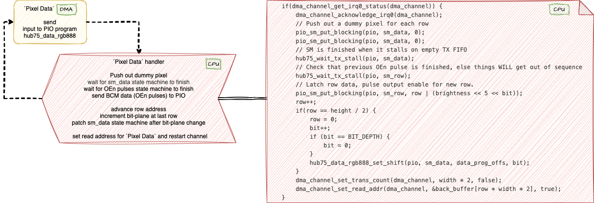

# HUB75 DMA based Driver

Work in progress ...


**Documentation**


This project is based on [pico-examples/pio/hub75](https://github.com/raspberrypi/pico-examples/tree/master/pio/hub75) and [pimoroni/.../drivers/hub75](https://github.com/pimoroni/pimoroni-pico/tree/main/drivers/hub75)

***History***

For a private project I needed to acquire some knowledge of the Raspberry Pi Pico Microcontroller. An internet search gave me the free [Raspberry Pi Pico Lectures 2022](https://www.youtube.com/playlist?list=PLDqMkB5cbBA5oDg8VXM110GKc-CmvUqEZ) by [Hunter Adams](https://vanhunteradams.com/) which are mind blowing good! If your focus is on Picos <b>P</b>rogrammable <b>I</b>nput <b>O</b>utput (PIO) you can jump in at [Raspberry Pi Pico Lecture 15: PIO Overview and Examples](https://www.youtube.com/watch?v=wet9CYpKZOQ).

***Genealogy***

The [Pico HUB75 example](https://github.com/raspberrypi/pico-examples/tree/master/pio/hub75) shows how to interface a HUB75 LED matrix panel with Picos PIO capabilities. It serves educational purposes and clarity and ease of understanding is its primary focus.


Pixel data transferred to the sm_data state machine is some kind o input - output, therefore prone to be processed by Direct Memory Access (DMA). Input are the pixels transferred to the state machines RX-FIFO. This is one of three significant changes done by the pimoroni-pico implementation of the HUB75 algorithm.



***DMA & PIO Biased***

Up to now <code>hub75_wait_tx_stall</code> had been indispensable. This method actively waits until the state machine has stalled on empty TX FIFO during a blocking PULL, or an OUT with autopull enabled. Without this method, checking that previous OEn pulse is finished, things WILL get out of sequence. This method somehow stands in the way and precludes an approach based on chained DMA channels which than feed PIOs.

```c
static inline void hub75_wait_tx_stall(PIO pio, uint sm) {
    uint32_t txstall_mask = 1u << (PIO_FDEBUG_TXSTALL_LSB + sm);
    pio->fdebug = txstall_mask;
    while (!(pio->fdebug & txstall_mask))
        tight_loop_contents();
}
````

So, how to get the information that the OEn pulse is finished ?
The PIO program ${\color{red}hub75\_row}$ listed below emits the OEn pulse and is checked by <code>hub75_wait_tx_stall</code>. The program takes a 32 bit word as input. It uses the first 5 bits of the input to address the row. The remaining 27 bits assert Output Enable for the number of cycles specified as value.

The key to the solution is to add the $\texttt{{\color{red}{ in x, 32 \space\space\space   side 0x0 }}}$ statement after the pulse loop. This statement always emits the value of the x register at that time (4,294,967,295) to the RX FIFO. By retrieving this dummy value from the RX-FIFO it is granted that the pulse loop has finished. The obvious way to retrieve this dummy value is by setting up a DMA channel which retrieves this value.


Here the source code for the DMA channel ´bcm_finished_chan´. It is setup to read one RX-FIFO entry into the same location ´bcm_finished_data´. The value stored into ´bcm_finished_data´ is always the dummy value 4,294,967,295 which is of no interest. The timing of the transfer from the state machines RX-FIFO is the key as it happens after the pulse loop has finished.

The complete sequence and interaction between each DMA and its assigned state-machine is depicted in the diagram below. 

1. As in the pimeroni solution an interlaced double row of pixel data (input) is sent to the LED panels shift register via the ´pixel data´ DMA which feeds the hub75_rdata_gb888 state machine (output). 

2. The ´pixel data´ DMA channel is chained to the ´dummy pixel data´ DMA channel. It seamlessly passes control to this channel when the number of transfers to perform has been reached.

3. At the end of the just emitted row some addtional dummy pixels (input) are sent via the ´dummy pixel data´ DMA channel to the hub75_rgb_data state machine (output). These dummy pixels at the end are required to clock out the last piece of genuine data.
(Easy to see the effect of no dummy data being emitted. Chain the ´pixel data´ DMA channel directly to the ´OEn data´ DMA channel and look for yourself.)

4. The ´dummy pixel data´ DMA channel is chained to the ´OEn data´ DMA channel. It passes control to the ´OEn data´ channel when the number of transfers to perform has been reached.

5. The ´OEn data´ DMA channel takes 32 bits as input and deliveres this data to the hub75_row state machine. Output is enabled for the specified time for each LED in the row addressed if a bit is set in the current bit-plane. In other words, all LEDs in the row are lit which have a colour bit set for the current bit-plane.

6. The 'OEn finished' DMA channel is patiently waiting for the output of the ´OEn data´ DMA channel. The value of the data (4,294,967,295) is irrelevant. Relevant is only when the data is delivered. This is the case after the OEn pulse has finished. The 'OEn finished' DMA channel has an attached interrupt handler ´oen_finished_handler´. This handler sets up the DMA channels for the next row and for BCM.


*Picture 1: Chained DMA Channels and assigned PIOs*

The modifications yield additional improvements with respect to the [pimeroni hub75 driver](https://github.com/pimoroni/pimoroni-pico/tree/main/drivers/hub75):

- work moved from cpu processor to DMA and PIO co-processors
- mutually self paced interlinked DMA and PIO processes
- no need for <code>hub75_wait_tx_stall</code> any more
- reduced cpu code in interrupt handler leads to better performance and less cpu load

A side-effect - no ghost images occured in testing up to 250MHz system clock.


