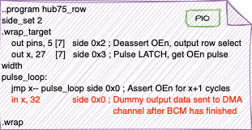
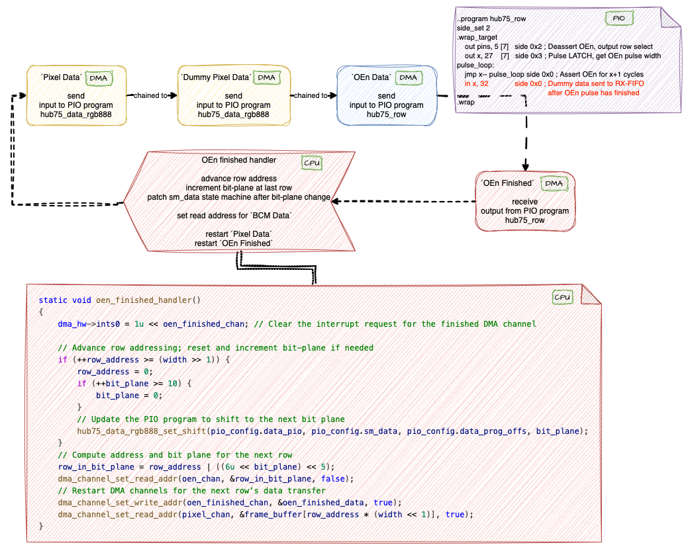
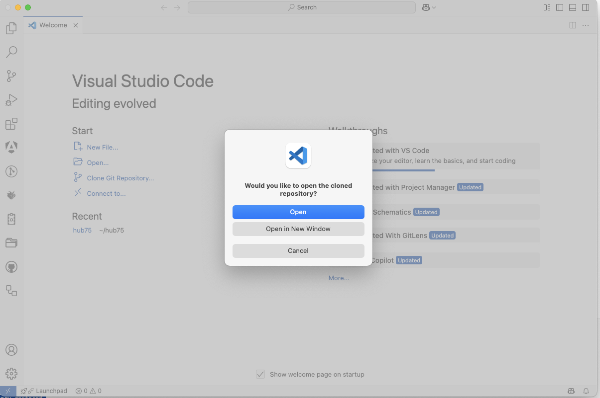
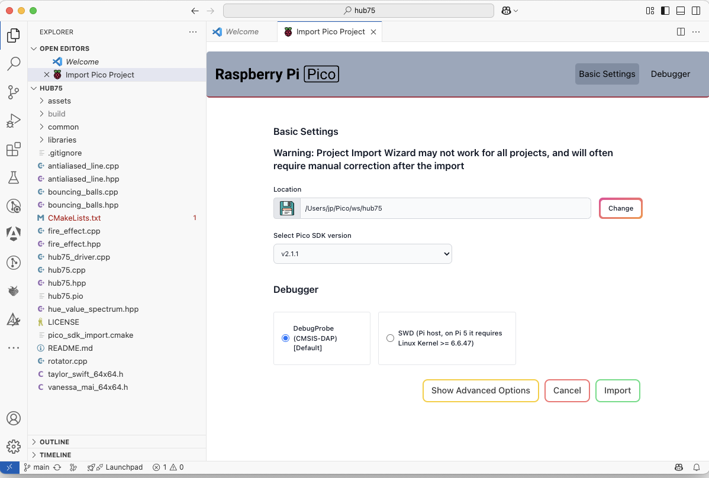

- [HUB75 DMA-Based Driver](#hub75-dma-based-driver)
  - [Documentation and References](#documentation-and-references)
  - [Hub75 Matrix Panel Driver Version 3.0](#hub75-matrix-panel-driver-version-30)
    - [A Short Oversight](#a-short-oversight)
  - [Achievements of the Revised Driver](#achievements-of-the-revised-driver)
  - [Motivation](#motivation)
  - [Evolution of Pico HUB75 Drivers](#evolution-of-pico-hub75-drivers)
    - [Raspberry Pi Pico HUB75 Example](#raspberry-pi-pico-hub75-example)
    - [Pimoroni HUB75 Driver](#pimoroni-hub75-driver)
  - [Eliminating `hub75_wait_tx_stall`](#eliminating-hub75_wait_tx_stall)
    - [Original `hub75_wait_tx_stall` Implementation](#original-hub75_wait_tx_stall-implementation)
    - [Alternative Approach](#alternative-approach)
  - [DMA Chains and PIO State Machines in the Revised HUB75 Driver](#dma-chains-and-pio-state-machines-in-the-revised-hub75-driver)
    - [Overview](#overview)
    - [Step-by-Step Breakdown](#step-by-step-breakdown)
  - [The Definitive Hub75 Driver Solution – A Bitplane Stream with Parallel Reading and Display of Pixel Data](#the-definitive-hub75-driver-solution--a-bitplane-stream-with-parallel-reading-and-display-of-pixel-data)
    - [Overview of the Redesigned Alternative Approach](#overview-of-the-redesigned-alternative-approach)
    - [Step-by-Step Breakdown of DMA and PIO Cooperation](#step-by-step-breakdown-of-dma-and-pio-cooperation)
    - [Refresh Rate Performance](#refresh-rate-performance)
    - [Key Benefits of this Approach](#key-benefits-of-this-approach)
  - [Conclusion for DMA and PIO based Approach](#conclusion-for-dma-and-pio-based-approach)
  - [Improved Colour Perception](#improved-colour-perception)
    - [Balanced Light Output](#balanced-light-output)
  - [Brightness Control](#brightness-control)
    - [API Functions](#api-functions)
    - [How it Works](#how-it-works)
    - [Default Settings](#default-settings)
    - [Practical Notes](#practical-notes)
  - [Demo Effects](#demo-effects)
  - [How to Use This Project in VSCode](#how-to-use-this-project-in-vscode)
  - [Next Steps](#next-steps)
- [Prerequisites for the Hub75 Driver](#prerequisites-for-the-hub75-driver)
  - [Wiring Details](#wiring-details)
    - [Colour Data Pins](#colour-data-pins)
    - [Address (Row Select) Pins](#address-row-select-pins)
    - [Control Pins](#control-pins)
    - [One Glance Mapping HUB75 Connector → Pico GPIOs](#one-glance-mapping-hub75-connector--pico-gpios)
  - [Allowed Deviations  ](#allowed-deviations--)
    - [Example: Custom Pin Mapping](#example-custom-pin-mapping)
- [Configuration via CMakeLists.txt](#configuration-via-cmakeliststxt)
  - [Overview](#overview-1)
  - [All Available Defines and Their Default Values](#all-available-defines-and-their-default-values)
  - [Full CMakeLists.txt Example](#full-cmakeliststxt-example)
  - [Notes on Default Values](#notes-on-default-values)
- [Configuring Your HUB75 LED Matrix Panel](#configuring-your-hub75-led-matrix-panel)
  - [Step 1 — Panel Dimensions](#step-1--panel-dimensions)
    - [Wiring](#wiring)
  - [Step 2 — Scan Rate and Rows Lit Simultaneously](#step-2--scan-rate-and-rows-lit-simultaneously)
    - [Rule](#rule)
    - [Examples](#examples)
      - [Panel with 64×64 height and width, 1/32 scan (-32S-), 5 Address lines (A, B, C, D, E) -\> (2 rows lit)](#panel-with-6464-height-and-width-132-scan--32s--5-address-lines-a-b-c-d-e---2-rows-lit)
      - [Panel with 32×64 height and width, 1/16 scan (-16S-), 4 Address lines (A, B, C, D) -\> (2 rows lit)](#panel-with-3264-height-and-width-116-scan--16s--4-address-lines-a-b-c-d---2-rows-lit)
  - [Step 3 — Panel Pixel Mapping Type](#step-3--panel-pixel-mapping-type)
    - [How to Configure](#how-to-configure)
  - [Step 4 — Panel Driver Chip Type](#step-4--panel-driver-chip-type)
    - [How to choose](#how-to-choose)
  - [Step 5 — Strobe Polarity (`INVERTED_STB`)](#step-5--strobe-polarity-inverted_stb)
  - [Step 6 — State Machine Clock Divider (`SM_CLOCKDIV`)](#step-6--state-machine-clock-divider-sm_clockdiv)
  - [Step 8 — Temporal Dithering (Optional)](#step-8--temporal-dithering-optional)
    - [Pixel Mapping](#pixel-mapping)
      - [How Pixel Mapping Works (General Idea)](#how-pixel-mapping-works-general-idea)
    - [Practical Notes](#practical-notes-1)
- [Troubleshooting](#troubleshooting)
  - [1. Panel Stays Completely Dark](#1-panel-stays-completely-dark)
    - [Check the obvious first](#check-the-obvious-first)
    - [Configuration checks](#configuration-checks)
  - [2. Panel Lights Up, But Only Shows Noise or Garbage](#2-panel-lights-up-but-only-shows-noise-or-garbage)
    - [What to check](#what-to-check)
    - [Typical symptoms](#typical-symptoms)
  - [3. Image Looks Correct, But Rows Are Missing or Repeated](#3-image-looks-correct-but-rows-are-missing-or-repeated)
    - [Check](#check)
    - [Rule reminder](#rule-reminder)
  - [4. Image Is Correct but Flickers or Shows Ghosting](#4-image-is-correct-but-flickers-or-shows-ghosting)
    - [Things to try](#things-to-try)
    - [Also check](#also-check)
  - [5. Panel Updates Sporadically or Only Every Few Frames](#5-panel-updates-sporadically-or-only-every-few-frames)
  - [6. Colors Look Wrong or Are Too Dim / Too Bright](#6-colors-look-wrong-or-are-too-dim--too-bright)
    - [Check](#check-1)
    - [How to verify](#how-to-verify)
  - [7. Problems While Using TEMPORAL\_DITHERING](#7-problems-while-using-temporal_dithering)
    - [If you see:](#if-you-see)
  - [8. When Nothing Makes Sense Anymore 😄](#8-when-nothing-makes-sense-anymore-)
  - [Major Architectural Overhaul: Decoupled DMA \& PIO Pipeline](#major-architectural-overhaul-decoupled-dma--pio-pipeline)
    - [1. Canonical Mapping Stage (`update()` / `update_bgr()`)](#1-canonical-mapping-stage-update--update_bgr)
    - [2. The New Hardware Pipeline](#2-the-new-hardware-pipeline)
    - [3. Simplified DMA Structure](#3-simplified-dma-structure)
    - [4. Advanced Signal Integrity \& Anti-Ghosting](#4-advanced-signal-integrity--anti-ghosting)
    - [5. Efficient BCM with Split-Bitplanes](#5-efficient-bcm-with-split-bitplanes)

# HUB75 DMA-Based Driver

<https://github.com/user-attachments/assets/7c41193c-c724-4fae-8823-af36d70fcedd>

*Demo video: Colours are much brighter and more brilliant in reality*

## Documentation and References

This project is based on:

- [Raspberry Pi's pico-examples/pio/hub75](https://github.com/raspberrypi/pico-examples)
- [Pimoroni's HUB75 driver](https://github.com/pimoroni/pimoroni-pico/tree/main/drivers/hub75)

To understand how RGB matrix panels work, refer to the article **[Everything You Didn't Want to Know About RGB Matrix Panels](https://news.sparkfun.com/2650)**.
For details on Binary Coded Modulation (BCM), see **[LED Dimming Using Binary Code Modulation](https://www.ti.com/lit/an/slva377a/slva377a.pdf)**.

---

## Hub75 Matrix Panel Driver Version 3.0

⚠️ Documentation in progress ⚠️

### A Short Oversight

A (nearly) complete rework of the DMA/PIO pipeline has been done. The Hub75 driver runs with almost no CPU involvement.

An interrupt handler is used to setup bitplanes on demand. After a call to update() or update_bgr() the bitplane slices are constructed heavily relying on DMA and PIO support.

Colour-data (pixels) from the pre-built bitplanes are now streamed to the matrix panel without any conversion.

A second interrupt handler is called once per frame. This interrupt handler is responsible for double-buffering (pointer switching) of the frame_buffer and double-buffering of the row_cmd_buffer. Both buffers are switched only when necessary. The row_cmd_buffer only when a brightness change has been made, and the frame_buffer when update or update_bgr is called. 

This documentation will be revised in the near future.

## Achievements of the Revised Driver

The modifications to the Pimoroni HUB75 driver result in the following improvements:

- **Offloading Work**: Moves processing from the CPU to DMA and PIO co-processors.
- **Performance Boost**: Implements self-paced, interlinked DMA and PIO processes.
- **Eliminates Synchronization Delays**: No need for `hub75_wait_tx_stall`, removing blocking synchronization.
- **Optimized Interrupt Handling**: Reduces code complexity in the interrupt handler.

These enhancements lead to significant performance improvements. In tests up to a **250 MHz system clock**, no ghost images were observed.

---

## Motivation

As part of a private project, I sought to gain deeper knowledge of the Raspberry Pi Pico microcontroller. I highly recommend **[Raspberry Pi Pico Lectures 2022 by Hunter Adams](https://youtu.be/CAMTBzPd-WI?feature=shared)**—they provide excellent insights!

If you are specifically interested in **PIO (Programmable Input/Output)**, start with [Lecture 14: Introducing PIO](https://youtu.be/BVdaw56Ln8s?feature=shared) and [Lecture 15: PIO Overview and Examples](https://youtu.be/wet9CYpKZOQ).

Inspired by Adams' discussion on **[DMA](https://youtu.be/TGjUHChO1kM?feature=shared&t=1475) and PIO co-processors**, I optimized the HUB75 driver as a self-assigned challenge.

😊 **[Raspberry Pi Pico Lectures 2025 by Hunter Adams](https://youtu.be/a4uLrfqHZQU?feature=shared")** is available now!

---

## Evolution of Pico HUB75 Drivers

### Raspberry Pi Pico HUB75 Example

The **Pico HUB75 example** demonstrates connecting an **HUB75 LED matrix panel** using PIO. This educational example prioritizes clarity and ease of understanding.

- The color palette is generated by modulating the **Output Enable (OE)** signal.
- **Binary Coded Modulation (BCM)** is applied row-by-row, modulating all color bits before advancing to the next row.
- Synchronization depends on `hub75_wait_tx_stall`.
- **No DMA is used**, leading to lower performance.

### Pimoroni HUB75 Driver

The **Pimoroni HUB75 driver** improves performance by:

- Switching from **row-wise** to **plane-wise** modulation handling.
- Using **DMA** to transfer pixel data to the PIO state machine.
- Still relying on `hub75_wait_tx_stall` for synchronization.


*Picture 1: Pimoroni's Hub75 Driver DMA Section*

---

## Eliminating `hub75_wait_tx_stall`

Both the **Raspberry Pi and Pimoroni** implementations use `hub75_wait_tx_stall`, which ensures:

- The state machine **stalls** on an empty TX FIFO.
- The system **waits** until the OEn pulse has finished.

However, this blocking method **prevents an efficient DMA-based approach**.

### Original `hub75_wait_tx_stall` Implementation

```c
static inline void hub75_wait_tx_stall(PIO pio, uint sm) {
    uint32_t txstall_mask = 1u << (PIO_FDEBUG_TXSTALL_LSB + sm);
    pio->fdebug = txstall_mask;
    while (!(pio->fdebug & txstall_mask)) {
        tight_loop_contents();
    }
}
```

### Alternative Approach

Instead of waiting for TX FIFO stalling, we can:

1. Modify the **PIO program** to emit a signal once the OEn pulse completes.
2. Set up a **DMA channel** to listen for this signal.
3. Establish an **interrupt handler** to trigger once the signal is received.

This approach allows fully **chained DMA execution** without CPU intervention.



*Picture 2: Modified hub75_row Program*

---

## DMA Chains and PIO State Machines in the Revised HUB75 Driver

### Overview

The following diagram illustrates the interactions between **DMA channels** and **PIO state machines**:

```
[ Pixel Data DMA ] -> [ hub75_data_rgb888 PIO ]
       |
       |--> [ Dummy Pixel Data DMA ] -> [ hub75_data_rgb888 PIO ]
                  |
                  |--> [ OEn Data DMA ] -> [ hub75_row PIO ]
                           |
                           |--> [ OEn Finished DMA ] (Triggers interrupt)
```

### Step-by-Step Breakdown

1. **Pixel Data Transfer**
   - Pixel data is streamed via **DMA** to the **hub75_rdata_gb888** PIO state machine.
   - This handles shifting pixel data into the LED matrix.

2. **Dummy Pixel Handling**
   - A secondary **dummy pixel DMA channel** adds additional pixel data.
   - This ensures correct clocking of the final piece of genuine data.

3. **OEn Pulse Generation**
   - The **OEn data DMA channel** sends 32-bit words - 5 bit address information (row select) and 27 bit puls width - to the **hub75_row** PIO state machine.
   - This output enable signal switches on those LEDs in the current row with bit set in the current bitplane for the specified number of cycles.

4. **Interrupt-Driven Synchronization**
   - A final **OEn finished DMA channel** listens for the end of the pulse.
   - An **interrupt handler** (`oen_finished_handler`) resets DMA for the next cycle.



*Picture 3: Chained DMA Channels and assigned PIOs*

---

## The Definitive Hub75 Driver Solution – A Bitplane Stream with Parallel Reading and Display of Pixel Data

### Overview of the Redesigned Alternative Approach

A (nearly) complete rework of the DMA/PIO pipeline has been done. In doing so, I also removed some features, such as temporal dithering, and added new ones, such as Balanced Light Output and hopefully have correctly implemented **[board707´s](https://github.com/board707)** suggestion of parallel loading of data.

In addition to **[Pimoroni’s anti-ghosting](https://github.com/pimoroni/pimoroni-pico/commit/9e7c2640d426f7b97ca2d5e9161d3f0a00f21abf)**, a “cooling-off period” for the line decoder has been incorporated after the address is set. The matrix panels available to me show no ghosting, no flickering, and no glimmering of pixels at the edges of the matrix even in dark environments.

The output quality has improved due to the usage of Balanced Light Output (can be enabled or disabled via define). That is, bit planes with high weight are divided into several smaller segments within the BCM sequence. This increases the effective refresh rate and reduces flickering.

The DMA/PIO pipeline has been completely revised. The Hub75 driver runs with almost no CPU involvement. There is an interrupt handler that is called once per frame. This interrupt handler is responsible for double-buffering (pointer switching) of the frame_buffer and double-buffering of the row_cmd_buffer. Both buffers are switched only when necessary. The row_cmd_buffer only when a brightness change has been made, and the frame_buffer when update or update_bgr is called.

A second interrupt handler is used to support the conversion of rgb pixel data into bitplane slices. An interrupt handler is used to setup bitplanes on demand. After a call to update() or update_bgr() the bitplane slices are constructed heavily relying on DMA and PIO support. This is in stark contrast to the previous version where this had been done on the fly for every frame. The result is a stream of bitplane slices pushed to the matrix panel in a highly efficient manner.

Overall, performance has improved even further. In summary, the following factors are responsible for this:

- First, loading of pixel data (bitplanes) and Binary Coded Modulation (BCM) are done in parallel as proposed by **[board707](https://github.com/board707)**
- Second, pixel data are provided in a bitplane structure and only need to be streamed to the matrix panel

The performance improvements mainly affect the lower and middle brightness ranges. Starting at a “Base Brightness” of 64 and higher, the BCM component becomes dominant. At that point, even the parallel loading of the pixel data and its provision in a bit-plane structure no longer provides any (significant) speedup.

The revised driver requires slightly more memory resources to achieve the improved quality. I am using “defines” to disable certain (new) functionalities and thus make more memory available for applications.

### Step-by-Step Breakdown of DMA and PIO Cooperation

ToDo

### Refresh Rate Performance

With a **bit-depth of 10** or a **bit-depth of 8**, the HUB75 driver achieves the following refresh rates for a 64 x 64 standard Hub75 matrix panel with scan mode 2 depending on the system clock and basis brightness settings.

Here some more relevant settings if you want to repeat the measurements and verify the listed frame rates.

```cmake
    SM_CLOCKDIV_FACTOR=1.0f     # to prevent flicker or ghosting it might be worth a try to reduce state machine speed
    BITPLANES=10                # number of bit-planes used for Binary Code Modulation - valid values for BIT_DEPTH are 8 or 10
    BALANCED_LIGHT_OUTPUT=true  # uses some more memory but it improves effective refresh rate and really cuts down flicker
    SEPARATE_CIE_CHANNELS=true  # use separate CIE channels for improved colour representation - needs more memory
    HUB75_MULTICORE=true        # use core1 for the hub75 driver
    FRAME_RATE=true             # emit frame rate information on usb - disable for production usage
``` 

| System Clock | Basis Brightness | Refresh Rate for 10 Bitplanes |  Refresh Rate for 8 Bitplanes |
|--------------|------------------|-------------------------------|-------------------------------|
| 100 MHz      | 8                | ~281 Hz                       | ~588 Hz                       |
| 150 MHz      | 8                | ~412 Hz                       | ~860 Hz                       |
| 200 MHz      | 8                | ~536 Hz                       | ~1118 Hz                      |
| 250 MHz      | 8                | ~655 Hz                       | ~1365 Hz                      |
| 266 MHz      | 1                | ~1133 Hz                      | ~1442 Hz                      |
| 266 MHz      | 2                | ~1133 Hz                      | ~1442 Hz                      |
| 266 MHz      | 4                | ~1003 Hz                      | ~1442 Hz                      |
| 266 MHz      | 8                | ~692 Hz                       | ~1442 Hz                      |
| 266 MHz      | 16               | ~419 Hz                       | ~1172 Hz                      |
| 266 MHz      | 32               | ~232 Hz                       | ~769 Hz                       |
| 266 MHz      | 64               | ~121 Hz                       | ~446 Hz                       |
| 266 MHz      | 128              | ~62 Hz                        | ~240 Hz                       |
| 266 MHz      | 255              | ~31 Hz                        | ~124 Hz                       |


These results demonstrate stable operation and high-performance display rendering across a wide range of system clocks.

As already remarked - with increasing "Basis Brightness" the BCM component becomes dominant. Even parallel loading of pixel data and the provision in a bit-plane structure no longer provides any (significant) speedup at high brightness values.

### Key Benefits of this Approach

✅ Fully **automated** data transfer using **chained DMA channels**.

✅ Eliminates **CPU-intensive** busy-waiting (`hub75_wait_tx_stall`).

✅ Ensures **precise timing** without unnecessary stalling.

---

## Conclusion for DMA and PIO based Approach

By offloading tasks to **DMA and PIO**, the revised HUB75 driver achieves **higher performance**, **simpler interrupt handling**, and **better synchronization**. This approach significantly reduces CPU overhead while eliminating artifacts like **ghosting** at high clock speeds.

If you're interested in optimizing **RGB matrix panel drivers**, this implementation serves as a valuable reference for efficient DMA-based rendering.

---

## Improved Colour Perception

The graphics system for the demo effects operates in **RGB888** format (8 bits per channel, 24 bits per pixel). To better match human vision, colours are mapped using the [CIE 1931 lightness curve](https://jared.geek.nz/2013/02/linear-led-pwm/). This mapping effectively expands the usable range to **10 bits per channel**.

The HUB75 driver takes advantage of this: its PIO/DMA pipeline packs each pixel as a **32-bit word** with 10 bits for red, 10 bits for green, and 10 bits for blue.

---

### Balanced Light Output

ToDo

## Brightness Control

In addition to bitplane modulation, the driver supports **software-based brightness regulation**. This allows easy adjustment of overall panel brightness without hardware changes.

### API Functions

```cpp
// Set the baseline brightness scaling factor (default = 6, range 1–255).
// Larger values increase brightness but also raise OEn frequency.
void setBasisBrightness(uint8_t factor);

// Set fine-grained brightness intensity as a fraction [0.0 – 1.0].
void setIntensity(float intensity);
```

### How it Works

- <code>setBasisBrightness(basis)</code>

  Defines the top brightness.

  Example: <code>setBasisBrightness(6)</code> → default brightness range for typical 64×64 panels. \
  Larger factors give more headroom for brightness but consume more **Binary Coded Modulation (BCM)** time slices.

- <code>setIntensity(intensity)</code>
  
  Fine-grained adjustment from 0.0 (dark/off) to 1.0 (full brightness).\
  This function scales the effective duty cycle within the current baseline brightness range.

```cpp
// Example: brighten the panel, then dim at runtime
setBasisBrightness(8); // Start with baseline factor 8 for a brighter panel
setIntensity(0.5f);    // Show at 50% of that baseline
```

### Default Settings

- <code>basis_factor = 6u</code>
- <code>intensity = 1.0f</code>
  (full brightness within the baseline)

This corresponds to the same brightness as earlier driver revisions without adjustment.

### Practical Notes

- Increasing the basis factor may increase peak current consumption.
- For indoor use, values between 4–8 are usually sufficient.
- For dimmer environments, you can keep the baseline factor low (e.g. 4) and rely on setIntensity() for smooth runtime control.
- Both functions are non-blocking and can be called during normal operation.

## Demo Effects

⚠️ The examples contained in hub75_lvgl.cpp have been tested with a Raspberry Pi Pico 2 microcontroller (RP2350). For a RP2040 processor you might have to comment out some demo effects due to minor memory capabilities. Ask if you need support 🙂.

## How to Use This Project in VSCode

You can easily use this project with VSCode, especially with the **Raspberry Pi Pico plugin** installed. Follow these steps:

1. **Open VSCode and start a new window**.
2. **Clone the repository**:
   - Press `Ctrl+Shift+P` and select `Git: Clone`.
   - Paste the URL: `https://github.com/JuPfu/hub75`

      

   - Choose a local directory to clone the repository into.

      

3. **Project Import Prompt**:
   - Consent to open the project.

      

   - When prompted, "Do you want to import this project as Raspberry Pi Pico project?", click **Yes** or wait a few seconds until the dialog prompt disappears by itself.

4. **Configure Pico SDK Settings**:
   - A settings page will open automatically.
   - Use the default settings unless you have a specific setup.

      

   - Click **Import** to finalize project setup.
   - Switch the board-type to your Pico model.

      

5. **Wait for Setup Completion**:
   - VSCode will download required tools, the Pico SDK, and any plugins.

6. **Connect the Hardware**:
   - Make sure the HUB75 LED matrix is properly connected to the Raspberry Pi Pico.
   - Attach the Rasberry Pi Pico USB cable to your computer

7. **Build and Upload**:
   - Compiling the project can be done without a Pico attached to the computer.

      

   - Click the **Run** button in the bottom taskbar.
   - VSCode will compile and upload the firmware to your Pico board.

> 💡 If everything is set up correctly, your matrix should come to life with the updated HUB75 DMA driver.

---

## Next Steps

- **Add another chained DMA channel** to further reduce calls to the oen_finished_handler, trading memory for reduced CPU load.

- **Investigate removing the hub75_data_rgb888_set_shift method**, potentially achieving a completely DMA- and PIO-based solution with no CPU involvement.

For any questions or discussions, feel free to contribute or open an issue!

# Prerequisites for the Hub75 Driver

This driver is designed for a **64×64 LED matrix panel**. It can be adapted for **128x64, 64×32, 32×32, 32x16**, or other HUB75-compatible panels by configuring c preprocessor defines in file hub75.hpp.

The PIO implementation requires that **data pins (colours)** and **row-select pins** must be in **consecutive GPIO blocks** and **STROBE_PIN** must be immediately followed by **OEN_PIN**.

The default implementation looks like this (see hub75.cpp). An example of a valid alternative pin defintion is shown in [Allowed Deviations](#allowed_deviations_anchor)

   ```cpp
   // Default wiring of HUB75 matrix to RP2350
   #define DATA_BASE_PIN    0   // first color data pin
   #define DATA_N_PINS      6   // number of color data pins (R0,G0,B0,R1,G1,B1)
   #define ROWSEL_BASE_PIN  6   // first row-select (address) pin
   #define ROWSEL_N_PINS    5   // number of row-select pins (A0–A4)
   #define CLK_PIN          11  // clock
   #define STROBE_PIN       12  // latch (LAT)
   #define OEN_PIN          13  // output enable (OE)
   ```

## Wiring Details

### Colour Data Pins

- `DATA_BASE_PIN` = **GPIO 0** (first in a consecutive block)
- `DATA_N_PINS` = **6** (for R0, G0, B0, R1, G1, B1)

| Hub75 Colour Bit   | connected to      | Pico GPIO |
|:-------------------|-------------------|:-----:|
| R0                 |                   | 0    |
| G0                 |                   | 1    |
| B0                 |                   | 2    |
| R1                 |                   | 3    |
| G1                 |                   | 4    |
| B1                 |                   | 5    |

### Address (Row Select) Pins

- `ROWSEL_BASE_PIN` = **GPIO 6**
- `ROWSEL_N_PINS` = **5** (A0–A4)

**Consecutiveness is required** by the PIO program.

| Address bit |  connected to      | Pico GPIO |
| ----------- |--------------------|:---------:|
| A0          |                    | 6    |
| A1          |                    | 7    |
| A2          |                    | 8    |
| A3          |                    | 9    |
| A4          |                    | 10   |

### Control Pins

- **CLK_PIN** (clock): GPIO 11
- **STROBE** (strobe/latch): GPIO 12
- **OE_PIN** (output enable): GPIO 13

⚠️ **STROBE_PIN** pin must be immediately followed by **OE_PIN** (must be consecutive)

### One Glance Mapping HUB75 Connector → Pico GPIOs

The diagram shows the default mapping as defined in the hub75.cpp file.
  


## Allowed Deviations  <a id='allowed_deviations_anchor'></a>

The **strict requirement** to be aware of is that **data pins** and **row-select pins** must be in **consecutive GPIO blocks**.
Be aware of a **second requirement** that **STROBE_PIN (latch pin)** must be immediately followed by **OEN_PIN**.
Clock pin may be freely chosen.

### Example: Custom Pin Mapping

```cpp
#define ROWSEL_BASE_PIN  15  // Row select pins moved to GPIO 15–19
#define ROWSEL_N_PINS    5   // number of row-select pins (A0–A4)

#define DATA_BASE_PIN    3   // Color data pins starting at GPIO 3
#define DATA_N_PINS      6   // number of color data pins (R0,G0,B0,R1,G1,B1)

#define STROBE_PIN       1   // aka latch pin
#define OEN_PIN          2   // must be consecutive to STROBE_PIN

// Clock pin might be assigned to arbitrarily GPIO pin
#define CLK_PIN          0
```

---

# Configuration via CMakeLists.txt

## Overview

All driver configuration can be set directly in **`CMakeLists.txt`** via `target_compile_definitions`, without needing to edit any source or header files.

This approach is especially convenient when:

- you use the driver as a **library** in a larger project,
- you want to **switch between different hardware setups** by maintaining separate CMake build configurations,
- you want to keep your source tree clean and avoid modifying `hub75.hpp` directly.

If a define is **not provided** in `CMakeLists.txt`, the driver falls back to the **default values** specified in `hub75.hpp` (see [Notes on Default Values](#notes-on-default-values) below).

---

## All Available Defines and Their Default Values

The table below lists every configurable preprocessor define, its **default value** as declared in `hub75.hpp`, and a short description.

| Define | Default Value | Description |
|---|---|---|
| `PICO_RP2350A` | *(not set)* | Set to `0` for RP2350**B** microcontrollers. Leave unset or set to `1` for RP2350**A**. Only relevant for RP2350-based boards. |
| `USE_PICO_GRAPHICS` | `true` | Set to `false` if hub75 is used as a pure library without pico_graphics. Removes any dependency on pico_graphics. |
| `MATRIX_PANEL_WIDTH` | `64` | Physical width of the LED matrix panel in pixels. |
| `MATRIX_PANEL_HEIGHT` | `64` | Physical height of the LED matrix panel in pixels. |
| `DATA_BASE_PIN` | `0` | First GPIO pin in the consecutive colour data block (R0). |
| `DATA_N_PINS` | `6` | Number of colour data pins (always 6 for standard HUB75: R0, G0, B0, R1, G1, B1). |
| `ROWSEL_BASE_PIN` | `6` | First GPIO pin in the consecutive row-select (address) block (A0). |
| `ROWSEL_N_PINS` | `5` | Number of address pins available on the panel connector (A0–A4 for 5). Must match the physical panel. |
| `CLK_PIN` | `11` | GPIO pin for the pixel clock (CLK). |
| `STROBE_PIN` | `12` | GPIO pin for the latch/strobe signal (LAT). |
| `OEN_PIN` | `13` | GPIO pin for the output enable signal (OE). |
| `PANEL_TYPE` | `PANEL_GENERIC` | Driver IC initialisation type. Valid values: `PANEL_GENERIC`, `PANEL_FM6126A`, `PANEL_RUL6024`. |
| `INVERTED_STB` | `false` | Set to `true` if the latch (strobe) signal is inverted on your board. |
| `TEMPORAL_DITHERING` | `false`  | Define to enable experimental temporal dithering for increased perceived colour depth (≈ 12 bits per channel). |
| `SM_CLOCKDIV_FACTOR` | `1.0f` | PIO state machine clock divider factor. Values > 1.0 slow down the state machine. Useful to reduce ghosting or flickering on smaller panels. |
| `BIT_DEPTH` | `10` | Number of bit-planes used for BCM (Binary Code Modulation). Valid values: `8` or `10`. |
| `HUB75_MULTICORE` | `true` | Set to `true` to run the hub75 driver on core 1, freeing core 0 for application logic. |

> ⚠️ Setting `SM_CLOCKDIV_FACTOR` in CMakeLists.txt implicitly enables the clock divider. If you do not set `SM_CLOCKDIV_FACTOR`, the state machine runs at full speed (equivalent to a factor of `1.0f`).

> ⚠️ For a bare RP2350 microcontroller without a board besides setting `PICO_RP2350A 0` uncomment the following two lines in **CMakeLists.txt** to compile for bare RP2350 without a board
  ```cmake
  set(PICO_PLATFORM rp2350)
  set(PICO_BOARD none CACHE STRING "Board type")
  ```

---

## Full CMakeLists.txt Example

The following example shows a complete `target_compile_definitions` block for a **RP2350B** microcontroller using GPIO pins 30–43. 

Make sure to uncomment the following lines in CMakeLists.txt for a RP2350 microcontroller without a board.

```cmake
set(PICO_PLATFORM rp2350)
set(PICO_BOARD none CACHE STRING "Board type")
```

```cmake
# No need to modify preprocessor defines in hub75.cpp - instead set their values here.
#
# Example:
# Settings for a RP2350B microcontroller with GPIO pins spanning from 30 to 43.
# Beware to set `PICO_PLATFORM rp2350` and `PICO_BOARD none` prior to `include(pico_sdk_import.cmake)`
target_compile_definitions(hub75 PRIVATE
    PICO_RP2350A=0              # `PICO_RP2350A=0` means not a RP2350A but a RP2350B microcontroller
                                # - uncomment for RP235xB microcontroller only!
    USE_PICO_GRAPHICS=true      # set to false if you use hub75 as a library
                                # - any reference to pico_graphics is removed
    MATRIX_PANEL_WIDTH=64       # your matrix panel width
    MATRIX_PANEL_HEIGHT=64      # your matrix panel height
    DATA_BASE_PIN=30            # base GPIO pin (aka start index) of R0, G0, B0, R1, G1, B1 GPIO pins
    DATA_N_PINS=6               # number (count) of colour pins (usually 6)
    ROWSEL_BASE_PIN=36          # base GPIO address pin (aka start index) of A, B (, C, D, E) GPIO pins
    ROWSEL_N_PINS=5             # number (count) of address pins available on your matrix panel board
                                # (look at your panel's connector)
    CLK_PIN=41                  # GPIO pin for CLK
    STROBE_PIN=42               # GPIO pin for STROBE (LATCH)
    OEN_PIN=43                  # GPIO for OE pin
    PANEL_TYPE=PANEL_GENERIC    # select PANEL_TYPE: PANEL_GENERIC, PANEL_FM6126A or PANEL_RUL6024
    INVERTED_STB=false          # set to true if the latch signal is inverted on your board
    TEMPORAL_DITHERING=true     # experimental - switch on temporal dithering to improve colour depth
                                # (currently 2 additional bits)
    SM_CLOCKDIV_FACTOR=1.0f     # to prevent flicker or ghosting it might be worth a try to reduce
                                # state machine speed (values > 1.0 slow down the state machine)
    BIT_DEPTH=8                 # number (count) of bit-planes used for BCM (Binary Code Modulation)
                                # - valid values for BIT_DEPTH are 8 or 10
    HUB75_MULTICORE=true        # use core1 for the hub75 driver
)
```

A minimal configuration for the default RP2350A wiring (GPIO 0–13) only needs to override what differs from the defaults, for example:

```cmake
target_compile_definitions(hub75 PRIVATE
    MATRIX_PANEL_WIDTH=32
    MATRIX_PANEL_HEIGHT=16
    ROWSEL_N_PINS=3
    BIT_DEPTH=8
)
```

All other values fall back to the defaults in `hub75.hpp`.

---

## Notes on Default Values

When no `target_compile_definitions` entry is provided for a given define, the driver uses the **default values** declared in `hub75.hpp`. These defaults correspond to the standard wiring and a **64×64 panel** connected to a **Raspberry Pi Pico** using GPIO 0–13:

```cpp
// hub75.hpp — default values (used when not overridden in CMakeLists.txt)

#ifndef MATRIX_PANEL_WIDTH
#define MATRIX_PANEL_WIDTH   64
#endif

#ifndef MATRIX_PANEL_HEIGHT
#define MATRIX_PANEL_HEIGHT  64
#endif

#ifndef DATA_BASE_PIN
#define DATA_BASE_PIN        0
#endif

#ifndef DATA_N_PINS
#define DATA_N_PINS          6
#endif

#ifndef ROWSEL_BASE_PIN
#define ROWSEL_BASE_PIN      6
#endif

#ifndef ROWSEL_N_PINS
#define ROWSEL_N_PINS        5
#endif

#ifndef CLK_PIN
#define CLK_PIN              11
#endif

#ifndef STROBE_PIN
#define STROBE_PIN           12
#endif

#ifndef OEN_PIN
#define OEN_PIN              13
#endif

#ifndef PANEL_TYPE
#define PANEL_TYPE           PANEL_GENERIC
#endif

#ifndef INVERTED_STB
#define INVERTED_STB         false
#endif

// TEMPORAL_DITHERING is experimental - development still in progress
#ifndef TEMPORAL_DITHERING
#define TEMPORAL_DITHERING   false
#endif

#ifndef SM_CLOCKDIV_FACTOR
#define SM_CLOCKDIV_FACTOR   1.0f
#endif

#ifndef BIT_DEPTH
#define BIT_DEPTH            10
#endif

#ifndef HUB75_MULTICORE
#define HUB75_MULTICORE      true
#endif
```

> 💡 You only need to specify the defines that differ from these defaults. There is no need to copy the entire block into `CMakeLists.txt` for a standard setup.

---

# Configuring Your HUB75 LED Matrix Panel

All panel-specific configuration is done in **`hub75.hpp`** — or, preferably, via [`CMakeLists.txt`](#configuration-via-cmakeliststxt) as described above.
The goal is to describe your panel's **geometry**, **scan method**, and **electronics** so the driver can map pixels correctly and drive the panel reliably.

This section walks you through the configuration **step by step**, starting from the most obvious parameters (panel size) to the more subtle ones (scan rate, driver chip quirks).

---

## Step 1 — Panel Dimensions

Every configuration starts with the **physical size** of your panel:

```cpp
#define MATRIX_PANEL_WIDTH  64
#define MATRIX_PANEL_HEIGHT 64
```

These values determine the memory usage of the frame buffer.

---

### Wiring

The physical wiring is essentially identical for most HUB75 panels. In file **hub75.hpp** the `ROWSEL_N_PINS` definition must be adapted to the number of address lines of your board. 

   ```cpp
   // Default wiring of HUB75 matrix to RP2350
   #define DATA_BASE_PIN    0   // first color data pin
   #define DATA_N_PINS      6   // number of color data pins (R0,G0,B0,R1,G1,B1)
   #define ROWSEL_BASE_PIN  6   // first row-select (address) pin
   #define ROWSEL_N_PINS    5   // ADAPT TO THE NUMBER OF ROW-SELECT ADDRESS PINS ON YOUR PANEL
   #define CLK_PIN          11  // clock
   #define STROBE_PIN       12  // latch (LAT)
   #define OEN_PIN          13  // output enable (OE)
   ```

The value in **ROWSEL_N_PINS** defines the number of address lines defined as output pins. These output pins receive the address information of the current row that is to be updated. Internally, this value is passed to the PIO state machine to control how many address bits are output per row. It might help to have a look at the configuration examples below if the documentation is to vague or unclear with respect to this topic.

## Step 2 — Scan Rate and Rows Lit Simultaneously

HUB75 panels are multiplexed: **not all rows are lit at once**. The matrix panel name usually contains a segment which reads something like *-32S-*, *-16S-*, *-8S-*, etc. as in **P3-64x64-32S-V2.0**.

Internally, the driver works with the concept of **multiplexed rows**:
this is the number of physical rows that are driven simultaneously for one row address.

The hub75 driver deduces the number of multiplexed rows from the following rule.

### Rule

> multiplexed_rows = MATRIX_PANEL_HEIGHT/ 2^ROWSEL_N_PINS

### Examples

#### Panel with 64×64 height and width, 1/32 scan (-32S-), 5 Address lines (A, B, C, D, E) -> (2 rows lit)

> multiplexed_rows = MATRIX_PANEL_HEIGHT / 2^ROWSEL_N_PINS

> $multiplexed_rows = 64 / 2^5 = 64 / 32 = 2

#### Panel with 32×64 height and width, 1/16 scan (-16S-), 4 Address lines (A, B, C, D) -> (2 rows lit)

> multiplexed_rows = MATRIX_PANEL_HEIGHT / 2^ROWSEL_N_PINS

> multiplexed_rows = 32 / 2^4 = 32 / 16 = 2

So, the number of multiplexed lines in both examples is $2$, even though the scan parameters (-32S- and -16S-) differ. Internally, the driver uses the number of multiplexed rows to resolve this ambiguity.

In both examples you should choose **HUB75_MULTIPLEX_2_ROWS** 

```c
#define HUB75_MULTIPLEX_2_ROWS
```

For panels **HUB75_P10_3535_16X32_4S** the calculation looks like this (the number of rows can easily be counted on the panel 😊):

> multiplexed_rows = MATRIX_PANEL_HEIGHT / 2^ROWSEL_N_PINS

> multiplexed_rows = 16 / 2^2 = 16 / 4 = 4

In summary, the number of address lines on this board is $2$ which corresponds to $4$ rows being multiplexed.

> ⚠️ The multiplexing define (e.g. `HUB75_MULTIPLEX_2_ROWS`) does **two things**:
> 
> 1. it defines how many rows are multiplexed **and** 
> 
> 2. selects the corresponding pixel mapping
> 
> The same applies to `HUB75_P10_3535_16X32_4S` and `HUB75_P3_1415_16S_64X64_S31`.

---

## Step 3 — Panel Pixel Mapping Type

Different panels wire pixels differently internally.
This driver provides **predefined mapping modes** for known layouts.

Select **exactly one**:

```cpp
#define HUB75_MULTIPLEX_2_ROWS
// #define HUB75_P10_3535_16X32_4S
// #define HUB75_P3_1415_16S_64X64_S31
```

If unsure:

* start with `HUB75_MULTIPLEX_2_ROWS`
* if the image looks scrambled, try another mapping

---

### How to Configure

All configuration (C pre-processor defines) must be done in **hub75.hpp**.

In your build, define the scan rate that matches your panel. 

```cpp
// Example for a 64×64 panel (1/32 scan) - 2 rows lit simultaneously
#define MATRIX_PANEL_WIDTH 64
#define MATRIX_PANEL_HEIGHT 64

#define HUB75_MULTIPLEX_2_ROWS
// Set the number of address lines - 2 rows lit simultaneously leaves 32 rows to be adressed via row select.
// That is 32 = 2 to the power of 5 - we need 5 row select pins  
#define ROWSEL_N_PINS 5


// Example for a 64×32 panel (1/16 scan) - 2 rows lit simultaneously
#define MATRIX_PANEL_WIDTH 64
#define MATRIX_PANEL_HEIGHT 32

#define HUB75_MULTIPLEX_2_ROWS
// Set the number of address lines - 2 rows lit simultaneously leaves 16 rows to be adressed via row select.
// That is 16 equals 2 to the power of 4 - we need 4 row select pins  
#define ROWSEL_N_PINS 4


// Example for a 32×16 panel (1/8 scan) - 2 rows lit simultaneously
#define MATRIX_PANEL_WIDTH 32
#define MATRIX_PANEL_HEIGHT 16
#define HUB75_MULTIPLEX_2_ROWS
// Set the number of address lines - 2 rows lit simultaneously leaves 8 rows to be adressed via row select.
// That is 8 equals 2 to the power of 3 - we need 3 row select pins  
#define ROWSEL_N_PINS 3


// Example for a 64×64 panels (1/16 scan) - 4 rows lit simultaneously
#define MATRIX_PANEL_WIDTH 64
#define MATRIX_PANEL_HEIGHT 64

#define HUB75_P3_1415_16S_64X64_S31
// Set the number of address lines - 4 rows lit simultaneously leaves 16 rows to be adressed via row select.
// That is 16 equals = 2 to the power of 4 - we need 4 row select pins  
#define ROWSEL_N_PINS 4
// 
#define SM_CLOCKDIV 1
#if SM_CLOCKDIV != 0
// To prevent flicker or ghosting it might be worth a try to reduce state machine speed.
// For panels with height less or equal to 16 rows try a factor of 8.0f
// For panels with height less or equal to 32 rows try a factor of 2.0f or 4.0f
// Even for panels with height less or equal to 62 rows a factor of about 2.0f might solve such an issue
#define SM_CLOCKDIV_FACTOR 1.0f
#endif


// Example for a 32×16 panel (1/4 scan) - 4 rows lit simultaneously
#define MATRIX_PANEL_WIDTH 32
#define MATRIX_PANEL_HEIGHT 16

#define HUB75_P10_3535_16X32_4S
// Set the number of address lines - 4 rows lit simultaneously leaves 4 rows to be adressed via row select.
// That is 4 equals 2 to the power of 2 -> we need 2 row select pins  
#define ROWSEL_N_PINS 2

#define SM_CLOCKDIV 1
#if SM_CLOCKDIV != 0
// To prevent flicker or ghosting it might be worth a try to reduce state machine speed.
// For panels with height less or equal to 16 rows try a factor of 8.0f
// For panels with height less or equal to 32 rows try a factor of 2.0f or 4.0f
// Even for panels with height less or equal to 62 rows a factor of about 2.0f might solve such an issue
#define SM_CLOCKDIV_FACTOR 1.0f
#endif
``` 

Note that the panel name usually does not encode the internal pixel wiring or the driver IC type.
These must be determined visually or experimentally.
But sometimes the name of the panel gives you a lot of information how the configuration has to be done.
Here an example for a **P3-64*64-32S-V2.0** panel.

```c
// Width and height are encoded in the panel name 
#define MATRIX_PANEL_WIDTH 64
#define MATRIX_PANEL_HEIGHT 64

// The 32S in the panel name refers to (1/32 scan) - 2 rows lit simultaneously 
// We can try the standard pixel mapping - maybe we are lucky and the pixel mapping fits
#define HUB75_MULTIPLEX_2_ROWS
// Set the number of address lines - 2 rows lit simultaneously leaves 32 rows to be adressed via row select.
// That is 32 equals 2 to the power of 5 -> we need 5 row select pins (as might be printed on the panel backside - A, B, C, D, E)
#define ROWSEL_N_PINS 5
// Look at the back of the panel. If you detect a chip which is labeled RUL6024 then define the appropriate panel type
#define PANEL_TYPE PANEL_RUL6024
```

---

## Step 4 — Panel Driver Chip Type

Some panels contain special driver ICs that require an **initialization sequence**.

```cpp
#define PANEL_GENERIC  0
#define PANEL_FM6126A  1
#define PANEL_RUL6024  2

#define PANEL_TYPE PANEL_GENERIC
```

### How to choose

* Look at the **back of the panel**
* If you see a chip labeled **FM6126A** or **RUL6024**, select it
* Otherwise, use `PANEL_GENERIC`

---

## Step 5 — Strobe Polarity (`INVERTED_STB`)

Most panels use a **non-inverted latch signal**, but some boards invert it.

```cpp
#define INVERTED_STB false
```

If:

* the panel flickers,
* or only updates sporadically,

try:

```cpp
#define INVERTED_STB true
```

---

## Step 6 — State Machine Clock Divider (`SM_CLOCKDIV`)

By default, the driver runs the PIO state machine at full speed.

Some panels benefit from a slower clock to reduce:

* ghosting
* flicker
* brightness artifacts

```cpp
#define SM_CLOCKDIV 0 // 0 = disabled
#if SM_CLOCKDIV != 0
// To prevent flicker or ghosting it might be worth a try to reduce state machine speed.
// For panels with height less or equal to 16 rows try a factor of 8.0f
// For panels with height less or equal to 32 rows try a factor of 2.0f or 4.0f
// Even for panels with height less or equal to 62 rows a factor of about 2.0f might solve such an issue
#define SM_CLOCKDIV_FACTOR 1.0f
#endif
```

---

## Step 8 — Temporal Dithering (Optional)

> ⚠️ TEMPORAL_DITHERING is experimental - development is still in progress!

To activate TEMPORAL_DITHERING switch from 

```cpp
#define TEMPORAL_DITHERING false
```

to

```cpp
#define TEMPORAL_DITHERING true
```


**Use it if:**

* you want smoother gradients
* you accept slightly higher CPU usage

**Do not use it if:**

* you need maximum refresh stability
* you are debugging mapping issues

> This feature is experimental!

---


### Pixel Mapping

Each panel type has it's own pixel mapping. 

#### How Pixel Mapping Works (General Idea)

HUB75 panels do not accept pixels in simple row-major order.

Instead, pixel data is shifted into the panel in the exact order expected by the
panel's internal shift registers and multiplexing logic.

Key properties:

- Pixels are shifted **column-wise**, not row-wise
- Multiple physical rows are driven **simultaneously**
- The shift buffer therefore always contains pixels from **different vertical regions**
- The exact ordering depends on:
  - how many rows are multiplexed
  - how the panel internally wires its row drivers

Each mapping below describes how pixels from the linear source buffer (`src`)
are reordered into the panel's shift buffer (`frame_buffer`).


***HUB75_MULTIPLEX_2_ROWS Mapping***

Generic hub75 led matrix panels with 2 rows lit simultaneously.

The **HUB75_MULTIPLEX_2_ROWS** defines the most common pixel mapping.

Pixels from the source-data (**src**) are copied in alternating sequence (first **src[j]** then **src[j + offset]**) into the shift register of the matrix panel because each clock cycle shifts two pixels belonging to two different physical rows
(upper half and lower half of the panel). Prior to this **offset** had been set to <em>MATRIX_PANEL_WIDTH * MATRIX_PANEL_HEIGHT / 2</em>. Additionally colour perception is improved by mapping colours via a look-up table (**lut**). This mapping effectively expands the usable range to **10 bits per channel**. For details see [CIE 1931 lightness curve](https://jared.geek.nz/2013/02/linear-led-pwm/).

```c
   constexpr size_t pixels = MATRIX_PANEL_WIDTH * MATRIX_PANEL_HEIGHT;
   constexpr size_t offset = pixels / 2;
   for (size_t fb_index = 0, j = 0; fb_index < pixels; fb_index += 2, ++j) {
      frame_buffer[fb_index] = LUT_MAPPING(j, src[j]);
      frame_buffer[fb_index + 1] = LUT_MAPPING(j + offset, src[j + offset]);
   }
```

***HUB75_P10_3535_16X32_4S Mapping***

Outdoor led matrix panel with 16 rows and 32 pixels per row. 4 rows lit simultaneously. So only two address lines needed to address a quarter of rows (0, 1, 2, 3). This is also mirrored in the available address lines (A, B) on the matrix panel board.

**ToDo** Describe pixel mapping in detail!

```c
   int line = 0;
   int counter = 0;

   constexpr int COLUMN_PAIRS = MATRIX_PANEL_WIDTH >> 1;
   constexpr int HALF_PAIRS = COLUMN_PAIRS >> 1;

   constexpr int PAIR_HALF_BIT = HALF_PAIRS;
   constexpr int PAIR_HALF_SHIFT = __builtin_ctz(HALF_PAIRS);

   constexpr int ROW_STRIDE = MATRIX_PANEL_WIDTH;
   constexpr int ROWS_PER_GROUP = MATRIX_PANEL_HEIGHT / SCAN_GROUPS;
   constexpr int GROUP_ROW_OFFSET = ROWS_PER_GROUP * ROW_STRIDE;
   constexpr int HALF_PANEL_OFFSET = (MATRIX_PANEL_HEIGHT >> 1) * ROW_STRIDE;

   constexpr int total_pairs = (MATRIX_PANEL_WIDTH * MATRIX_PANEL_HEIGHT) >> 1;

   // Example: HUB75 panel, 32×16 pixels, 1/4 scan (2 address lines)
   //
   // Geometry:
   //   COLUMN_PAIRS  = 32 / 2 = 16
   //   HALF_PAIRS    = 16 / 2 = 8
   //   PAIR_HALF_BIT = 8
   //   PAIR_HALF_SHIFT = ctz(8) = 3
   //
   // Vertical scan:
   //   SCAN_GROUPS     = 1 << ROWSEL_N_PINS = 4
   //   ROWS_PER_GROUP  = 16 / 4 = 4
   //   GROUP_ROW_OFFSET = 4 × 32 = 128
   //   HALF_PANEL_OFFSET = (16 / 2) × 32 = 256
   //
   // Resulting source index:
   //   index = (j & 8) == 0
   //         ? j - (line << 3)
   //         : 128 + j - ((line + 1) << 3)
   //
   // j advances in column pairs.
   // One scan group consists of COLUMN_PAIRS iterations.
   // Bit PAIR_HALF_BIT selects the first or second half of the column pairs within the current scan group.
   //
   // (j & PAIR_HALF_BIT) == 0 → first half of column pairs
   //                          → quarters 1 (upper) + 3 (lower)
   // (j & PAIR_HALF_BIT) != 0 → second half of column pairs
   //                          → quarters 2 (upper) + 4 (lower)
   // Note: The selector bit in j depends only on panel width (column pairing), not on HUB75 scan rate.

   for (int j = 0, fb_index = 0; j < total_pairs; ++j, fb_index += 2) {
      int32_t index = !(j & PAIR_HALF_BIT) ? j - (line << PAIR_HALF_SHIFT)
                                             : GROUP_ROW_OFFSET + j - ((line + 1) << PAIR_HALF_SHIFT);

      frame_buffer[fb_index] = LUT_MAPPING(index, src[index]);
      frame_buffer[fb_index + 1] = LUT_MAPPING(index + HALF_PANEL_OFFSET, src[index + HALF_PANEL_OFFSET]);

      if (++counter >= COLUMN_PAIRS)
      {
            counter = 0;
            ++line;
      }
   }
```

***HUB75_P3_1415_16S_64X64_S31 Mapping***

Outdoor led matrix panel with 64 rows and each row has 64 pixels. 16S means 64 / 16 = 4 rows lit simultaneously. Four address lines (A, B, C, D) are available on the led matrix panel board, which confirms this calculation.

Driving ICs are MBI5253 / ICND2055 / ICDN2065 / ICND2153S / CFD325 / MBI5264 / CFD555 / ICND2165.

The shift-buffer is filled in alternating sequence with pixels from a line from second and fourth quarter of the panel 
followed by an alternating sequence of the corresponding line from the first and third quarter.

```c
   constexpr uint total_pixels = MATRIX_PANEL_WIDTH * MATRIX_PANEL_HEIGHT;
   constexpr uint line_offset = 2 * MATRIX_PANEL_WIDTH;

   constexpr uint quarter = total_pixels >> 2;

   uint quarter1 = 0 * quarter;
   uint quarter2 = 1 * quarter;
   uint quarter3 = 2 * quarter;
   uint quarter4 = 3 * quarter;

   uint p = 0; // per line pixel counter

   // Number of logical rows processed
   uint line = 0;

   // Framebuffer write pointer
   volatile uint32_t *dst = frame_buffer;

   // Each iteration processes 4 physical rows (2 scan-row pairs)
   while (line < (height >> 2)) {
      // even src lines
      dst[0] = LUT_MAPPING(quarter2, src[quarter2]); quarter2++;
      dst[1] = LUT_MAPPING(quarter4, src[quarter4]); quarter4++;
      // odd src lines
      dst[line_offset + 0] = LUT_MAPPING(quarter1, src[quarter1]); quarter1++;
      dst[line_offset + 1] = LUT_MAPPING(quarter3, src[quarter3]); quarter3++;

      dst += 2; // move to next output pixels
      p++;

      // End of logical row
      if (p == width) {
            p = 0;
            line++;
            dst += line_offset; // advance to next scan-row pair
      }
   }
```

### Practical Notes

Not all of the demo effects will show correctly for matrix panels with a format different to 64x64 pixels. The first two demo effects use image data for a 64x64 layout. You will see some output, but it will look weird.

The `bouncing balls` effect will not show the complete text as the position is hard coded. The `fire_effect` and the `rotator`might look as they should be.

Have fun with adapting the source code or with implementing your own effects.

Do not hesitate to contact me - I will gladly answer your questions!

---

# Troubleshooting

If your panel does not behave as expected, do **not** change multiple configuration options at once.
Most issues can be isolated by checking **one dimension at a time**.

The sections below are ordered from **most common** to **least common** problems.

---

## 1. Panel Stays Completely Dark

### Check the obvious first

* Is the panel powered with the **correct voltage** (usually 5 V)?
* Is the power supply strong enough (HUB75 panels can draw several amps)?
* Is `OEN_PIN` wired correctly and not permanently disabling output?

### Configuration checks

* Verify `MATRIX_PANEL_WIDTH` and `MATRIX_PANEL_HEIGHT`
* Verify `ROWSEL_N_PINS` matches the number of address pins on the panel (A, B, C, …)

If `ROWSEL_N_PINS` is too large or too small, **no rows will be selected correctly**.

---

## 2. Panel Lights Up, But Only Shows Noise or Garbage

This usually indicates a **pixel mapping mismatch**.

### What to check

* Try a different mapping define:

  ```cpp
  #define HUB75_MULTIPLEX_2_ROWS
  // #define HUB75_P10_3535_16X32_4S
  // #define HUB75_P3_1415_16S_64X64_S31
  ```

### Typical symptoms

| Symptom                       | Likely cause                     |
| ----------------------------- | -------------------------------- |
| Completely scrambled image    | Wrong mapping define             |
| Image mirrored or interleaved | Wrong internal wiring assumption |
| Repeating blocks or patterns  | Mapping partially correct        |

> 💡 If the image is *stable but wrong*, the scan rate is likely correct and only the mapping needs adjustment.

---

## 3. Image Looks Correct, But Rows Are Missing or Repeated

This usually points to a **row addressing issue**.

### Check

* `ROWSEL_N_PINS`
* Panel height (`MATRIX_PANEL_HEIGHT`)

### Rule reminder

```
multiplexed_rows = MATRIX_PANEL_HEIGHT / 2^ROWSEL_N_PINS
```

If this value does not match the panel's actual multiplexing, rows will be:

* skipped
* duplicated
* shifted

---

## 4. Image Is Correct but Flickers or Shows Ghosting

This is typically a **timing issue**.

### Things to try

1. Enable and tune `SM_CLOCKDIV`:

   ```cpp
   #define SM_CLOCKDIV_FACTOR 1.0f
   ```

2. Increase the divider if necessary:

   * ≤ 16 rows → try `8.0f`
   * ≤ 32 rows → try `2.0f` or `4.0f`

### Also check

* Power supply quality
* Cable length and signal integrity
* Ground connection between MCU and panel

---

## 5. Panel Updates Sporadically or Only Every Few Frames

This often indicates **strobe polarity mismatch**.

Try

```cpp
#define INVERTED_STB true
```

If the panel suddenly becomes stable, the latch signal is inverted on your board.

---

## 6. Colors Look Wrong or Are Too Dim / Too Bright

### Check

* Panel driver chip type:

  ```cpp
  #define PANEL_TYPE PANEL_GENERIC
  // #define PANEL_FM6126A
  // #define PANEL_RUL6024
  ```

If the panel contains an FM6126A or RUL6024 chip and is not initialized correctly:

* brightness may be wrong
* colors may look distorted
* output may be unstable

### How to verify

* Inspect the **back of the panel**
* Look for chip markings (FM6126A, RUL6024)

---

## 7. Problems While Using TEMPORAL_DITHERING

Temporal dithering increases perceived color depth but also increases complexity.

### If you see:

* flicker
* unstable brightness
* strange artifacts

Disable it first:

```cpp
#define TEMPORAL_DITHERING false
```

> ⚠️ Always debug **mapping and scan issues first**, then enable temporal dithering later.

---

## 8. When Nothing Makes Sense Anymore 😄

Follow this **minimal recovery procedure**:

1. Use the simplest known-good configuration:

   ```cpp
   #define HUB75_MULTIPLEX_2_ROWS
   #define PANEL_TYPE PANEL_GENERIC
   #define TEMPORAL_DITHERING false
   ```

2. Verify:

   * correct width and height
   * correct `ROWSEL_N_PINS`

3. Use a **simple test pattern**:

   * solid colors
   * vertical and horizontal stripes

4. Change **one parameter at a time**

---

## Major Architectural Overhaul: Decoupled DMA & PIO Pipeline

The driver has transitioned from a CPU-intensive real-time mapping approach to a structured, three-stage hardware pipeline. This change significantly reduces CPU overhead and provides native support for complex panel layouts (S31, ZigZag, etc.).

### 1. Canonical Mapping Stage (`update()` / `update_bgr()`)
* **Panel-Specific Normalization:** All panel-specific quirks (scan-mode, physical row mapping, and ZigZag patterns) are handled during the initial copy to `rgb_buffer`.
* **Standardized Format:** The buffer is organized into a "canonical" 32-bit RGB format, allowing the subsequent PIO stages to remain generic and extremely fast.

### 2. The New Hardware Pipeline
The data flow is now managed by three specialized PIO programs working in concert:

| Component | Role | Mechanism |
| :--- | :--- | :--- |
| **`hub75_bitplane_setup`** | **Bit-Slicing** | Converts the canonical `rgb_buffer` into the bit-plane structured `frame_buffer`. |
| **`hub75_bitplane_stream`** | **Data Feeding** | Streams the prepared bit-planes to the panel's shift registers. |
| **`hub75_row`** | **Timing & Logic** | The "Master" SM. Handles Row Addressing (A-E), BCM timing, and Latch (STB) signals. |


### 3. Simplified DMA Structure
The DMA logic has been streamlined. Instead of complex per-row interrupts, the system now uses **DMA Chaining**:
* **Autonomous Frames:** DMA channels now loop through all bit-planes and rows automatically.
* **Minimal CPU Interrupts:** The Interrupt Handler is now only called **once per frame**. It handles:
    1. **Double-Buffering:** Swapping `frame_buffer` and `row_cmd_buffer` only when a full frame is complete.
    2. **Runtime Updates:** Activating new BCM cycles if brightness was changed via the API.

### 4. Advanced Signal Integrity & Anti-Ghosting
The `hub75_row` program now includes specific hardware-level timing improvements:
* **Anti-Ghosting Wait Cycles:** A configurable `wait_loop` is executed after the Latch (STB) signal but before enabling the next row. This ensures the LEDs from the previous row have fully discharged, eliminating the "shadow" or "ghost" effect common in high-speed multiplexing.
* **Settling Buffers:** Added precise timing padding around the Address (A-E) and Strobe transitions to account for cable capacitance and level-shifter propagation delays.
* **Hardware Synchronization:** `hub75_row` and `hub75_bitplane_stream` are hardware-locked via PIO IRQ flags, ensuring that row switching never occurs while data is still being shifted.

### 5. Efficient BCM with Split-Bitplanes
* **Balanced Light Output:** High-weight bit-planes are split into multiple smaller slices within the BCM sequence. This increases the effective refresh rate and eliminates visible flicker, even at low intensity settings.
* **Constant Frame Rate:** The sum of `lit_cycles` and `dark_cycles` is kept constant, ensuring a rock-solid refresh rate regardless of brightness levels.


