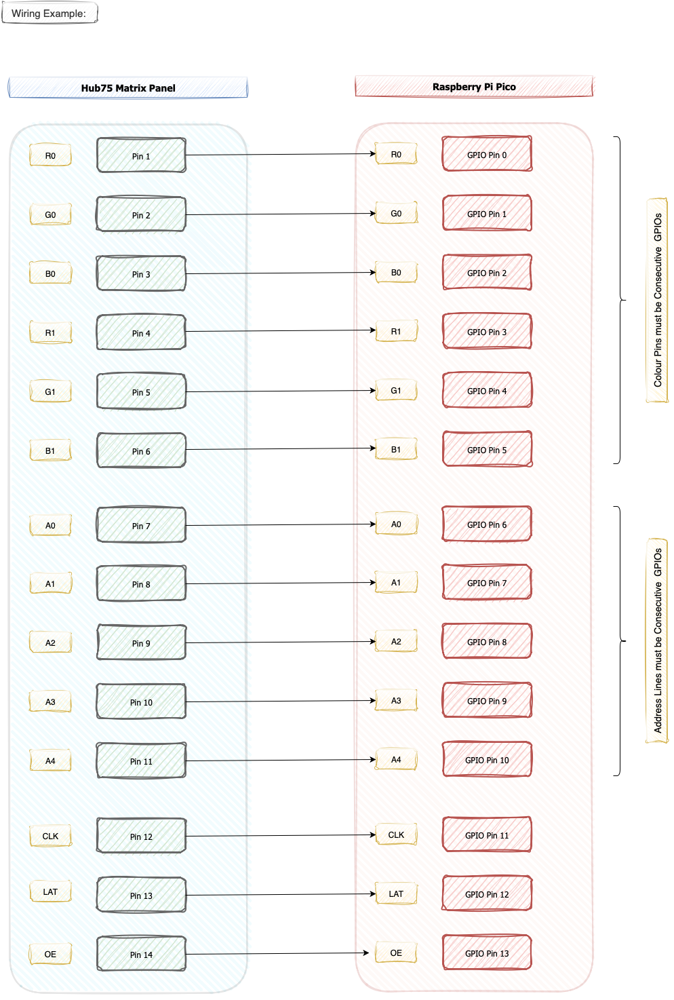
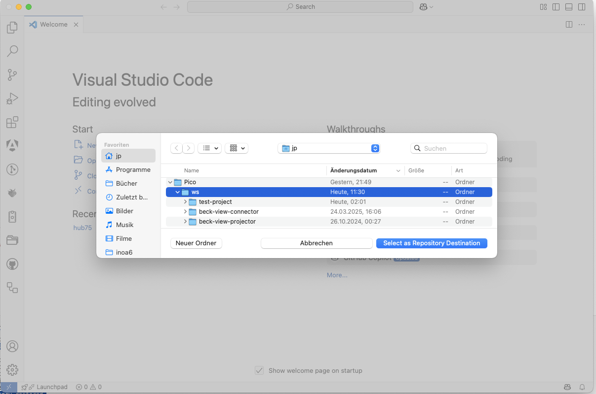
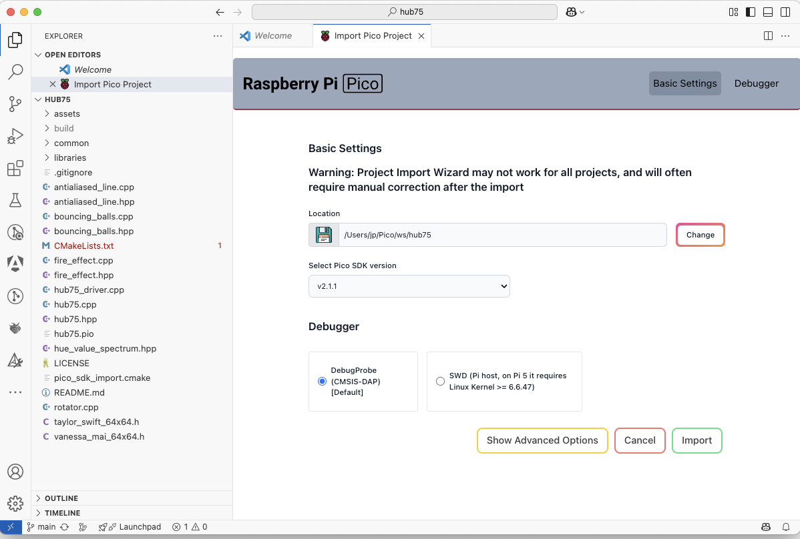
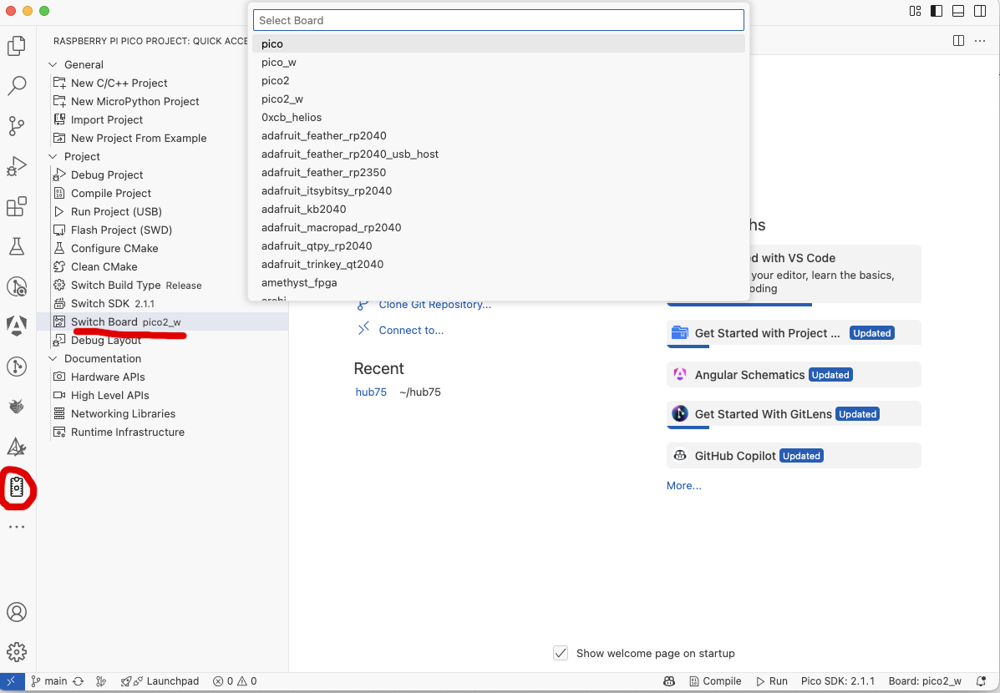
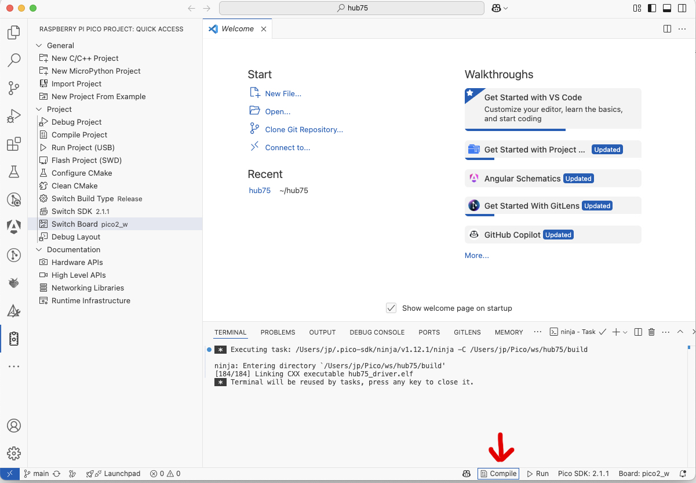
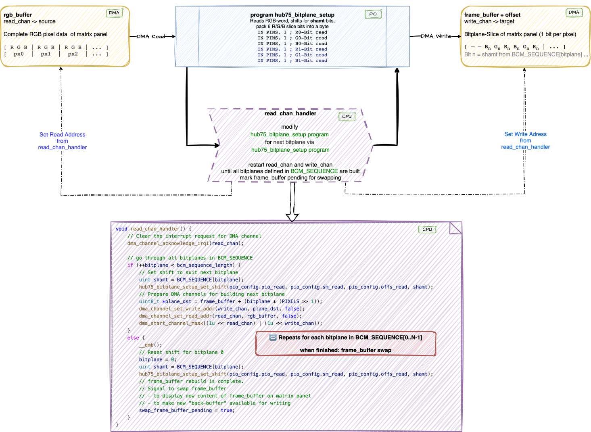
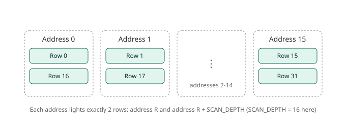
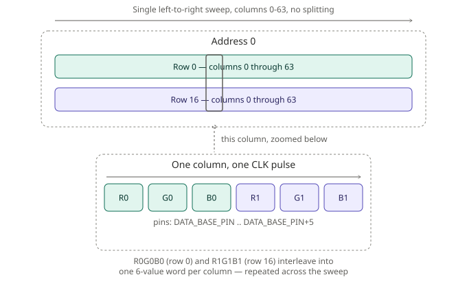

> **⚠️ Breaking change:** As of [issue #22](https://github.com/JuPfu/hub75/issues/22), almost
> all driver configuration has moved from `CMakeLists.txt` preprocessor defines into a
> `constexpr Hub75Config` value passed as a template argument to `Hub75Driver<Cfg>` — see
> [Configuration in Code](#configuration-in-code). Only `PICO_RP2350A`, `USE_PICO_GRAPHICS`,
> and `HUB75_MULTICORE` remain as `target_compile_definitions`.
>
> The pixel-mapping panel defines from the previous breaking change (issue #21) are now the
> `RowMapping` enum's values (`panel.panel_kind` field):
>
> | Old macro name | Current `RowMapping` value |
> |---|---|
> | `HUB75_MULTIPLEX_2_ROWS` (formerly `HUB75_DEFAULT` / `HUB75`), later `ROW_MAP_STANDARD` | `RowMapping::Standard` |
> | `HUB75_P10_3535_16X32_4S`, later `ROW_MAP_SPLIT` | `RowMapping::Split` |
> | `HUB75_P3_1415_16S_64X64_S31`, later `ROW_MAP_S31` | `RowMapping::S31` |
>
> Update your panel setup to build a `Hub75Config` accordingly.

- [HUB75 DMA/PIO Driver for Raspberry Pi Pico / RP2350](#hub75-dmapio-driver-for-raspberry-pi-pico--rp2350)
- [Quick Start](#quick-start)
  - [Prerequisites](#prerequisites)
  - [Wiring Details](#wiring-details)
    - [Colour Data Pins](#colour-data-pins)
    - [Address (Row Select) Pins](#address-row-select-pins)
    - [Control Pins](#control-pins)
    - [One Glance Mapping HUB75 Connector → Pico GPIOs](#one-glance-mapping-hub75-connector--pico-gpios)
  - [Allowed Deviations  ](#allowed-deviations--)
    - [Example: Pin Mapping and Environment Settings for Pico 2](#example-pin-mapping-and-environment-settings-for-pico-2)
    - [Example: Pin Mapping and Environment Settings for RP2350B](#example-pin-mapping-and-environment-settings-for-rp2350b)
  - [How to Use This Project in VSCode](#how-to-use-this-project-in-vscode)
- [Configuration in Code](#configuration-in-code)
  - [Overview](#overview)
  - [All Available Fields and Their Default Values](#all-available-fields-and-their-default-values)
    - [`Hub75PanelConfig panel`](#hub75panelconfig-panel)
    - [`Hub75ScreenConfig screen`](#hub75screenconfig-screen)
    - [`Hub75PinConfig pins`](#hub75pinconfig-pins)
    - [`Hub75ColorConfig color`](#hub75colorconfig-color)
    - [`Hub75Config` top level](#hub75config-top-level)
  - [Full `Hub75Config` Example](#full-hub75config-example)
  - [Notes on Default Values](#notes-on-default-values)
  - [Pixel Mapping — Choosing the Right `RowMapping` for Your Panel](#pixel-mapping--choosing-the-right-rowmapping-for-your-panel)
    - [Why This Mapping Step Exists](#why-this-mapping-step-exists)
    - [The Three `RowMapping` Values at a Glance](#the-three-rowmapping-values-at-a-glance)
    - [`RowMapping::Standard` — Standard Two-Row Multiplexing](#rowmappingstandard--standard-two-row-multiplexing)
    - [`RowMapping::Split` — Outdoor P10 Panel, Four-Row Multiplexing](#rowmappingsplit--outdoor-p10-panel-four-row-multiplexing)
    - [`RowMapping::S31` — Outdoor P3 64×64 Panel, Four-Row Multiplexing](#rowmappings31--outdoor-p3-6464-panel-four-row-multiplexing)
    - [How to Select the Correct Value — Decision Guide](#how-to-select-the-correct-value--decision-guide)
    - [What Happens When You Set `panel_kind`](#what-happens-when-you-set-panel_kind)
    - [Important Notes](#important-notes)
- [HUB75 DMA-Based Driver](#hub75-dma-based-driver)
  - [Hub75 Matrix Panel Driver Version 3.0](#hub75-matrix-panel-driver-version-30)
  - [Achievements at a Glance](#achievements-at-a-glance)
    - [Version 2.0 — DMA/PIO Pipeline](#version-20--dmapio-pipeline)
    - [Version 3.0 — Colour Fidelity \& Signal Integrity](#version-30--colour-fidelity--signal-integrity)
  - [The Definitive Hub75 Driver Solution – A Bitplane Stream with Parallel Reading and Display of Pixel Data](#the-definitive-hub75-driver-solution--a-bitplane-stream-with-parallel-reading-and-display-of-pixel-data)
    - [Overview of the Redesigned Alternative Approach](#overview-of-the-redesigned-alternative-approach)
    - [High-Level Architectural View of HUB75 Pipeline](#high-level-architectural-view-of-hub75-pipeline)
    - [1. Canonical Mapping Stage (`update()` / `update_bgr()`)](#1-canonical-mapping-stage-update--update_bgr)
    - [2. The New Hardware Pipeline](#2-the-new-hardware-pipeline)
    - [3. Simplified DMA Structure](#3-simplified-dma-structure)
    - [4. Advanced Signal Integrity \& Anti-Ghosting](#4-advanced-signal-integrity--anti-ghosting)
    - [5. Efficient BCM with Split-Bitplanes](#5-efficient-bcm-with-split-bitplanes)
    - [Step-by-Step Breakdown of DMA and PIO Cooperation](#step-by-step-breakdown-of-dma-and-pio-cooperation)
      - [RGB Pixel Data Transformation into Bitplane Slices](#rgb-pixel-data-transformation-into-bitplane-slices)
      - [Row-Addressing, Loading and Display of Pixel Data](#row-addressing-loading-and-display-of-pixel-data)
    - [Refresh Rate Performance](#refresh-rate-performance)
    - [Key Benefits of this Approach](#key-benefits-of-this-approach)
  - [Conclusion for DMA and PIO based Approach](#conclusion-for-dma-and-pio-based-approach)
  - [Improved Colour Perception](#improved-colour-perception)
    - [Balanced Light Output](#balanced-light-output)
      - [Example: 10-bit color depth (`bitplanes = 10`)](#example-10-bit-color-depth-bitplanes--10)
      - [Visual comparison](#visual-comparison)
  - [Colour Correction Matrix](#colour-correction-matrix)
    - [Overview](#overview-1)
    - [Two-Stage Colour Pipeline](#two-stage-colour-pipeline)
    - [Mathematical Model](#mathematical-model)
    - [Implementation](#implementation)
    - [Configuration in Code](#configuration-in-code-1)
    - [The `cie.py` LUT Generator](#the-ciepy-lut-generator)
    - [Tuning Procedure](#tuning-procedure)
      - [Step 1 — Establish a baseline](#step-1--establish-a-baseline)
      - [Step 2 — Use a grey-ramp test image](#step-2--use-a-grey-ramp-test-image)
      - [Step 3 — Tune one term at a time](#step-3--tune-one-term-at-a-time)
      - [Step 4 — Verify with saturated primaries](#step-4--verify-with-saturated-primaries)
      - [Step 5 — Check with a real image](#step-5--check-with-a-real-image)
      - [Step 6 — Final white-balance trim](#step-6--final-white-balance-trim)
    - [Runtime Cost](#runtime-cost)
  - [Brightness Control](#brightness-control)
    - [API Functions](#api-functions)
    - [How it Works](#how-it-works)
    - [Default Settings](#default-settings)
    - [Practical Notes](#practical-notes)
  - [Chained Panels](#chained-panels)
    - [Topology Overview](#topology-overview)
    - [Configuration Parameters](#configuration-parameters)
      - [Chain Modes](#chain-modes)
    - [Code Example](#code-example)
    - [Source Buffer Layout](#source-buffer-layout)
    - [How Serpentine Reversal Works Internally](#how-serpentine-reversal-works-internally)
    - [Single-Panel Optimisation](#single-panel-optimisation)
    - [Supported Panel Types and Chaining](#supported-panel-types-and-chaining)
    - [Memory Considerations](#memory-considerations)
    - [Quick-Reference: Common Configurations](#quick-reference-common-configurations)
  - [Display Rotation](#display-rotation)
    - [Configuration](#configuration)
    - [Physical Panel vs. Logical Source Buffer](#physical-panel-vs-logical-source-buffer)
    - [Screen Dimensions per Rotation Value](#screen-dimensions-per-rotation-value)
    - [Setting Up the Source Buffer](#setting-up-the-source-buffer)
    - [Combining Rotation with Chained Panels](#combining-rotation-with-chained-panels)
  - [Demo Effects](#demo-effects)
  - [Next Steps](#next-steps)
- [Configuration in Code — Quick Reference](#configuration-in-code--quick-reference)
  - [Overview](#overview-2)
  - [All Available Fields and Their Default Values](#all-available-fields-and-their-default-values-1)
  - [Remaining `CMakeLists.txt` Build Flags](#remaining-cmakeliststxt-build-flags)
  - [Dual-Instance Configuration](#dual-instance-configuration)
    - [Resource Limits](#resource-limits)
    - [`hub75_demo_dual.cpp` Example](#hub75_demo_dualcpp-example)
- [Configuring Your HUB75 LED Matrix Panel](#configuring-your-hub75-led-matrix-panel)
  - [Step 1 — Panel Dimensions](#step-1--panel-dimensions)
    - [Wiring](#wiring)
  - [Step 2 — Scan Rate and Rows Lit Simultaneously](#step-2--scan-rate-and-rows-lit-simultaneously)
    - [Rule](#rule)
    - [Examples](#examples)
      - [Panel with 64×64 height and width, 1/32 scan (-32S-), 5 Address lines (A, B, C, D, E) -\> (2 rows lit)](#panel-with-6464-height-and-width-132-scan--32s--5-address-lines-a-b-c-d-e---2-rows-lit)
      - [Panel with 32×64 height and width, 1/16 scan (-16S-), 4 Address lines (A, B, C, D) -\> (2 rows lit)](#panel-with-3264-height-and-width-116-scan--16s--4-address-lines-a-b-c-d---2-rows-lit)
  - [Step 3 — Panel Pixel Mapping Type](#step-3--panel-pixel-mapping-type)
    - [Configuration Examples](#configuration-examples)
  - [Step 4 — Panel Driver Chip Type](#step-4--panel-driver-chip-type)
    - [How to choose](#how-to-choose)
  - [Step 5 — Strobe Polarity (`inverted_stb`)](#step-5--strobe-polarity-inverted_stb)
  - [Step 6 — State Machine Clock Divider (`sm_clockdiv_factor`)](#step-6--state-machine-clock-divider-sm_clockdiv_factor)
    - [Pixel Mapping](#pixel-mapping)
      - [How Pixel Mapping Works (General Idea)](#how-pixel-mapping-works-general-idea)
    - [Practical Notes](#practical-notes-1)
- [Troubleshooting](#troubleshooting)
  - [1. Panel Stays Completely Dark](#1-panel-stays-completely-dark)
    - [Check the obvious first](#check-the-obvious-first)
    - [Configuration checks](#configuration-checks)
  - [2. Panel Lights Up, But Only Shows Noise or Garbage](#2-panel-lights-up-but-only-shows-noise-or-garbage)
    - [What to check](#what-to-check)
    - [Typical symptoms](#typical-symptoms)
  - [3. Image Looks Correct, But Rows Are Missing or Repeated](#3-image-looks-correct-but-rows-are-missing-or-repeated)
    - [Check](#check)
    - [Rule reminder](#rule-reminder)
  - [4. Image Is Correct but Flickers or Shows Ghosting](#4-image-is-correct-but-flickers-or-shows-ghosting)
    - [Things to try](#things-to-try)
    - [Also check](#also-check)
  - [5. Panel Updates Sporadically or Only Every Few Frames](#5-panel-updates-sporadically-or-only-every-few-frames)
  - [6. Colors Look Wrong or Are Too Dim / Too Bright](#6-colors-look-wrong-or-are-too-dim--too-bright)
    - [Check](#check-1)
    - [How to verify](#how-to-verify)
  - [7. When Nothing Makes Sense Anymore 😄](#7-when-nothing-makes-sense-anymore-)
- [Boards](#boards)
  - [Overview](#overview-3)
  - [1. P3QD-64x64-21 / P3-64x64-2012-21A-1.0 (`ROW_MAP_STANDARD`)](#1-p3qd-64x64-21--p3-64x64-2012-21a-10-row_map_standard)
    - [Hardware](#hardware)
    - [Pixel Mapping](#pixel-mapping-1)
    - [Configuration](#configuration-1)
  - [2. P3-64x64-32S-V2.0 / 2310P3](#2-p3-64x64-32s-v20--2310p3)
    - [Hardware](#hardware-1)
    - [Pixel Mapping](#pixel-mapping-2)
    - [Configuration](#configuration-2)
  - [3. QP3 Outdoor / P3-1415 (`RowMapping::S31`)](#3-qp3-outdoor--p3-1415-rowmappings31)
    - [Hardware](#hardware-2)
    - [Pixel Mapping](#pixel-mapping-3)
    - [Configuration](#configuration-3)
  - [4. P10-SMD-16x32-b (`RowMapping::Split`)](#4-p10-smd-16x32-b-rowmappingsplit)
    - [Hardware](#hardware-3)
    - [Pixel Mapping](#pixel-mapping-4)
    - [Configuration](#configuration-4)
  - [Template for a New Board](#template-for-a-new-board)


# HUB75 DMA/PIO Driver for Raspberry Pi Pico / RP2350

<https://github.com/user-attachments/assets/7c41193c-c724-4fae-8823-af36d70fcedd>

*Demo video: Colours are much brighter and more brilliant in reality*

High-performance HUB75 RGB matrix driver using:
- DMA chaining
- PIO co-processors
- autonomous BCM streaming
- on-demand bitplane generation
- double buffering
- balanced light output
- CIE1931 colour correction

Supports:
- RP2040
- RP2350A/B
- chained HUB75 panels
- serpentine/U-turn topologies
- multiple panel scan architectures

# Quick Start

## Prerequisites

- **Hardware:** Raspberry Pi Pico, Pico W, Pico 2 (RP2350A/B) or compatible board
- **Panel:** HUB75-compatible LED matrix (64×64 default; other sizes configurable)
- **Host OS:** Linux, macOS, or Windows (WSL recommended on Windows)

## Wiring Details

### Colour Data Pins

- `pins.data_base_pin` = **GPIO 0** (first in a consecutive block)
- `pins.data_n_pins` = **6** (for R0, G0, B0, R1, G1, B1)

| Hub75 Colour Bit   | connected to      | Pico GPIO |
|:-------------------|-------------------|:-----:|
| R0                 |                   | 0    |
| G0                 |                   | 1    |
| B0                 |                   | 2    |
| R1                 |                   | 3    |
| G1                 |                   | 4    |
| B1                 |                   | 5    |

### Address (Row Select) Pins

- `pins.rowsel_base_pin` = **GPIO 6**
- `pins.rowsel_n_pins` = **5** (A0–A4)

**Consecutiveness is required** by the PIO program.

| Address bit |  connected to      | Pico GPIO |
| ----------- |--------------------|:---------:|
| A0 (A)      |                    | 6    |
| A1 (B)      |                    | 7    |
| A2 (C)      |                    | 8    |
| A3 (D)      |                    | 9    |
| A4 (E)      |                    | 10   |

### Control Pins

- **`pins.clk_pin`** (clock): GPIO 11
- **`pins.strobe_pin`** (latch): GPIO 12
- **`pins.oen_pin`** (output enable): GPIO 13

⚠️ **`pins.strobe_pin`** pin must be immediately followed by **`pins.oen_pin`** (must be consecutive)

### One Glance Mapping HUB75 Connector → Pico GPIOs

The diagram shows the default mapping as defined in the hub75.cpp file.
  


## Allowed Deviations  <a id='allowed_deviations_anchor'></a>

The **strict requirement** to be aware of is that **data pins** and **row-select pins** must be in **consecutive GPIO blocks**.
Be aware of a **second requirement** that **`pins.strobe_pin`** must be immediately followed by **`pins.oen_pin`**.
Clock pin may be freely chosen.

### Example: Pin Mapping and Environment Settings for Pico 2

Almost all driver configuration now lives in code as a `constexpr Hub75Config`, passed as a
template argument to `Hub75Driver<Cfg>` — see [Configuration in Code](#configuration-in-code)
below. Only a handful of build-system-level flags remain in `CMakeLists.txt`.

```cmake
set(PICO_BOARD pico2 CACHE STRING "Board type")

# The following two lines must be uncommented to compile for bare RP2350 without a board
# set(PICO_PLATFORM rp2350)
# set(PICO_BOARD none CACHE STRING "Board type")

target_compile_definitions(hub75_demo PRIVATE
    # PICO_RP2350A=0             # uncomment for RP2350B microcontrollers only
    USE_PICO_GRAPHICS=true       # set to false if you use hub75 as a library
    HUB75_MULTICORE=true         # use core1 for the hub75 driver
)
```

```cpp
// hub75_demo.cpp / your own .cpp file
constexpr Hub75Config panel_cfg{
    .panel = {
        .matrix_panel_width = 64,      // your matrix panel width
        .matrix_panel_height = 32,     // your matrix panel height
        .panel_kind = RowMapping::S31, // default — other values: Split, Standard
    },
    .pins = {
        .data_base_pin = 0,     // base GPIO of R0, G0, B0, R1, G1, B1
        .data_n_pins = 6,       // count of colour pins (usually 6)
        .rowsel_base_pin = 6,   // base GPIO of A, B (, C, D, E)
        .rowsel_n_pins = 5,     // count of address pins on your panel connector
        .clk_pin = 11,
        .strobe_pin = 12,
        .oen_pin = 13,
    },
};

using Panel = Hub75Driver<panel_cfg>;
```

### Example: Pin Mapping and Environment Settings for RP2350B

```cmake
# set(PICO_BOARD pico2 CACHE STRING "Board type")

# The following two lines must be uncommented to compile for bare RP2350 without a board
set(PICO_PLATFORM rp2350)
set(PICO_BOARD none CACHE STRING "Board type")

target_compile_definitions(hub75_demo PRIVATE
    PICO_RP2350A=0                # not a RP2350A but a RP2350B microcontroller
    USE_PICO_GRAPHICS=true
    HUB75_MULTICORE=true
)
```

```cpp
constexpr Hub75Config panel_cfg{
    .panel = {
        .matrix_panel_width = 64,   // your matrix panel width
        .matrix_panel_height = 64,  // your matrix panel height
    },
    .pins = {
        .data_base_pin = 30,    // use 30 for RP2350B
        .data_n_pins = 6,
        .rowsel_base_pin = 36,  // use 36 for RP2350B
        .rowsel_n_pins = 5,
        .clk_pin = 41,          // use 41 for RP2350B
        .strobe_pin = 42,       // use 42 for RP2350B
        .oen_pin = 43,          // use 43 for RP2350B
    },
};

using Panel = Hub75Driver<panel_cfg>;
```
---

## How to Use This Project in VSCode

You can easily use this project with VSCode, especially with the **Raspberry Pi Pico plugin** installed. Follow these steps:

1. **Open VSCode and start a new window**.
2. **Clone the repository**:
   - Press `Ctrl+Shift+P` and select `Git: Clone`.
   - Paste the URL: `https://github.com/JuPfu/hub75`

      

   - Choose a local directory to clone the repository into.

      

3. **Project Import Prompt**:
   - Consent to open the project.

      

   - When prompted, "Do you want to import this project as Raspberry Pi Pico project?", click **Yes** or wait a few seconds until the dialog prompt disappears by itself.

4. **Configure Pico SDK Settings**:
   - A settings page will open automatically.
   - Use the default settings unless you have a specific setup.

      

   - Click **Import** to finalize project setup.
   - Switch the board-type to your Pico model.

      

5. **Wait for Setup Completion**:
   - VSCode will download required tools, the Pico SDK, and any plugins.

6. **Connect the Hardware**:
   - Make sure the HUB75 LED matrix is properly connected to the Raspberry Pi Pico.
   - Attach the Rasberry Pi Pico USB cable to your computer

7. **Build and Upload**:
   - Compiling the project can be done without a Pico attached to the computer.

      

   - Click the **Run** button in the bottom taskbar.
   - VSCode will compile and upload the firmware to your Pico board.

> 💡 If everything is set up correctly, your matrix should come to life with the updated HUB75 DMA driver.

# Configuration in Code

## Overview

Driver configuration now lives in code, as a `constexpr Hub75Config` value passed as a
**template argument** to `Hub75Driver<Cfg>` (see [issue #21](https://github.com/JuPfu/hub75/issues/21)):

```cpp
#include "hub75.hpp"

constexpr Hub75Config panel_cfg{
    .panel = { /* ... */ },
    .screen = { /* ... */ },
    .pins = { /* ... */ },
    .color = { /* ... */ },
    .frame_rate_debug = false,
};

using Panel = Hub75Driver<panel_cfg>;
static Panel driver; // large fixed-size buffers - must have static storage duration
```

This replaces the previous `target_compile_definitions`-based approach. The benefits:

- **Strictly type-checked at compile time** — a typo like `.data_base_pinn = 0` is a compile
  error, not a silently-ignored preprocessor define.
- **No more risk of a stale/forgotten `#ifndef` default** — every field has an explicit,
  visible default in `Hub75Config`'s member-initializers in `hub75.hpp`.
- **Multiple independent configurations in one program** are now possible — each
  `constexpr Hub75Config` instantiates its own `Hub75Driver<Cfg>` type, so you can run two
  differently-configured panels (even two different chains) from a single RP2350. See
  [Dual-Instance Configuration](#dual-instance-configuration).

If a field is **not set** in your `Hub75Config` initializer, it falls back to the **default
value** declared directly in the struct definition in `hub75.hpp` (see
[Notes on Default Values](#notes-on-default-values) below).

A **small number of build-system-level flags** remain in `CMakeLists.txt` — these control how
the project is *built*, not how the panel is *wired or timed*, so they stay as
`target_compile_definitions`: `PICO_RP2350A`, `USE_PICO_GRAPHICS`, and `HUB75_MULTICORE`.
See [Configuration in Code — Quick Reference](#configuration-in-code--quick-reference) for the
complete, current list.

---

## All Available Fields and Their Default Values

`Hub75Config` is composed of four sub-structs plus one top-level field. The table below lists
every configurable field, its **default value** as declared in `hub75.hpp`, and a short
description.

### `Hub75PanelConfig panel`

| Field | Default | Description |
|---|---|---|
| `matrix_panel_width` | `64` | Width of a **single** physical panel in pixels. |
| `matrix_panel_height` | `64` | Height of a **single** physical panel in pixels. |
| `chain_rows` | `1` | Number of chain rows stacked vertically. |
| `chain_cols` | `1` | Number of panels chained left-to-right within a single chain row. |
| `chain_mode` | `Hub75ChainMode::SERPENTINE` | `SERPENTINE` (U-turn, default) or `RASTER`. |
| `panel_kind` | `RowMapping::Standard` | Pixel-mapping topology: `Standard`, `Split`, or `S31`. |
| `panel_chip` | `Hub75PanelChip::GENERIC` | Driver-IC init sequence: `GENERIC`, `FM6126A`, or `RUL6024`. |
| `inverted_stb` | `false` | Set `true` if the latch (strobe) signal is inverted on your board. |
| `sm_clockdiv_factor` | `1.0f` | PIO state machine clock divider. Values > 1.0 slow the state machine down — useful against ghosting/flicker on smaller panels. |
| `base_latch_ns` | `80` | Wait time in nanoseconds to stabilise latch. |
| `base_addr_ns` | `160` | Wait time in nanoseconds to stabilise row addressing. |

### `Hub75ScreenConfig screen`

| Field | Default | Description |
|---|---|---|
| `rotation` | `Hub75Rotation::DEG_0` | Logical display orientation: `DEG_0`, `DEG_90`, `DEG_180`, `DEG_270`. |

### `Hub75PinConfig pins`

| Field | Default | Description |
|---|---|---|
| `data_base_pin` | `0` | First GPIO pin in the consecutive colour data block (R0). |
| `data_n_pins` | `6` | Number of colour data pins (always 6 for standard HUB75). |
| `rowsel_base_pin` | `6` | First GPIO pin in the consecutive row-select (address) block (A0). |
| `rowsel_n_pins` | `5` | Number of address pins on the panel connector. Must match the physical panel. |
| `clk_pin` | `11` | GPIO pin for the pixel clock (CLK). |
| `strobe_pin` | `12` | GPIO pin for the latch/strobe signal (LAT). |
| `oen_pin` | `13` | GPIO pin for the output enable signal (OE). |

### `Hub75ColorConfig color`

| Field | Default | Description |
|---|---|---|
| `bitplanes` | `10` | Number of bit-planes for BCM (Binary Code Modulation). Valid values: `8` or `10`. |
| `separate_cie_channels` | `false` | Use separate per-channel CIE LUTs for improved colour representation — needs more memory. |
| `balanced_light_output` | `true` | Split high-weight bitplanes into slices — improves effective refresh rate, cuts flicker, costs a little more memory. |
| `ccm_rg_shift` | `31` (off) | CCM: bits of Green mixed into Red. |
| `ccm_rb_shift` | `31` (off) | CCM: bits of Blue mixed into Red. |
| `ccm_gr_shift` | `31` (off) | CCM: bits of Red mixed into Green. |
| `ccm_gb_shift` | `31` (off) | CCM: bits of Blue mixed into Green. |
| `ccm_br_shift` | `31` (off) | CCM: bits of Red mixed into Blue. |
| `ccm_bg_shift` | `31` (off) | CCM: bits of Green mixed into Blue. |

See [Colour Correction Matrix](#colour-correction-matrix) for what the CCM shift values mean.

### `Hub75Config` top level

| Field | Default | Description |
|---|---|---|
| `frame_rate_debug` | `false` | For testing/debugging only: print frame frequency via `printf`. Set `false` for production. |

> ⚠️ Setting `sm_clockdiv_factor` below `1.0f` has no effect — the driver clamps it to `1.0f`
> internally. Values above `1.0f` slow the PIO state machine down proportionally.

---

## Full `Hub75Config` Example

The block below shows a complete `Hub75Config` for a **RP2350B** using GPIO pins 30–43. For
real-world board configurations (including the RP2350B with a 64×64 outdoor panel) see the
[Boards](#boards) section.

For a bare RP2350 without a board, uncomment these two lines **before**
`include(pico_sdk_import.cmake)` in `CMakeLists.txt`:

```cmake
set(PICO_PLATFORM rp2350)
set(PICO_BOARD none CACHE STRING "Board type")
```

```cpp
// No need to modify hub75.hpp - instead set these values in your own .cpp file.
//
// Example:
// Settings for a RP2350B microcontroller with GPIO pins spanning from 30 to 43.
// Beware to set `PICO_PLATFORM rp2350` and `PICO_BOARD none` prior to `include(pico_sdk_import.cmake)`
constexpr Hub75Config panel_cfg{
    .panel = {
        .matrix_panel_width = 64,
        .matrix_panel_height = 64,
        .chain_rows = 1,
        .chain_cols = 1,
        .chain_mode = Hub75ChainMode::SERPENTINE,
        .panel_kind = RowMapping::S31,
        .panel_chip = Hub75PanelChip::RUL6024,
        .inverted_stb = false,
        .sm_clockdiv_factor = 1.0f,
        .base_latch_ns = 80,
        .base_addr_ns = 160,
    },
    .screen = {
        .rotation = Hub75Rotation::DEG_0,
    },
    .pins = {
        .data_base_pin = 30,     // RP2350B GPIO block starts at 30
        .data_n_pins = 6,
        .rowsel_base_pin = 36,   // RP2350B address pins start at 36
        .rowsel_n_pins = 5,
        .clk_pin = 41,
        .strobe_pin = 42,
        .oen_pin = 43,
    },
    .color = {
        .bitplanes = 10,
        .separate_cie_channels = true,
        .balanced_light_output = true,
        .ccm_rg_shift = 6,
        .ccm_gb_shift = 7,
    },
    .frame_rate_debug = false,
};

using Panel = Hub75Driver<panel_cfg>;
```

A minimal configuration for the default RP2350A wiring (GPIO 0–13) only needs to set what
differs from the defaults, for example:

```cpp
constexpr Hub75Config panel_cfg{
    .panel = {
        .matrix_panel_width = 32,
        .matrix_panel_height = 16,
    },
    .color = {
        .bitplanes = 8,
    },
};

using Panel = Hub75Driver<panel_cfg>;
```

All other fields fall back to the defaults in `hub75.hpp`.

---

## Notes on Default Values

When a field is **not set** in your `Hub75Config` initializer, the driver uses the **default
value** declared directly on that field in `hub75.hpp`. These defaults correspond to the
standard wiring and a **64×64 panel** connected to a **Raspberry Pi Pico** using GPIO 0–13,
exactly as shown in the struct definitions in [All Available Fields](#all-available-fields-and-their-default-values)
above.

---

## Pixel Mapping — Choosing the Right `RowMapping` for Your Panel

`panel.panel_kind` (a `RowMapping` enum value) tells the `update()` / `update_bgr()` method how
to reorder pixels from your application's linear source buffer into the shift-register order
that your physical panel expects.

> ⚠️ Setting the wrong `panel_kind` is one of the most common configuration mistakes.
> The panel will light up, but the image will look scrambled, interleaved, or repeated
> in blocks — depending on how far off the mapping is.

---

### Why This Mapping Step Exists

HUB75 panels do not accept pixels in simple top-to-bottom, left-to-right row-major order.
Their internal shift registers are loaded column by column, and multiple physical rows are
driven **simultaneously** in a single clock cycle. The exact arrangement depends on how many
rows the panel multiplexes at once and how its row drivers are internally wired.

The mapping step inside `update()` / `update_bgr()` bridges this gap. It reads pixels from the
flat source buffer your application writes to and places each one into the correct position in
the internal `frame_buffer_` that the DMA/PIO hardware will stream to the panel.

The mapping also applies the CIE 1931 look-up table (LUT) to each pixel as it is copied,
so there is no separate colour-correction pass — it is folded into the same loop at no
extra cost.

---

### The Three `RowMapping` Values at a Glance

| `panel_kind` | Rows lit simultaneously | Typical scan notation | Typical panel dimensions | Address lines needed |
|---|:---:|---|---|:---:|
| `RowMapping::Standard` | 2 | 1/8 S, 1/16 S, 1/32 S | 32×16 / 64×32 / 64×64 | 3 / 4 / 5 |
| `RowMapping::Split` | 4 | 1/4 S | 32×16 outdoor | 2 |
| `RowMapping::S31` | 4 | 1/16 S | 64×64 outdoor | 4 |

> 💡 The number of address lines (`pins.rowsel_n_pins`) must match the selected mapping.
> See [Step 2 — Scan Rate and Rows Lit Simultaneously](#step-2--scan-rate-and-rows-lit-simultaneously)
> for the formula that connects panel height, simultaneous rows, and pin count.

---

### `RowMapping::Standard` — Standard Two-Row Multiplexing

**Use this for the vast majority of HUB75 panels.** It is the correct choice whenever exactly
**two rows** of the panel are driven at the same time — one from the upper half and one from
the corresponding row in the lower half.

**How to recognise it:**

- The scan notation on the panel label contains `-16S-`, `-32S-`, or similar odd-sounding
  fractions (1/8, 1/16, 1/32 scan). A 64×64 panel labelled `-32S-` drives 64/32 = 2 rows
  simultaneously → use this value.
- The panel connector exposes **5 address pins** (A, B, C, D, E) for a 64×64 panel,
  or **4 pins** (A, B, C, D) for a 32×64 panel, matching the formula
  `rowsel_n_pins = log₂(height / 2)`.
- The driver chip is **ICND2012**, **FM6124**, **FM6126A**, **RUL6024**, or similar standard
  HUB75 LED driver.

**What the mapping does:**

Pixels are copied into the shift buffer in alternating pairs: one pixel from row `r` in the
upper half, followed immediately by the corresponding pixel from row `r` in the lower half.
The offset between the two halves is `matrix_panel_width × matrix_panel_height / 2`.

```c
// Simplified view of the mapping kernel
constexpr size_t offset = (matrix_panel_width * matrix_panel_height) / 2;
for (size_t fb = 0, j = 0; fb < total_pixels; fb += 2, ++j) {
    frame_buffer[fb]     = pack_lut_rgb(j,          src[j]);           // upper half
    frame_buffer[fb + 1] = pack_lut_rgb(j + offset, src[j + offset]);  // lower half
}
```

**Configuration:**

```cpp
// 64×64 standard panel, 1/32 scan (2 rows lit, 5 address pins)
constexpr Hub75Config panel_cfg{
    .panel = {
        .matrix_panel_width = 64,
        .matrix_panel_height = 64,
        // .panel_kind = RowMapping::Standard is the default — no need to set it explicitly
    },
    .pins = { .rowsel_n_pins = 5 },
};

// 64×32 standard panel, 1/16 scan (2 rows lit, 4 address pins)
constexpr Hub75Config panel_cfg_b{
    .panel = { .matrix_panel_width = 64, .matrix_panel_height = 32 },
    .pins = { .rowsel_n_pins = 4 },
};

// 32×16 standard panel, 1/8 scan (2 rows lit, 3 address pins)
constexpr Hub75Config panel_cfg_c{
    .panel = { .matrix_panel_width = 32, .matrix_panel_height = 16 },
    .pins = { .rowsel_n_pins = 3 },
};
```

> 💡 `RowMapping::Standard` is the **default**. You do not need to set `panel_kind`
> explicitly unless you are switching back from one of the other values.

---

### `RowMapping::Split` — Outdoor P10 Panel, Four-Row Multiplexing

Use this for the **P10-SMD 16×32** outdoor panel (3535 LED pitch, 1/4 scan) and any
electrically equivalent panel where **four rows** are driven simultaneously and only
**2 address lines** (A, B) are present.

**How to recognise it:**

- Panel label contains `-4S-` or similar 1/4 scan notation.
- Physical dimensions are **32 columns × 16 rows**.
- The connector exposes only **2 address pins** (A, B), matching
  `rowsel_n_pins = log₂(height / 4) = log₂(4) = 2`.
- The driver IC is typically **DP5020B** or equivalent.
- The panel is usually an **outdoor** type (weatherproof casing, brighter LEDs).

**What the mapping does:**

The panel's internal shift registers are arranged in four vertical quarters rather than
two halves. Pixels are interleaved in column-pair groups: a selector bit derived from the
panel width determines whether a column-pair slot draws from the first or the second half
of the available column pairs, and a group-row offset advances the source pointer at each
scan-group boundary.

```c
// Key constants for 32×16, 1/4 scan
// COLUMN_PAIRS        = 32 / 2 = 16
// HALF_PAIRS          = 16 / 2 = 8   (= PAIR_HALF_BIT)
// PAIR_HALF_SHIFT     = ctz(8) = 3
// SCAN_GROUPS         = 2^rowsel_n_pins = 4
// ROWS_PER_GROUP      = 16 / 4 = 4
// GROUP_ROW_OFFSET    = 4 × 32 = 128 source pixels
// HALF_PANEL_OFFSET   = (16 / 2) × 32 = 256 source pixels
```

**Configuration:**

```cpp
// 32×16 outdoor panel, 1/4 scan (4 rows lit, 2 address pins)
constexpr Hub75Config panel_cfg{
    .panel = {
        .matrix_panel_width = 32,
        .matrix_panel_height = 16,
        .panel_kind = RowMapping::Split,
        .sm_clockdiv_factor = 1.0f,   // increase if ghosting occurs
        .panel_chip = Hub75PanelChip::GENERIC,
    },
    .pins = { .rowsel_n_pins = 2 },
};
```

> ⚠️ **Do not use this value with larger panels or panels that have more than 2 address
> lines.** The mapping constants are compiled in from the width and height, but the
> quarter-split logic is specific to the 4S wiring architecture.

---

### `RowMapping::S31` — Outdoor P3 64×64 Panel, Four-Row Multiplexing

Use this for the **QP3 outdoor 64×64** panel (1415 / 1.4 mm LED pitch, 1/16 scan) and
panels with the same internal wiring convention — sometimes labelled `-16S-` on a 64-tall
panel, which gives 64/16 = 4 rows lit simultaneously.

**How to recognise it:**

- Panel label contains `-16S-` **on a 64-row-tall panel** (not 32-row). The key
  distinction from a standard `-16S-` panel is that this one lights **4** rows at once,
  not 2.
- Physical dimensions are **64 columns × 64 rows**.
- The connector exposes **4 address pins** (A, B, C, D), matching
  `rowsel_n_pins = log₂(height / 4) = log₂(16) = 4`.
- Compatible driver ICs include: **DP5125D**, **MBI5253**, **ICND2055**, **ICND2065**,
  **ICND2153S**, **CFD325**, **MBI5264**, **CFD555**, **ICND2165**.
- The panel is typically an **outdoor** type (weatherproof, high-brightness).
- Confirmed working board: **P3QD / QP3 Outdoor** (see [Boards](#boards)).

**What the mapping does:**

The panel divides its 64 rows into four equal quarters of 16 rows each. The shift buffer
is filled in a specific two-pass pattern per logical scan line: first the pixels from the
second and fourth quarter are interleaved into even output slots, then the pixels from the
first and third quarter are interleaved into the odd output slots (offset by
`line_offset = 2 × matrix_panel_width`). This unusual ordering matches the internal
scan-row pairing of this panel family.

```c
// Key geometry for 64×64, 1/16 scan
// quarter       = 64 × 64 / 4 = 1024 pixels each
// line_offset   = 2 × 64 = 128 output words
//
// Per logical row: even dst slots   ← quarters 2 & 4 (src pixels)
//                  odd  dst slots   ← quarters 1 & 3 (src pixels, at dst + line_offset)
```

**Configuration:**

```cpp
// 64×64 outdoor P3 panel, 1/16 scan (4 rows lit, 4 address pins)
constexpr Hub75Config panel_cfg{
    .panel = {
        .matrix_panel_width = 64,
        .matrix_panel_height = 64,
        .panel_kind = RowMapping::S31,
        .sm_clockdiv_factor = 2.75f,   // recommended starting value for this panel family
        .panel_chip = Hub75PanelChip::GENERIC,
    },
    .pins = { .rowsel_n_pins = 4 },
};
```

> ⚠️ A 64×64 panel with a `-16S-` label **could also be a standard two-row panel** at
> 1/32 scan that the manufacturer labelled inconsistently. If this value produces a
> scrambled image, try `RowMapping::Standard` with `rowsel_n_pins = 5` instead.

---

### How to Select the Correct Value — Decision Guide

```
Does your panel label contain "-16S-" or "-32S-" on a 64-tall panel
with 5 address pins (A–E)?
    └─ Yes → RowMapping::Standard  (standard 1/32 scan, 2 rows lit)

Does your panel label contain "-16S-" on a 64-tall panel
with 4 address pins (A–D)?
    └─ Yes → RowMapping::S31  (4 rows lit)
              If image is still scrambled, try RowMapping::Standard

Does your panel label contain "-4S-" and the panel is 32 × 16
with 2 address pins (A, B)?
    └─ Yes → RowMapping::Split

For any other panel, or when uncertain:
    └─ Start with RowMapping::Standard — it covers the majority of panels.
       If the image is stable but scrambled or interleaved, try the others.
```

**Quick check table:**

| Address pins on connector | Panel height | Rows lit simultaneously | Value to try first |
|:---:|:---:|:---:|---|
| 5 (A–E) | 64 | 2 | `RowMapping::Standard` |
| 4 (A–D) | 64 | 2 | `RowMapping::Standard` (e.g. 64×32) |
| 4 (A–D) | 64 | 4 | `RowMapping::S31` |
| 3 (A–C) | 16 | 2 | `RowMapping::Standard` |
| 2 (A, B) | 16 | 4 | `RowMapping::Split` |

---

### What Happens When You Set `panel_kind`

Setting `panel_kind` has **two effects**:

1. **Selects the pixel reorder algorithm** used inside `update()` / `update_bgr()`. The
   chosen algorithm determines how the driver maps each `(x, y)` coordinate from the
   source buffer to the correct slot in the internal `frame_buffer_` that will be streamed
   to the panel's shift registers.

2. **Implicitly fixes the memory layout** of `frame_buffer_`. Different mappings produce
   differently structured buffers. Activating a mapping that does not match the physical
   panel causes address aliasing — pixels from unrelated source rows land in the same
   shift-register slot — which is why the image appears scrambled rather than just offset.

The CIE/CCM colour correction (`pack_lut_rgb`) is applied **inside the same copy loop**
regardless of which value is active, so colour fidelity is unaffected by the choice of
mapping.

---

### Important Notes

- **`panel_kind` picks exactly one mapping at a time** — it's a single enum field, so
  there's no way to accidentally activate more than one (unlike the old preprocessor
  defines, where defining two mapping macros at once was a possible mistake).

- **`rowsel_n_pins` must match the mapping.** The number of address lines is not derived
  from `panel_kind`; you must set `pins.rowsel_n_pins` explicitly and consistently. An
  incorrect value causes wrong row selection independently of the pixel mapping.

- **The fields are set in your own `.cpp` file**, not by editing `hub75.hpp` directly. Build
  a `constexpr Hub75Config` value (see examples above). The `hub75.hpp` struct definitions
  show the available fields and their defaults but are not the intended configuration point.

- **Panel names are not standardised.** Two panels from different manufacturers with the
  same printed label may have different internal wiring. If the expected mapping produces a
  scrambled image, work through the decision guide above and test each option with a simple
  solid-colour or stripe test pattern — change **one parameter at a time**.

- **`sm_clockdiv_factor` may need adjustment for 4-row panels.** Panels using
  `RowMapping::Split` or `RowMapping::S31` sometimes exhibit ghosting
  or flicker at full PIO speed. Start with `sm_clockdiv_factor = 1.0f` and increase
  (e.g. `2.0f`, `2.75f`) if artefacts appear. See
  [Step 6 — State Machine Clock Divider](#step-6--state-machine-clock-divider-sm_clockdiv).


> 💡 You only need to set the fields that differ from these defaults. There is no need to
> repeat the entire struct for a standard setup.

---

# HUB75 DMA-Based Driver

## Hub75 Matrix Panel Driver Version 3.0

Version 3.0 is a near-complete rework of the DMA/PIO pipeline. Once started, the driver runs almost entirely in hardware — the CPU is barely involved. Two independent DMA/PIO stages handle all the work: one constructs BCM bitplanes on demand whenever `update()` or `update_bgr()` is called; the other streams the pre-built bitplanes to the panel autonomously and continuously. For the full architectural detail see [The Definitive Hub75 Driver Solution](#the-definitive-hub75-driver-solution--a-bitplane-stream-with-parallel-reading-and-display-of-pixel-data).

## Achievements at a Glance

A detailed description of the development history, the motivation and some external documentation links nad reference can be found in [HUB75 Driver — Development History](docs/HISTORY.md).

### Version 2.0 — DMA/PIO Pipeline

Improvements:

- **CPU Offloading** — Processing moved from the CPU to DMA and PIO co-processors.
- **Self-paced Pipeline** — Interlinked DMA and PIO processes run without CPU supervision.
- **No Blocking Synchronization** — `hub75_wait_tx_stall` eliminated entirely.
- **Reduced Interrupt Complexity** — Lighter, leaner interrupt handlers.

### Version 3.0 — Colour Fidelity & Signal Integrity

Building on the DMA/PIO foundation, Version 3.0 adds:

- **On-demand Bitplane Construction** — RGB pixel data is decomposed into BCM bitplanes
  by a dedicated DMA/PIO stage, triggered only on `update()` / `update_bgr()`.
  Streaming to the panel runs fully autonomously in the background.
- **Balanced Light Output** — High-weight bitplanes are split into multiple shorter segments,
  spreading illumination evenly across the frame. Effective refresh rate increases significantly;
  visible flicker is eliminated even at low brightness.
- **Per-channel CIE 1931 Correction** — Separate `CIE_RED`, `CIE_GREEN`, `CIE_BLUE` lookup
  tables (generated by `cie.py`) map 8-bit input to 10-bit perceptually linear output,
  with per-channel white-balance scaling via `RED_CAP` / `GREEN_CAP` / `BLUE_CAP`.
- **Colour Correction Matrix (CCM)** — Six integer-shift cross-terms correct spectral bleed
  between channels. Zero floating-point cost; off by default (`shift = 31`).
- **Anti-ghosting & Settling Delays** — Configurable nano-second timing guards
  (`BASE_LATCH_NS`, `BASE_ADDR_NS`) around latch and address transitions
  eliminate ghosting and edge glimmer at high clock speeds.
- **Double-buffering for both frame and command buffers** — Tear-free updates; the
  `row_cmd_buffer` is only swapped when brightness actually changes.
- **`cie.py` generates the full `cie.hpp`** — The LUT generator now emits the complete
  header file including all `#if SEPARATE_CIE_CHANNELS` / `#if BITPLANES` preprocessor
  guards. Run once, redirect to file, done:
```bash
  python3 utils/cie.py > cie.hpp
```

Together these enhancements deliver a display pipeline that is faster, more visually accurate, and almost entirely autonomous — leaving the CPU free for application logic.

---


## The Definitive Hub75 Driver Solution – A Bitplane Stream with Parallel Reading and Display of Pixel Data

A detailed desciption of the evolution of the Hub75 driver can be found here: 

### Overview of the Redesigned Alternative Approach

A (nearly) complete rework of the DMA/PIO pipeline has been done. In this context, I removed some features, such as temporal dithering, and added new ones, such as **Balanced Light Output** and did implement **[board707´s](https://github.com/board707)** suggestion of parallel loading of data while BCM is running.

In addition to **[Pimoroni’s anti-ghosting](https://github.com/pimoroni/pimoroni-pico/commit/9e7c2640d426f7b97ca2d5e9161d3f0a00f21abf)**, a “cooling-off period” for the line decoder has been incorporated after the address is set. Precise timing values in nano-seconds can be specified via compile time definitions in CMakeLists.txt. This applies to the the wait time to stabilise latch, the wait time to stabilise row addressing, and pre-Oe guard wait time to prevent ghost flashes. The matrix panels available to me show no ghosting, no flickering, and no glimmering of pixels at the edges of the matrix even in dark environments.

The output quality has improved due to the usage of Balanced Light Output. That is, bit planes with high weight are divided into several smaller segments within the BCM sequence. This increases the effective refresh rate and reduces flickering.

An interrupt handler is used to support the conversion of rgb pixel data into bitplane slices. At the end of the update() and update_bgr() methods the bitplane slices are constructed heavily relying on DMA and PIO support. This is in stark contrast to the previous version where this had been done on the fly for every frame. The result is a stream of bitplane slices pushed to the matrix panel in a highly efficient manner.

Another interrupt handler is called once per frame. This interrupt handler is responsible for double-buffer administration (pointer switching) of the frame_buffer and double-buffering of the row_cmd_buffer. Both buffers are switched only when necessary. The row_cmd_buffer only when a brightness change has been made, and the frame_buffer when update or update_bgr is called.

### High-Level Architectural View of HUB75 Pipeline

```
CPU part - usually done in 60Hz or 100Hz frequency

[Input 8-bit RGB via update(...) or update_bgr(...) method]
        ↓
[Double Buffered Frame Buffer]
        ↓
[CIE → 10-bit or 8-bit linear light]
        ↓
[Color Correction Matrix (per channel)]
        ↓
[Pixel Mapping / Layout Transform]
        ↓
DMA & PIO part - usually runs at much higher frequency than the CPU part

[Bitplane Extraction Engine (DMA- and PIO-based with a bitplane sequence optimised for the balanced light output strategy)]
        ↓
[DMA → PIO Row Engine (OE / LAT / ADDR)] ← → [DMA → PIO Engine for bitplane row streaming]
        ↓
[Matrix Panel]
```

The driver has transitioned from a CPU-intensive real-time mapping approach to a structured, three-stage hardware pipeline. This change significantly reduces CPU overhead.

### 1. Canonical Mapping Stage (`update()` / `update_bgr()`)
* **Panel-Specific Normalization:** All panel-specific quirks (scan-mode, physical row mapping, and ZigZag patterns) are handled during the initial copy to `rgb_buffer`.
* **Standardized Format:** The buffer is organized into a "canonical" 32-bit RGB format, allowing the subsequent PIO stages to remain generic and extremely fast.

### 2. The New Hardware Pipeline
The data flow is now managed by three specialized PIO programs working in concert:

| Component | Role | Mechanism |
| :--- | :--- | :--- |
| **`hub75_bitplane_setup`** | **Bit-Slicing** | Converts the canonical `rgb_buffer` into the bit-plane structured `frame_buffer`. |
| **`hub75_bitplane_stream`** | **Data Feeding** | Streams the prepared bit-planes to the panel's shift registers. |
| **`hub75_row`** | **Timing & Logic** | The "Master" State-Machine (SM). Handles Row Addressing (A-E), BCM timing, and Latch (STB) signals. |

### 3. Simplified DMA Structure
The DMA logic has been streamlined. Instead of complex per-row interrupts, the system now uses **DMA Chaining**:
* **Autonomous Frames:** DMA channels now loop through all bit-planes and rows automatically.
* **Minimal CPU Interrupts:** The Interrupt Handler is now only called **once per frame**. 
  
  It handles:
    1. **Double-Buffering:** Swapping `frame_buffer` and `row_cmd_buffer` only when a full frame is complete.
    2. **Runtime Updates:** Activating new BCM cycles if brightness was changed via the API.

### 4. Advanced Signal Integrity & Anti-Ghosting
The `hub75_row` program now includes specific hardware-level timing improvements:
* **Anti-Ghosting Wait Cycles:** A configurable `wait_loop` is executed after the Latch (STB) signal but before enabling the next row. This ensures the LEDs from the previous row have fully discharged, eliminating the "shadow" or "ghost" effect common in high-speed multiplexing.
* **Settling Buffers:** Added precise timing padding around the Address (A-E) and Strobe transitions to account for cable capacitance and level-shifter propagation delays.
* **Hardware Synchronization:** `hub75_row` and `hub75_bitplane_stream` are hardware-locked via PIO IRQ flags, ensuring that row switching never occurs while data is still being shifted.

### 5. Efficient BCM with Split-Bitplanes
* **Balanced Light Output:** High-weight bit-planes are split into multiple smaller slices within the BCM sequence. This increases the effective refresh rate and eliminates visible flicker, even at low intensity settings.
* **Constant Frame Rate:** The sum of `lit_cycles` and `dark_cycles` is kept constant, ensuring a rock-solid refresh rate regardless of brightness levels.

### Step-by-Step Breakdown of DMA and PIO Cooperation

Two independent DMA/PIO pipelines do the "background" work in the **Definitive Hub75 Driver Solution**.

The first DMA/PIO pipeline transforms the RGB pixel data into bitplane slices. This is done <em>On Demand</em> whenever the <code>update(...)</code> or <code>update_bgr(...)</code> method is called by the user.

The second DMA/PIO pipeline streams the bitplanes to the matrix panel.  Each row in the bitplane has its address and on/off BCM duration supplied from a precalculated structure which is read via DMA. Loading of pixel data (bitplanes) and BCM are done in parallel.

#### RGB Pixel Data Transformation into Bitplane Slices



*Picture 4: Bitplane Creation Pipeline*

#### Row-Addressing, Loading and Display of Pixel Data


*Picture 5: Row-Addressing, Pixel Loading and BCM*

### Refresh Rate Performance

With a **bit-depth of 10** or a **bit-depth of 8**, the HUB75 driver achieves the following refresh rates for a 64 x 64 standard Hub75 matrix panel with scan mode 2 depending on the system clock and basis brightness settings.

Here some more relevant settings if you want to repeat the measurements and verify the listed frame rates:

```cpp
constexpr Hub75Config panel_cfg{
    .panel = {
        .sm_clockdiv_factor = 1.0f,     // to prevent flicker or ghosting it might be worth a try to reduce state machine speed
    },
    .color = {
        .bitplanes = 10,                // number of bit-planes used for Binary Code Modulation - valid values are 8 or 10
        .balanced_light_output = true,  // uses some more memory but it improves effective refresh rate and really cuts down flicker
        .separate_cie_channels = true,  // use separate CIE channels for improved colour representation - needs more memory
    },
    .frame_rate_debug = true,           // emit frame rate information on usb - disable for production usage
};
```
`HUB75_MULTICORE=true` remains a `CMakeLists.txt` build flag — see
[Remaining `CMakeLists.txt` Build Flags](#remaining-cmakeliststxt-build-flags).


| System Clock | Basis Brightness | Refresh Rate for 10 Bitplanes |  Refresh Rate for 8 Bitplanes |
|--------------|------------------|-------------------------------|-------------------------------|
| 100 MHz      | 8                | ~271 Hz                       | ~519 Hz                       |
| 150 MHz      | 8                | ~398 Hz                       | ~762 Hz                       |
| 200 MHz      | 8                | ~519 Hz                       | ~993 Hz                       |
| 250 MHz      | 8                | ~634 Hz                       | ~1216 Hz                      |
| 266 MHz      | 1                | ~1009 Hz                      | ~1285 Hz                      |
| 266 MHz      | 2                | ~1009 Hz                      | ~1285 Hz                      |
| 266 MHz      | 4                | ~951 Hz                       | ~1285 Hz                      |
| 266 MHz      | 8                | ~670 Hz                       | ~1285 Hz                      |
| 266 MHz      | 16               | ~412 Hz                       | ~1121 Hz                      |
| 266 MHz      | 32               | ~230 Hz                       | ~751 Hz                       |
| 266 MHz      | 64               | ~121 Hz                       | ~441 Hz                       |
| 266 MHz      | 128              | ~62 Hz                        | ~239 Hz                       |
| 266 MHz      | 255              | ~31 Hz                        | ~124 Hz                       |


These results demonstrate stable operation and high-performance display rendering across a wide range of system clocks.

Overall, performance has improved compared to the predecessor versions. In summary, the following factors are responsible for this:

- pixel data are provided in a bitplane structure and only need to be streamed to the matrix panel
- loading of pixel data (bitplanes) and Binary Coded Modulation (BCM) are done in parallel as proposed by **[board707](https://github.com/board707)**

The performance improvements mainly affect the lower and middle brightness ranges. Starting at a “Base Brightness” of 64 and higher, the BCM component becomes dominant. At that point, even the parallel loading of the pixel data and its provision in a bit-plane structure no longer provides any (significant) speedup.

The revised driver requires slightly more memory resources to achieve the improved quality. I am using “defines” to disable certain (new) functionalities and thus make more memory available for applications.

### Key Benefits of this Approach

✅ Fully **automated** data transfer using **chained DMA channels**.

✅ Eliminates **CPU-intensive** busy-waiting (`hub75_wait_tx_stall`).

✅ Ensures **precise timing** without unnecessary stalling.

---

## Conclusion for DMA and PIO based Approach

By offloading tasks to **DMA and PIO** the definitive HUB75 driver achieves **higher performance**, **simpler interrupt handling**, and **better synchronization**. Especially splitting RGB data into bitplanes **on demand** in a separate **DMA and PIO** step has contributed a great deal to this improvement. This separate step also eased the implementation of **Balanced Light Output**. Overall, this approach has significantly reduced CPU overhead while simultaneously minimizing artifacts such as **ghosting** at high clock speeds.

If you're interested in optimizing **RGB matrix panel drivers**, this implementation serves as a valuable reference for efficient DMA-based rendering.

---

## Improved Colour Perception

The graphics system for the demo effects operates in **RGB888** format (8 bits per channel, 24 bits per pixel). To better match human vision, colours are mapped using the [CIE 1931 lightness curve](https://jared.geek.nz/2013/02/linear-led-pwm/). This mapping effectively expands the usable range to **10 bits per channel**.

The HUB75 driver takes advantage of this: its PIO/DMA pipeline packs each pixel as a **32-bit word** with 10 bits for red, 10 bits for green, and 10 bits for blue.

---

### Balanced Light Output

In standard Binary Code Modulation (BCM), each bitplane is displayed for a duration proportional to its bit weight — the MSB plane stays on for half the entire frame period. At low brightness settings or when the display content changes rapidly, this long uninterrupted ON-period becomes visible as flicker.

**Balanced Light Output** addresses this by splitting high-weight bitplanes into multiple smaller segments, distributing them evenly across the BCM sequence. The total illumination time per bitplane remains identical — only the distribution changes. This increases the effective refresh rate and eliminates visible flicker, even at low brightness levels.

#### Example: 10-bit color depth (`bitplanes = 10`)

Without Balanced Light Output, the BCM sequence processes bitplanes 0–9 in a single pass (10 steps):

```c
// Standard BCM — 10 steps
static const uint8_t BCM_SEQUENCE[] = { 0, 1, 2, 3, 4, 5, 6, 7, 8, 9 };
```

A first step towards **Balanced Light Output** is the reordering of the bitplanes as is done in the current implementation when `color.balanced_light_output` is set to `false`. This already has an effect to mitigate flicker by mixing long and short ON-periods.

```c
// Reordered BCM — 10 steps
static const uint8_t BCM_SEQUENCE[] = { 0, 9, 2, 7, 4, 5, 1, 8, 3, 6 };
```

Enabling `color.balanced_light_output = true` produces a 14-step sequence instead. Bitplane 9 (highest weight) is split into **4 segments**, bitplane 8 into **2 segments** — all other bitplanes appear once:

```c
// Balanced Light Output — 14 steps
static const uint8_t BCM_SEQUENCE[] = {
    9, 0, 1, 2, 8, 3, 4, 9, 5, 9, 6, 8, 7, 9
//  ^           ^        ^     ^     ^     ^
//  |           |        |     |     |     bitplane 9 (4x total)
//  bitplane 9 (1st)     |     bitplane 9 (3rd)
//              |        bitplane 9 (2nd)
//              bitplane 8 (1st)     |
//                                   bitplane 8 (2nd)
};
```

> **Note:** The sum of all BCM cycle durations is identical in both sequences — Balanced Light Output does not affect overall brightness, only the temporal distribution of light.

#### Visual comparison

```
Standard BCM (10 steps):
|0|1|2|3|4|5|6|7|████8████|████████████████9████████████████|
                           ↑ long ON-period → visible flicker

Balanced Light Output (14 steps):
|███9███|0|1|2|██8██|3|4|███9███|5|███9███|6|██8██|7|███9███|
 ↑               ↑          ↑         ↑        ↑        ↑
 MSB segments spread evenly across the frame → no flicker
```

Balanced Light Output improves the *temporal* distribution of light. The next section addresses *spectral* accuracy — correcting the colour cross-channel bleed that makes neutral grey appear tinted on real panels.

## Colour Correction Matrix

### Overview

HUB75 LED matrix panels do not reproduce colour faithfully out of the box. Two independent sources of error contribute to inaccurate colour:

**1. Per-channel luminance non-linearity** — already corrected by the [CIE 1931 lightness curve](https://jared.geek.nz/2013/02/linear-led-pwm/) baked into `CIE_RED`, `CIE_GREEN`, and `CIE_BLUE`. The per-channel white-balance scaling factors `RED_CAP`, `GREEN_CAP`, and `BLUE_CAP` in `cie.py` handle the remaining per-channel gain difference.

**2. Spectral cross-channel bleed** — *not* corrected by the CIE LUTs. Real LEDs emit light across a broader spectrum than their nominal colour. A red LED radiates slightly into the orange-green range; a green LED dominates perceived brightness. The result is that neutral grey (`R = G = B`) appears tinted, saturated colours look shifted, and skin tones are rendered incorrectly.

A **Colour Correction Matrix (CCM)** addresses this second source of error by mixing a small, controlled fraction of each channel's CIE-corrected output into its neighbours. This is the same technique used in professional LED processors and ICC display profiles.

---

### Two-Stage Colour Pipeline

The full colour pipeline works in two consecutive stages, each handling a distinct correction:

```
 8-bit input  ┌─────────────────────────────────────────┐  10-bit output
 R, G, B ───▶ │  Stage 1: CIE LUT + per-channel CAP     │ ──▶ rv, gv, bv
              │  (baked into CIE_RED/GREEN/BLUE)        │
              └─────────────────────────────────────────┘
                                   │
                                   ▼
              ┌─────────────────────────────────────────┐  10-bit output
              │  Stage 2: CCM cross-channel mixing      │ ──▶ rv′, gv′, bv′
              │  (additive, integer shift arithmetic)   │
              └─────────────────────────────────────────┘
                                   │
                                   ▼
                        32-bit packed pixel word
                        (bv′ << 20) | (gv′ << 10) | rv′
```

The two stages are **orthogonal**: the CIE LUT correction and the `RED_CAP` / `GREEN_CAP` / `BLUE_CAP` scaling factors in `cie.py` remain completely unchanged when CCM is enabled. CCM operates on the already CIE- and CAP-corrected 10-bit values.

---

### Mathematical Model

The CCM adds cross-channel contributions using a superposition model:

```
r′ = clamp( rv  +  (gv >> CCM_RG_SHIFT)  +  (bv >> CCM_RB_SHIFT) )
g′ = clamp( gv  +  (rv >> CCM_GR_SHIFT)  +  (bv >> CCM_GB_SHIFT) )
b′ = clamp( bv  +  (rv >> CCM_BR_SHIFT)  +  (gv >> CCM_BG_SHIFT) )
```

Each coefficient is expressed as an integer **right-shift amount**, which avoids floating-point arithmetic entirely. The equivalent fractional contribution is:

| Shift value | Added fraction | Typical use |
|:-----------:|:--------------:|:------------|
| `5`  | ≈ 3.1 % | Strong correction |
| `6`  | ≈ 1.6 % | Moderate correction |
| `7`  | ≈ 0.8 % | Fine correction |
| `8`  | ≈ 0.4 % | Very fine correction |
| `9`  | ≈ 0.2 % | Barely perceptible |
| `31` | = 0.0 % | **Disabled** (identity, no bleed) |

Setting a shift to `31` disables that cross-term completely — a shift of 31 on a 10-bit value always produces zero. All six cross-terms default to `31`, so CCM is **off by default** and introduces no change to the output unless explicitly configured.

---

### Implementation

The CCM is implemented as two macros in `hub75.hpp`, inserted directly after the `SEPARATE_CIE_CHANNELS` preprocessor block:

```cpp
// ---------------------------------------------------------------------------
// Colour Correction Matrix (CCM) — cross-channel mixing
//
// Applied after the CIE LUT lookup, on already CAP-scaled 10-bit values.
// All six cross-terms default to 31 (= disabled, adds zero contribution).
//
// Shift reference:  5 → ~3.1%   6 → ~1.6%   7 → ~0.8%   31 → 0% (off)
// ---------------------------------------------------------------------------

#ifndef CCM_RG_SHIFT
#define CCM_RG_SHIFT 31   // fraction of Green added into Red
#endif
#ifndef CCM_RB_SHIFT
#define CCM_RB_SHIFT 31   // fraction of Blue  added into Red
#endif
#ifndef CCM_GR_SHIFT
#define CCM_GR_SHIFT 31   // fraction of Red   added into Green
#endif
#ifndef CCM_GB_SHIFT
#define CCM_GB_SHIFT 31   // fraction of Blue  added into Green
#endif
#ifndef CCM_BR_SHIFT
#define CCM_BR_SHIFT 31   // fraction of Red   added into Blue
#endif
#ifndef CCM_BG_SHIFT
#define CCM_BG_SHIFT 31   // fraction of Green added into Blue
#endif

#if BITPLANES == 10
#define CCM_MAX_VAL 1023u
#elif BITPLANES == 8
#define CCM_MAX_VAL 255u
#endif

// Branchless saturation — the compiler generates a single USAT or CMP+MOV
// on Cortex-M0+ and M33; no branching, no pipeline stall.
#define CCM_CLAMP(val) ((val) > CCM_MAX_VAL ? CCM_MAX_VAL : (val))

// CCM_APPLY operates in-place on three uint32_t locals rv, gv, bv.
// All cross-terms for a channel are accumulated first, then clamped once.
#define CCM_APPLY(rv, gv, bv)                                           \
    do {                                                                \
        uint32_t _r = (rv) + ((gv) >> CCM_RG_SHIFT)                     \
                           + ((bv) >> CCM_RB_SHIFT);                    \
        uint32_t _g = (gv) + ((rv) >> CCM_GR_SHIFT)                     \
                           + ((bv) >> CCM_GB_SHIFT);                    \
        uint32_t _b = (bv) + ((rv) >> CCM_BR_SHIFT)                     \
                           + ((gv) >> CCM_BG_SHIFT);                    \
        (rv) = CCM_CLAMP(_r);                                           \
        (gv) = CCM_CLAMP(_g);                                           \
        (bv) = CCM_CLAMP(_b);                                           \
    } while (0)
```

`CCM_APPLY` is inserted as a single additional line in both `pack_lut_rgb` and `pack_lut_rgb_` in `hub75.cpp`, immediately before the packed 32-bit word is assembled:

```cpp
// Before (without CCM):
static inline uint32_t pack_lut_rgb_(uint8_t r, uint8_t g, uint8_t b) {
    uint32_t rv = CIE_RED[r];
    uint32_t gv = CIE_GREEN[g];
    uint32_t bv = CIE_BLUE[b];
    return (bv << 20u) | (gv << 10u) | rv;
}

// After (with CCM — one line added):
static inline uint32_t pack_lut_rgb_(uint8_t r, uint8_t g, uint8_t b) {
    uint32_t rv = CIE_RED[r];
    uint32_t gv = CIE_GREEN[g];
    uint32_t bv = CIE_BLUE[b];
    CCM_APPLY(rv, gv, bv);
    return (bv << 20u) | (gv << 10u) | rv;
}
```

---

### Configuration in Code

CCM is configured exclusively through the `color` fields of `Hub75Config` — no source file
edits are required beyond the one-line change to `pack_lut_rgb_`.

```cpp
constexpr Hub75Config panel_cfg{
    // ... panel / pins / etc ...
    .color = {
        .separate_cie_channels = true,   // required — CCM needs per-channel LUTs

        // Colour Correction Matrix cross-terms.
        // Omitting a field leaves it at the default of 31 (= disabled).
        .ccm_rg_shift = 6,                // ~1.6% of Green added into Red
        .ccm_gb_shift = 7,                // ~0.8% of Blue  added into Green
        // .ccm_rb_shift = 31,            // disabled
        // .ccm_gr_shift = 31,            // disabled
        // .ccm_br_shift = 31,            // disabled
        // .ccm_bg_shift = 31,            // disabled
    },
};
```

> ⚠️ CCM requires `color.separate_cie_channels = true`. With `separate_cie_channels = false`
> all three channels share a single `CIE` table and cross-channel mixing has no meaningful
> effect.

---

### The `cie.py` LUT Generator

`cie.py` generates the complete `cie.hpp` header, including all `#if SEPARATE_CIE_CHANNELS` and `#if BITPLANES` preprocessor branches for both 8-bit and 10-bit colour depth. The per-channel scaling factors `RED_CAP`, `GREEN_CAP`, `BLUE_CAP` handle white-balance gain differences between the three LED colours independently of the CCM cross-terms.

Regenerate after any change to the CAP values:

```bash
python3 utils/cie.py > cie.hpp
```

The CCM shift fields in `Hub75Config` are unaffected and do not require a re-run of `cie.py`.

---

### Tuning Procedure

Colour calibration follows a strict order: white-balance first, cross-channel correction second. Mixing the two steps produces confusing interactions.

#### Step 1 — Establish a baseline

Set all six CCM shift fields to `31` in your `Hub75Config` (or omit them entirely — `31` is the default). Rebuild and flash. This confirms that the output is identical to the pre-CCM state and gives you a known reference point.

#### Step 2 — Use a grey-ramp test image

A grey-ramp effect has been added to `hub75_demo.cpp`:

```cpp
// Diagnostic grey ramp — equal R, G, B at every luminance level.
// On a perfectly calibrated panel this ramp appears neutral grey
// from black to white with no colour tint at any brightness.
    ...
    else if (demo_index == 7)
    {
        greyScaleStripes.drawStripes();
        update(&greyScaleStripes);
    }
```

Observe the ramp carefully:

| Visible tint | Likely cause | First term to try |
|:-------------|:-------------|:------------------|
| Warm / orange-red cast | Green leaking into Red | `CCM_RG_SHIFT=6` |
| Cool / blue-green cast | Blue leaking into Green | `CCM_GB_SHIFT=7` |
| Red cast in bright areas | Blue leaking into Red | `CCM_RB_SHIFT=7` |
| Green cast overall | Red leaking into Green | `CCM_GR_SHIFT=7` |
| Yellow cast | Both Red and Green too high | Reduce `RED_CAP` in `cie.py` first |

#### Step 3 — Tune one term at a time

Enable only the single most visible cross-term and rebuild. Never change more than one shift value per build-flash-observe cycle. The following starting values work well for most common indoor HUB75 panels:

```cpp
.ccm_rg_shift = 6,   // ~1.6% Green → Red  (most panels need this)
.ccm_gb_shift = 7,   // ~0.8% Blue  → Green
```

Each increment of the shift value **halves** the contribution. Each decrement **doubles** it. A shift of `5` (≈ 3.1%) is usually already too strong and risks a visible tint in the opposite direction.

#### Step 4 — Verify with saturated primaries

Display solid full-brightness red (`255, 0, 0`), green (`0, 255, 0`), and blue (`0, 0, 255`) in turn. Each primary should appear as a pure, uncontaminated hue. Then display the additive secondaries — yellow (`255, 255, 0`), cyan (`0, 255, 255`), magenta (`255, 0, 255`) — and verify they look balanced.

#### Step 5 — Check with a real image

Use a photographic test image containing known neutral greys, skin tones, and saturated colours. The grey areas should remain neutral; skin tones should appear natural; saturated hues should not appear shifted relative to the original.

#### Step 6 — Final white-balance trim

If a residual gain imbalance remains after CCM is set (e.g. pure white still looks faintly warm), adjust `RED_CAP`, `GREEN_CAP`, or `BLUE_CAP` in `cie.py`, regenerate the LUT tables, and rebuild. Do not use CCM cross-terms to compensate for a simple gain imbalance — that is the job of the CAP factors.

---

### Runtime Cost

`CCM_APPLY` consists of six integer right-shifts, six integer additions, and three saturating comparisons. On the RP2040 (Cortex-M0+) and RP2350 (Cortex-M33) this amounts to approximately 8–10 additional clock cycles per pixel, executed only during `update()` or `update_bgr()`.

For a 64 × 64 panel at 266 MHz the total overhead per `update()` call is approximately **0.12 µs** — completely negligible compared to the DMA and PIO transfer time.

## Brightness Control

In addition to bitplane modulation, the driver supports **software-based brightness regulation**. This allows easy adjustment of overall panel brightness without hardware changes.

### API Functions

```cpp
// Set the baseline brightness scaling factor (default = 6, range 1–255).
// Larger values increase brightness but also raise OEn frequency.
void setBasisBrightness(uint8_t factor);

// Set fine-grained brightness intensity as a fraction [0.0 – 1.0].
void setIntensity(float intensity);
```

### How it Works

- <code>setBasisBrightness(basis)</code>

  Defines the top brightness.

  Example: <code>setBasisBrightness(6)</code> → default brightness range for typical 64×64 panels. \
  Larger factors give more headroom for brightness but consume more **Binary Coded Modulation (BCM)** time slices.

- <code>setIntensity(intensity)</code>
  
  Fine-grained adjustment from 0.0 (dark/off) to 1.0 (full brightness).\
  This function scales the effective duty cycle within the current baseline brightness range.

```cpp
// Example: brighten the panel, then dim at runtime
setBasisBrightness(8); // Start with baseline factor 8 for a brighter panel
setIntensity(0.5f);    // Show at 50% of that baseline
```

### Default Settings

- <code>basis_factor = 6u</code>
- <code>intensity = 1.0f</code>
  (full brightness within the baseline)

This corresponds to the same brightness as earlier driver revisions without adjustment.

### Practical Notes

- Increasing the basis factor may increase peak current consumption.
- For indoor use, values between 4–8 are usually sufficient.
- For dimmer environments, you can keep the baseline factor low (e.g. 4) and rely on setIntensity() for smooth runtime control.
- Both functions are non-blocking and can be called during normal operation.

## Chained Panels

The driver supports driving multiple HUB75 panels connected in series from a single Raspberry Pi Pico.
Panels are arranged in a **serpentine (U-turn) topology**: data flows left-to-right through the first
chain row, then reverses and flows right-to-left through the second chain row, and so on.
The signal input connector is always on the **left panel of chain row 0**.

---

### Topology Overview

Panels are described by a two-dimensional grid:

- **`panel.chain_cols`** — number of panels chained left-to-right within a single chain row (horizontal extent).
- **`panel.chain_rows`** — number of chain rows stacked vertically (vertical extent).

The diagram below shows a `chain_cols = 3`, `chain_rows = 2` arrangement (six panels total):

```
Signal IN
    │
    ▼
┌───────┐   ┌───────┐   ┌───────┐
│  0,0  │──▶│  0,1  │──▶│  0,2  │   chain row 0  (left → right)
└───────┘   └───────┘   └───────┘
                                │
                        U-turn  ▼
┌───────┐   ┌───────┐   ┌───────┐
│  1,0  │◀──│  1,1  │◀──│  1,2  │   chain row 1  (right → left)
└───────┘   └───────┘   └───────┘
```

> **Physical wiring is unchanged.** The serpentine reversal is handled in software by the pixel mapping
> stage (`update()` / `update_bgr()`): panels on odd-numbered chain rows automatically receive their
> content rotated 180° so that the image appears upright on the display.

---

### Configuration Parameters

All chaining parameters are set in the `panel` sub-struct of `Hub75Config`.
`matrix_panel_width` and `matrix_panel_height` always describe **one physical panel**.
The total virtual display dimensions (`DISPLAY_WIDTH` / `DISPLAY_HEIGHT`, internal to
`Hub75Driver<Cfg>`) are derived automatically.

| Field | Default | Description |
|---|---|---|
| `panel.matrix_panel_width` | `64` | Width of a single physical panel in pixels |
| `panel.matrix_panel_height` | `64` | Height of a single physical panel in pixels |
| `panel.chain_cols` | `1` | Number of panels per chain row (horizontal) |
| `panel.chain_rows` | `1` | Number of chain rows stacked vertically |
| `panel.chain_mode` | `Hub75ChainMode::SERPENTINE` | Topology: `SERPENTINE` or `RASTER` |

The derived display dimensions are computed at compile time inside `Hub75Driver<Cfg>`:

```cpp
static constexpr uint32_t DISPLAY_WIDTH  = Cfg.panel.matrix_panel_width  * Cfg.panel.chain_cols;
static constexpr uint32_t DISPLAY_HEIGHT = Cfg.panel.matrix_panel_height * Cfg.panel.chain_rows;
```

The raw display dimensions are only used internally; use the
[rotation-aware](#display-rotation) `Panel::SCREEN_WIDTH` and `Panel::SCREEN_HEIGHT` static
members to initialize graphics libraries or allocate framebuffers.

#### Chain Modes

| Mode | Description |
|---|---|
| `Hub75ChainMode::SERPENTINE` | Odd chain rows are reversed 180° (U-turn topology, default) |
| `Hub75ChainMode::RASTER` | All panels in the same orientation; no reversal applied |

Use `Hub75ChainMode::RASTER` only if your physical cable layout already compensates for
direction changes (non-standard wiring).

---

### Code Example

The example below configures a **2×3 array** of 64×64 panels (total virtual display: 192×128 pixels):

```cpp
constexpr Hub75Config panel_cfg{
    .panel = {
        .matrix_panel_width = 64,         // width of one physical panel
        .matrix_panel_height = 64,        // height of one physical panel
        .chain_rows = 2,                  // 2 chain rows stacked vertically
        .chain_cols = 3,                  // 3 panels side-by-side per chain row
        .chain_mode = Hub75ChainMode::SERPENTINE,  // U-turn topology (default)
    },
};

using Panel = Hub75Driver<panel_cfg>;
```

This yields `DISPLAY_WIDTH=192` and `DISPLAY_HEIGHT=128`.
Your application draws into a framebuffer of exactly that size; the driver handles all panel
addressing and serpentine reordering transparently.

---

### Source Buffer Layout

The `update()` and `update_bgr()` functions expect a flat source buffer whose pixels are laid out
in **row-major order** across the full virtual display:

```
pixel(x, y) = src[y * DISPLAY_WIDTH + x]          // update()     — RGB888 packed
pixel(x, y) = src[(y * DISPLAY_WIDTH + x) * 3]    // update_bgr() — BGR888 byte triplets
```

The driver internally translates this linear layout into the correct per-panel, per-row addressing
required by the HUB75 protocol, including the 180° rotation for reversed panels in serpentine mode.

---

### How Serpentine Reversal Works Internally

During the pixel mapping stage, each panel is identified by its position `(v, h)` where `v` is the
chain row index and `h` is the column index within that row.

For every scan row the driver iterates over all panels:

```cpp
   int32_t fb_index = 0;

    for (int row = 0; row < SCAN_DEPTH; row++) // row: current row
    {
        for (int v = 0; v < Cfg.panel.chain_rows; v++) // v: panel in row (vertical chain)
        {
            const bool reverse = (Cfg.panel.chain_mode == Hub75ChainMode::SERPENTINE) ? (v & 1) : false;

            for (int h = 0; h < Cfg.panel.chain_cols; h++) // h: panel in column (horizontal chain)
            {
                // Input parameters
                // row: current row, (v, h): panel coordinates, reverse: U-turn descriptor
                // Output parameters
                // row_base: row offset
                int32_t row_base = map_panel_row(row, v, h, reverse);

                // map row and its paired row(s) in current panel located at position (v, h)
                if (reverse)
                {
                    // 180° rotation:
                    // reverse:
                    //   - local scan row      (done in map_panel_row)
                    //   - i traversal         (done here)
                    //   - multiplex ordering  (done here)
                    for (int i = Cfg.panel.matrix_panel_width - 1; i >= 0; --i)
                    {
                        for (int p = 0; p < PanelConfig::ROWS_IN_PARALLEL; ++p)
                        {
                           // set rotated content for odd chain rows
                           ...
                           rgb_buffer[fb_index++] = ...
                        }
                    }
                }
                else
                {
                    for (int i = 0; i < Cfg.panel.matrix_panel_width; ++i)
                    {
                        for (int p = 0; p < PanelConfig::ROWS_IN_PARALLEL; ++p)
                        {
                            // set content for even chain rows
                            ...
                            rgb_buffer[fb_index++] = ...
                        }
                    }
                }
            }
        }
    }
```

When `reverse` is `true`, pixel coordinates within the panel are mirrored both horizontally and
vertically, which is equivalent to a 180° software rotation. This compensates for the physical
cable U-turn without requiring any change to the panel wiring.

---

### Single-Panel Optimisation

When `panel.chain_cols == 1 && panel.chain_rows == 1`, the compiler selects a dedicated
single-panel fast path that skips all chain-related loop overhead. No special configuration is
required; the optimisation is applied automatically at compile time via `if constexpr` guards.

---

### Supported Panel Types and Chaining

All three supported panel mapping modes work with chained configurations:

| `panel_kind` value | Chain support |
|---|---|
| `RowMapping::Standard` (default) | ✔ all `chain_rows` × `chain_cols` combinations |
| `RowMapping::Split` | ✔ all `chain_rows` × `chain_cols` combinations |
| `RowMapping::S31` | ✔ all `chain_rows` × `chain_cols` combinations |

---

### Memory Considerations

Memory requirements scale linearly with the total number of panels:

```
TOTAL_PIXELS = matrix_panel_width × matrix_panel_height × chain_rows × chain_cols
```

Each additional panel increases the size of the `rgb_buffer_`, the `frame_buffer_` (all bitplanes),
and the `row_cmd_buffer_` proportionally. For large arrays on the RP2040 (264 KB SRAM), verify that
total buffer allocation fits within available memory before enabling `color.balanced_light_output = true`
and/or `color.separate_cie_channels = true`, as both options increase memory usage further.

---

### Quick-Reference: Common Configurations

| Array | `chain_cols` | `chain_rows` | `DISPLAY_WIDTH` | `DISPLAY_HEIGHT` |
|---|---|---|---|---|
| Single 64×64 panel | `1` | `1` | 64 | 64 |
| Two panels side-by-side | `2` | `1` | 128 | 64 |
| Four panels (2×2) | `2` | `2` | 128 | 128 |
| Six panels (3×2) | `3` | `2` | 192 | 128 |
| Eight panels (4×2) | `4` | `2` | 256 | 128 |

## Display Rotation

The driver supports software rotation of the displayed image by `0°`, `90°`, `180°`, or `270°`,
independent of how the panels are physically wired. This is useful when the matrix chain has to be
mounted in an orientation (e.g. portrait instead of landscape) that doesn't match the natural
left-to-right, top-to-bottom layout of the signal chain.

Rotation is set once, at compile time, and applies to the whole display — including chained arrays.

---

### Configuration

Set `screen.rotation` in your `Hub75Config`:

```cpp
constexpr Hub75Config panel_cfg{
    // ... panel / pins / etc ...
    .screen = {
        .rotation = Hub75Rotation::DEG_90,   // DEG_0 (default), DEG_90, DEG_180, or DEG_270
    },
};
```

| Value | Effect |
|---|---|
| `Hub75Rotation::DEG_0` (default) | No rotation |
| `Hub75Rotation::DEG_90` | Rotated 90° clockwise |
| `Hub75Rotation::DEG_180` | Rotated 180° (upside down) |
| `Hub75Rotation::DEG_270` | Rotated 270° clockwise (= 90° counter-clockwise) |

Only these four values exist — `Hub75Rotation` is a scoped enum, so anything else is a compile
error, not a silently-accepted invalid value.

---

### Physical Panel vs. Logical Source Buffer

`DISPLAY_WIDTH` and `DISPLAY_HEIGHT` (internal to `Hub75Driver<Cfg>`; see
[Configuration Parameters](#configuration-parameters) above) always describe the **physical**
matrix chain — `matrix_panel_width × chain_cols` and `matrix_panel_height × chain_rows`. These
two values never change when you set `screen.rotation`; the physical wiring obviously doesn't
change just because you rotate the image.

What *does* change is the shape of the buffer your application has to draw into and hand to
`update()` / `update_bgr()` — the **logical source buffer**. At `DEG_90`/`DEG_270` the logical
buffer is the *transpose* of the physical chain, because you're effectively drawing into a
canvas that is then turned sideways onto the panel:

```
Physical chain:  DISPLAY_WIDTH × DISPLAY_HEIGHT     (fixed — depends only on panel + chain layout)
Logical buffer:  depends on screen.rotation          (this is what YOU must size correctly)
```

> **This is the one part of rotation the driver cannot do for you.** It derives `DISPLAY_WIDTH` /
> `DISPLAY_HEIGHT` purely from your physical panel and chain configuration, and applies the rotation
> internally when sampling from your buffer — but nothing checks at compile time or runtime that the
> buffer you actually pass in has the right shape for the rotation you configured.

---

To help avoiding mistakes, `Hub75Driver<Cfg>` exposes the rotation-aware `Panel::SCREEN_WIDTH`
and `Panel::SCREEN_HEIGHT` static members (where `Panel = Hub75Driver<panel_cfg>`). They contain
the current width and height of your logical screen.

### Screen Dimensions per Rotation Value

| `screen.rotation` | Screen width | Screen height |
|---|---|---|
| `DEG_0` | `DISPLAY_WIDTH` | `DISPLAY_HEIGHT` |
| `DEG_90` | `DISPLAY_HEIGHT` | `DISPLAY_WIDTH` |
| `DEG_180` | `DISPLAY_WIDTH` | `DISPLAY_HEIGHT` |
| `DEG_270` | `DISPLAY_HEIGHT` | `DISPLAY_WIDTH` |

---

### Setting Up the Source Buffer

**`update_bgr()`** takes a raw byte buffer. Use the provided rotation-aware constants instead of `DISPLAY_WIDTH × DISPLAY_HEIGHT`:

```cpp
uint8_t src_buffer[Panel::SCREEN_WIDTH * Panel::SCREEN_HEIGHT * 3]; // BGR888
```
The underlying memory allocation stays the same, but the code gets much more readable. The graphics library can be initialized with the exact same constants as well:

**`update()`** takes a `PicoGraphics` canvas:

```cpp
PicoGraphics_PenRGB888 graphics(Panel::SCREEN_WIDTH, Panel::SCREEN_HEIGHT, frame_buffer);
```

---

### Combining Rotation with Chained Panels

Rotation and serpentine chaining are independent and compose cleanly: `panel.chain_mode =
Hub75ChainMode::SERPENTINE` handles the 180° per-panel correction needed for the physical
U-turn cabling (see
[How Serpentine Reversal Works Internally](#how-serpentine-reversal-works-internally)), while
`screen.rotation` applies on top of that, to the display as a whole. You don't need to do
anything differently for chained arrays.

## Demo Effects

The demo effects in `hub75_demo.cpp` are included to exercise the driver and showcase colour fidelity. They cycle automatically; press the button to advance to the next effect.

| # | Effect | Purpose |
|---|--------|---------|
| 0 | Bouncing balls with text | Tests real-time animation; text position is hard-coded for 64×64 |
| 1 | Fire effect | Demonstrates per-pixel colour blending at high refresh rates |
| 2 | Static 64×64 images | Verify colour accuracy and panel mapping on the reference panel size |
| 3 | Rotator | Geometric transformation test - rotating antialiased line |
| 4 | Analog clock | Geometric transformation test - application of multiple rotating antialiased lines|
| 5 | Colour gradient / plasma | Full-spectrum colour coverage |
| 6 | Straight lines | Helps to detect mapping errors |
| 7 | Grey-scale ramp | **Calibration tool** — equal R, G, B at every luminance step. Use this with the [CCM Tuning Procedure](#tuning-procedure) to eliminate colour tints |

> ⚠️ The demo has been tested on a **Raspberry Pi Pico 2 RP2350A** and **Raspberry Pi Pico 2 RP2350B**. On a RP2040 you may need to comment out some effects due to tighter memory constraints. Open an issue if you need help.

## Next Steps

The core driver pipeline is stable. Possible future directions include:

- **Additional panel mappings** — contributions for panels with unusual internal wiring (e.g. serpentine, split-scan) are welcome.
- **RP2040 memory optimisations** — the `color.separate_cie_channels`, `color.balanced_light_output`, and `color.bitplanes` fields already allow memory/quality trade-offs; further tuning for constrained targets is an open area.

For questions, bug reports, or feature discussions, feel free to open an issue on [GitHub](https://github.com/JuPfu/hub75).

# Configuration in Code — Quick Reference

## Overview

This is a compact recap of [Configuration in Code](#configuration-in-code) above — useful as a
quick lookup once you're already familiar with `Hub75Config`. All driver configuration is set
in a `constexpr Hub75Config` value passed as a template argument to `Hub75Driver<Cfg>`; only a
handful of build-system flags remain in `CMakeLists.txt` (see
[Remaining `CMakeLists.txt` Build Flags](#remaining-cmakeliststxt-build-flags) below).

If a field is **not set** in your `Hub75Config` initializer, the driver falls back to the
**default value** declared on that field in `hub75.hpp` (see
[Notes on Default Values](#notes-on-default-values) above).

---

## All Available Fields and Their Default Values

| Field | Default | Description |
|---|---|---|
| `panel.matrix_panel_width` | `64` | Physical width of a single LED matrix panel in pixels. |
| `panel.matrix_panel_height` | `64` | Physical height of a single LED matrix panel in pixels. |
| `panel.chain_mode` | `Hub75ChainMode::SERPENTINE` | Chain topology — default is serpentine (U-turn with 180° compensation). |
| `panel.chain_cols` | `1` | Number of panels chained left-to-right in a single chain row (columns). |
| `panel.chain_rows` | `1` | Number of chain rows stacked vertically (rows). |
| `panel.panel_kind` | `RowMapping::Standard` | Pixel-mapping topology — `Standard`, `Split`, or `S31`. |
| `panel.panel_chip` | `Hub75PanelChip::GENERIC` | Driver-IC init sequence — `GENERIC`, `FM6126A`, or `RUL6024`. |
| `panel.inverted_stb` | `false` | Set `true` if the latch (strobe) signal is inverted on your board. |
| `panel.sm_clockdiv_factor` | `1.0f` | PIO state machine clock divider factor. Values > 1.0 slow down the state machine — useful to reduce ghosting/flicker on smaller panels. |
| `panel.base_latch_ns` | `80` | Wait time in nanoseconds to stabilise latch. |
| `panel.base_addr_ns` | `160` | Wait time in nanoseconds to stabilise row addressing. |
| `screen.rotation` | `Hub75Rotation::DEG_0` | Logical display orientation — `DEG_0`, `DEG_90`, `DEG_180`, `DEG_270`. |
| `pins.data_base_pin` | `0` | First GPIO pin in the consecutive colour data block (R0). |
| `pins.data_n_pins` | `6` | Number of colour data pins (always 6 for standard HUB75: R0, G0, B0, R1, G1, B1). |
| `pins.rowsel_base_pin` | `6` | First GPIO pin in the consecutive row-select (address) block (A0). |
| `pins.rowsel_n_pins` | `5` | Number of address pins on the panel connector. Must match the physical panel. |
| `pins.clk_pin` | `11` | GPIO pin for the pixel clock (CLK). |
| `pins.strobe_pin` | `12` | GPIO pin for the latch/strobe signal (LAT). |
| `pins.oen_pin` | `13` | GPIO pin for the output enable signal (OE). |
| `color.bitplanes` | `10` | Number of bit-planes used for BCM (Binary Code Modulation). Valid values: `8` or `10`. |
| `color.separate_cie_channels` | `false` | Use separate per-channel CIE LUTs for improved colour representation — needs more memory. |
| `color.balanced_light_output` | `true` | Uses some more memory but improves effective refresh rate and cuts down flicker. |
| `color.ccm_rg_shift` | `31` (off) | CCM cross-channel mixing — bits of Green added into Red. |
| `color.ccm_rb_shift` | `31` (off) | CCM cross-channel mixing — bits of Blue added into Red. |
| `color.ccm_gr_shift` | `31` (off) | CCM cross-channel mixing — bits of Red added into Green. |
| `color.ccm_gb_shift` | `31` (off) | CCM cross-channel mixing — bits of Blue added into Green. |
| `color.ccm_br_shift` | `31` (off) | CCM cross-channel mixing — bits of Red added into Blue. |
| `color.ccm_bg_shift` | `31` (off) | CCM cross-channel mixing — bits of Green added into Blue. |
| `frame_rate_debug` | `false` | For testing and debugging purpose only: output frame rate information (`printf`) — set `false` for production. |

> ⚠️ Setting `panel.sm_clockdiv_factor` below `1.0f` has no effect — the driver clamps it to
> `1.0f`. If you do not set it at all, the state machine runs at full speed (equivalent to `1.0f`).

---

## Remaining `CMakeLists.txt` Build Flags

A few flags are still set via `target_compile_definitions` because they control the **build**,
not the panel — they select toolchain targets, remove/add library dependencies, or pick which
CPU core the driver task runs on, none of which fit naturally as `constexpr Hub75Config` fields:

| Define | Default | Description |
|---|---|---|
| `PICO_RP2350A` | *(not set)* | Set to `0` for RP2350**B** microcontrollers. Leave unset for RP2350**A**. Only relevant for RP2350-based boards. |
| `USE_PICO_GRAPHICS` | `true` | Set to `false` if hub75 is used as a pure library without pico_graphics — removes any dependency on pico_graphics, and disables `Hub75Driver::update(PicoGraphics const*)`. |
| `HUB75_MULTICORE` | `true` | Set to `true` to run the hub75 driver on core 1 (via `hub75_demo.cpp`'s `initialize()`), freeing core 0 for application logic. Only consulted by the single-instance demo — `hub75_demo_dual.cpp` always runs both driver instances' `create()`/`start()` on core 1. |

```cmake
target_compile_definitions(hub75_demo PRIVATE
    PICO_RP2350A=0            # uncomment for RP2350B microcontrollers only
    USE_PICO_GRAPHICS=true    # set to false if you use hub75 as a library
    HUB75_MULTICORE=true      # use core1 for the hub75 driver
)
```

> ⚠️ For a bare RP2350 microcontroller without a board — besides setting `PICO_RP2350A=0` —
> uncomment the following two lines in **`CMakeLists.txt`**, before `include(pico_sdk_import.cmake)`:
  ```cmake
  set(PICO_PLATFORM rp2350)
  set(PICO_BOARD none CACHE STRING "Board type")
  ```

---

## Dual-Instance Configuration

Because the panel/pin/colour/screen setup is now a **template argument** to `Hub75Driver<Cfg>`,
each distinct `constexpr Hub75Config` value produces its own driver **type**. This makes it
possible to run **two independently-configured HUB75 chains** — different dimensions, different
GPIO ranges, different chain layout, different rotation, even different colour tuning — from a
single RP2350, side by side in the same program. See `hub75_demo_dual.cpp` for a complete,
runnable example.

### Resource Limits

Each `Hub75Driver<Cfg>` instance claims:

- **6 DMA channels** (`row_chan_`, `row_ctrl_chan_`, `pixel_chan_`, `pixel_ctrl_chan_`,
  `read_chan_`, `write_chan_`) — RP2350 has 16 channels total, so **2 instances (12 channels)
  is the practical maximum** that fits.
- **A dedicated PIO block pair** for `hub75_row`/`hub75_row_inverted` and
  `hub75_bitplane_stream` (these two programs must share one physical PIO block per instance).
  A second instance's row+stream pair can never land on the same PIO block as the first — the
  driver enforces this automatically at `create()` time.

`Hub75DriverBase::MAX_INSTANCES` is `2` — this is a hard ceiling baked into the driver, not
just a documentation note. Every `Hub75Driver<Cfg>` instance registers itself with the shared
`Hub75DriverBase` on `create()` (and unregisters on destruction), so the two chip-wide
`DMA_IRQ_0`/`DMA_IRQ_1` handlers can dispatch to whichever instances are currently live —
regardless of which `Cfg` each one was built with.

> ⚠️ **The two instances must not share any GPIO pin.** Nothing in the type system checks this
> for you — pick non-overlapping `pins.data_base_pin`/`pins.rowsel_base_pin`/`clk_pin`/
> `strobe_pin`/`oen_pin` ranges for each `Hub75Config`, exactly as you would when wiring two
> physically separate panel chains.

### `hub75_demo_dual.cpp` Example

Two independent 64×32 chains (3 panels stacked vertically for instance A, 5 for instance B),
wired to non-overlapping GPIO ranges, each with its own rotation and its own driver type:

```cpp
#include "hub75.hpp"

// Instance A - panel wired to GPIO 0-13.
constexpr Hub75Config panel_cfg_a{
    .panel = {
        .matrix_panel_width = 64,
        .matrix_panel_height = 32,
        .chain_rows = 3,
        .chain_cols = 1,
        .chain_mode = Hub75ChainMode::SERPENTINE,
        .panel_kind = RowMapping::S31,
        .panel_chip = Hub75PanelChip::GENERIC,
        .sm_clockdiv_factor = 1.0f,
        .base_latch_ns = 80,
        .base_addr_ns = 120,
    },
    .screen = { .rotation = Hub75Rotation::DEG_90 },
    .pins = {
        .data_base_pin = 0, .data_n_pins = 6,
        .rowsel_base_pin = 6, .rowsel_n_pins = 3,
        .clk_pin = 11, .strobe_pin = 12, .oen_pin = 13,
    },
    .color = {
        .bitplanes = 10,
        .separate_cie_channels = true,
        .balanced_light_output = true,
        .ccm_rg_shift = 6,
        .ccm_gb_shift = 7,
    },
};

// Instance B - same color config as A, wired starting 14 pins further along so the two
// panels don't share any GPIO (data 14-19, rowsel 20-24, clk 25, strobe 26, oen 27).
constexpr Hub75Config panel_cfg_b{
    .panel = {
        .matrix_panel_width = 64,
        .matrix_panel_height = 32,
        .chain_rows = 5,
        .chain_cols = 1,
        .chain_mode = Hub75ChainMode::SERPENTINE,
        .panel_kind = RowMapping::S31,
        .panel_chip = Hub75PanelChip::GENERIC,
        .sm_clockdiv_factor = 1.0f,
        .base_latch_ns = 80,
        .base_addr_ns = 120,
    },
    .screen = { .rotation = Hub75Rotation::DEG_270 },
    .pins = {
        .data_base_pin = 14, .data_n_pins = 6,
        .rowsel_base_pin = 20, .rowsel_n_pins = 3,
        .clk_pin = 26, .strobe_pin = 27, .oen_pin = 28,
    },
    .color = panel_cfg_a.color,   // reuse instance A's colour tuning verbatim
};

using PanelA = Hub75Driver<panel_cfg_a>;
using PanelB = Hub75Driver<panel_cfg_b>;

// Large fixed-size buffers - must have static storage duration, not live on the stack.
static PanelA driver_a;
static PanelB driver_b;

void core1_entry()
{
    driver_a.create();
    driver_b.create();
    driver_a.start();
    driver_b.start();

    // KEEP CORE 1 ALIVE - without this, Core 1's NVIC is torn down and the DMA IRQs stop firing.
    while (true) { tight_loop_contents(); }
}

int main()
{
    stdio_init_all();
    multicore_reset_core1();
    multicore_launch_core1(core1_entry);

    // ... application setup ...

    while (true)
    {
        // ... update whatever each panel should show, then push it out independently ...
        driver_a.update(/* ... */);
        driver_b.update(/* ... */);
        sleep_ms(10);
    }
}
```

The build target for the dual demo needs its own `CMakeLists.txt` entry (already present in
this repository's `CMakeLists.txt`):

```cmake
add_executable(hub75_demo_dual hub75_demo_dual.cpp)
target_compile_definitions(hub75_demo_dual PRIVATE
    USE_PICO_GRAPHICS=true
)
# ... target_sources / target_link_libraries / pico_generate_pio_header, same pattern as
#     the hub75_demo target — see this repository's CMakeLists.txt for the full block.
```

Note there is **no `HUB75_MULTICORE` switch** for the dual demo — with two driver instances
both needing to run continuously on DMA/PIO, `hub75_demo_dual.cpp` always launches both
`create()`/`start()` pairs together on core 1 and keeps application logic on core 0.

---


# Configuring Your HUB75 LED Matrix Panel

All panel-specific configuration is done in your own `.cpp` file, as a `constexpr Hub75Config` — see [Configuration in Code](#configuration-in-code) above.
The goal is to describe your panel's **geometry**, **scan method**, and **electronics** so the driver can map pixels correctly and drive the panel reliably.

This section walks you through the configuration **step by step**, starting from the most obvious parameters (panel size) to the more subtle ones (scan rate, driver chip quirks).

---

## Step 1 — Panel Dimensions

Every configuration starts with the **physical size** of your panel:

```cpp
constexpr Hub75Config panel_cfg{
    .panel = {
        .matrix_panel_width  = 64,
        .matrix_panel_height = 64,
    },
};
```

These values determine the memory usage of the frame buffer.

---

### Wiring

The physical wiring is essentially identical for most HUB75 panels. The only value that commonly needs changing is `pins.rowsel_n_pins` — it must match the number of address lines (A, B, C, …) printed on your panel's connector. See [Wiring Details](#wiring-details) for the full pin table and [Allowed Deviations](#allowed-deviations--) for a custom-pin example.

> 💡 `pins.rowsel_n_pins` controls how many address bits the PIO state machine outputs per row. If this value is wrong, no rows will be selected correctly. The configuration examples in [Step 2](#step-2--scan-rate-and-rows-lit-simultaneously) show how to derive the correct value from your panel's scan specification.

## Step 2 — Scan Rate and Rows Lit Simultaneously

HUB75 panels are multiplexed: **not all rows are lit at once**. The matrix panel name usually contains a segment which reads something like *-32S-*, *-16S-*, *-8S-*, etc. as in **P3-64x64-32S-V2.0**.

Internally, the driver works with the concept of **multiplexed rows**:
this is the number of physical rows that are driven simultaneously for one row address.

The hub75 driver deduces the number of multiplexed rows from the following rule.

### Rule

> multiplexed_rows = matrix_panel_height / 2^rowsel_n_pins

### Examples

#### Panel with 64×64 height and width, 1/32 scan (-32S-), 5 Address lines (A, B, C, D, E) -> (2 rows lit)

> multiplexed_rows = matrix_panel_height / 2^rowsel_n_pins

> $multiplexed_rows = 64 / 2^5 = 64 / 32 = 2

#### Panel with 32×64 height and width, 1/16 scan (-16S-), 4 Address lines (A, B, C, D) -> (2 rows lit)

> multiplexed_rows = matrix_panel_height / 2^rowsel_n_pins

> multiplexed_rows = 32 / 2^4 = 32 / 16 = 2

So, the number of multiplexed lines in both examples is $2$, even though the scan parameters (-32S- and -16S-) differ. Internally, the driver uses the number of multiplexed rows to resolve this ambiguity.

In both examples you should choose **`RowMapping::Standard`**

```cpp
.panel_kind = RowMapping::Standard,
```

For panels using **`RowMapping::Split`** the calculation looks like this (the number of rows can easily be counted on the panel 😊):

> multiplexed_rows = matrix_panel_height / 2^rowsel_n_pins

> multiplexed_rows = 16 / 2^2 = 16 / 4 = 4

In summary, the number of address lines on this board is $2$ which corresponds to $4$ rows being multiplexed.

> ⚠️ The multiplexing value (e.g. `RowMapping::Standard`) does **two things**:
>
> 1. it defines how many rows are multiplexed **and**
>
> 2. selects the corresponding pixel mapping
>
> The same applies to `RowMapping::Split` and `RowMapping::S31`.

---

## Step 3 — Panel Pixel Mapping Type

Different panels wire pixels differently internally.
This driver provides **predefined mapping modes** for known layouts.


If unsure:

* start with `RowMapping::Standard`
* if the image looks scrambled, try another mapping

---

### Configuration Examples

The examples below cover the most common panel types. For each one, only `panel.matrix_panel_width`, `panel.matrix_panel_height`, `panel.panel_kind`, and `pins.rowsel_n_pins` need to be set — everything else falls back to the defaults.

```cpp
// Example for a 64×64 panel (1/32 scan) - 2 rows lit simultaneously
constexpr Hub75Config cfg_64x64_2row{
    .panel = {
        .matrix_panel_width = 64,
        .matrix_panel_height = 64,
        .panel_kind = RowMapping::Standard,
    },
    // Set the number of address lines - 2 rows lit simultaneously leaves 32 rows to be adressed via row select.
    // That is 32 = 2 to the power of 5 - we need 5 row select pins
    .pins = { .rowsel_n_pins = 5 },
};


// Example for a 64×32 panel (1/16 scan) - 2 rows lit simultaneously
constexpr Hub75Config cfg_64x32_2row{
    .panel = {
        .matrix_panel_width = 64,
        .matrix_panel_height = 32,
        .panel_kind = RowMapping::Standard,
    },
    // Set the number of address lines - 2 rows lit simultaneously leaves 16 rows to be adressed via row select.
    // That is 16 equals 2 to the power of 4 - we need 4 row select pins
    .pins = { .rowsel_n_pins = 4 },
};


// Example for a 32×16 panel (1/8 scan) - 2 rows lit simultaneously
constexpr Hub75Config cfg_32x16_2row{
    .panel = {
        .matrix_panel_width = 32,
        .matrix_panel_height = 16,
        .panel_kind = RowMapping::Standard,
    },
    // Set the number of address lines - 2 rows lit simultaneously leaves 8 rows to be adressed via row select.
    // That is 8 equals 2 to the power of 3 - we need 3 row select pins
    .pins = { .rowsel_n_pins = 3 },
};


// Example for a 64×64 panel (1/16 scan) - 4 rows lit simultaneously
constexpr Hub75Config cfg_64x64_4row{
    .panel = {
        .matrix_panel_width = 64,
        .matrix_panel_height = 64,
        .panel_kind = RowMapping::S31,
        // If ghosting or flicker occurs, try increasing sm_clockdiv_factor (see Step 6)
        .sm_clockdiv_factor = 1.0f,
    },
    // Set the number of address lines - 4 rows lit simultaneously leaves 16 rows to be adressed via row select.
    // That is 16 equals = 2 to the power of 4 - we need 4 row select pins
    .pins = { .rowsel_n_pins = 4 },
};


// Example for a 32×16 panel (1/4 scan) - 4 rows lit simultaneously
constexpr Hub75Config cfg_32x16_4row{
    .panel = {
        .matrix_panel_width = 32,
        .matrix_panel_height = 16,
        .panel_kind = RowMapping::Split,
        // If ghosting or flicker occurs, try increasing sm_clockdiv_factor (see Step 6)
        .sm_clockdiv_factor = 1.0f,
    },
    // Set the number of address lines - 4 rows lit simultaneously leaves 4 rows to be adressed via row select.
    // That is 4 equals 2 to the power of 2 -> we need 2 row select pins
    .pins = { .rowsel_n_pins = 2 },
};
```

Note that the panel name usually does not encode the internal pixel wiring or the driver IC type.
These must be determined visually or experimentally.
But sometimes the name of the panel gives you a lot of information how the configuration has to be done.
Here an example for a **P3-64*64-32S-V2.0** panel.

```cpp
constexpr Hub75Config panel_cfg{
    // Width and height are encoded in the panel name
    .panel = {
        .matrix_panel_width = 64,
        .matrix_panel_height = 64,

        // The 32S in the panel name refers to (1/32 scan) - 2 rows lit simultaneously
        // We can try the standard pixel mapping - maybe we are lucky and the pixel mapping fits
        .panel_kind = RowMapping::Standard,

        // Look at the back of the panel. If you detect a chip which is labeled RUL6024
        // then set the appropriate panel chip
        .panel_chip = Hub75PanelChip::RUL6024,
    },
    // Set the number of address lines - 2 rows lit simultaneously leaves 32 rows to be adressed via row select.
    // That is 32 equals 2 to the power of 5 -> we need 5 row select pins (as might be printed on the panel backside - A, B, C, D, E)
    .pins = { .rowsel_n_pins = 5 },
};
```

---

## Step 4 — Panel Driver Chip Type

Some panels contain special driver ICs that require an **initialization sequence**.

```cpp
enum class Hub75PanelChip
{
    GENERIC,
    FM6126A,
    RUL6024,
};

constexpr Hub75Config panel_cfg{
    .panel = {
        .panel_chip = Hub75PanelChip::GENERIC,
    },
};
```

### How to choose

* Look at the **back of the panel**
* If you see a chip labeled **FM6126A** or **RUL6024**, select it
* Otherwise, use `Hub75PanelChip::GENERIC`

---

## Step 5 — Strobe Polarity (`inverted_stb`)

Most panels use a **non-inverted latch signal**, but some boards invert it.

```cpp
constexpr Hub75Config panel_cfg{
    .panel = { .inverted_stb = false },
};
```

If:

* the panel flickers,
* or only updates sporadically,

try:

```cpp
constexpr Hub75Config panel_cfg{
    .panel = { .inverted_stb = true },
};
```

---

## Step 6 — State Machine Clock Divider (`sm_clockdiv_factor`)

By default, the driver runs the PIO state machine at full speed (`sm_clockdiv_factor = 1.0f`).

Some panels benefit from a slower clock to reduce:

* ghosting
* flicker
* brightness artifacts

```cpp
constexpr Hub75Config panel_cfg{
    // To prevent flicker or ghosting it might be worth a try to reduce state machine speed.
    // For panels with height less or equal to 16 rows try a factor of 8.0f
    // For panels with height less or equal to 32 rows try a factor of 2.0f or 4.0f
    // Even for panels with height less or equal to 62 rows a factor of about 2.0f might solve such an issue
    .panel = { .sm_clockdiv_factor = 1.0f },
};
```

Values below `1.0f` have no effect — the driver clamps `sm_clockdiv_factor` to a minimum of `1.0f` internally.

---

### Pixel Mapping

Each panel type has it's own pixel mapping.

#### How Pixel Mapping Works (General Idea)

HUB75 panels do not accept pixels in simple row-major order.

Instead, pixel data is shifted into the panel in the exact order expected by the
panel's internal shift registers and multiplexing logic.

Key properties:

- Pixels are shifted **column-wise**, not row-wise
- Multiple physical rows are driven **simultaneously**
- The shift buffer therefore always contains pixels from **different vertical regions**
- The exact ordering depends on:
  - how many rows are multiplexed
  - how the panel internally wires its row drivers

Each mapping describes how pixels from the linear source buffer (`src`) are reordered into the panel's shift buffer (`frame_buffer_`).

### Practical Notes

Not all of the demo effects will show correctly for matrix panels with a format different to 64x64 pixels. The first two demo effects use image data for a 64x64 layout. You will see some output, but it will look weird.

The `bouncing balls` effect will not show the complete text as the position is hard coded. The `fire_effect` and the `rotator`might look as they should be.

Have fun with adapting the source code or with implementing your own effects.

Do not hesitate to contact me - I will gladly answer your questions!

---

# Troubleshooting

If your panel does not behave as expected, do **not** change multiple configuration options at once.
Most issues can be isolated by checking **one dimension at a time**.

The sections below are ordered from **most common** to **least common** problems.

---

## 1. Panel Stays Completely Dark

### Check the obvious first

* Is the panel powered with the **correct voltage** (usually 5 V)?
* Is the power supply strong enough (HUB75 panels can draw several amps)?
* Is `pins.oen_pin` wired correctly and not permanently disabling output?

### Configuration checks

* Verify `panel.matrix_panel_width` and `panel.matrix_panel_height`
* Verify `pins.rowsel_n_pins` matches the number of address pins on the panel (A, B, C, …)

If `pins.rowsel_n_pins` is too large or too small, **no rows will be selected correctly**.

---

## 2. Panel Lights Up, But Only Shows Noise or Garbage

This usually indicates a **pixel mapping mismatch**.

### What to check

* Try a different `panel_kind` value:

  ```cpp
  .panel_kind = RowMapping::Standard,
  // .panel_kind = RowMapping::Split,
  // .panel_kind = RowMapping::S31,
  ```

### Typical symptoms

| Symptom                       | Likely cause                     |
| ----------------------------- | -------------------------------- |
| Completely scrambled image    | Wrong `panel_kind`               |
| Image mirrored or interleaved | Wrong internal wiring assumption |
| Repeating blocks or patterns  | Mapping partially correct        |

> 💡 If the image is *stable but wrong*, the scan rate is likely correct and only the mapping needs adjustment.

---

## 3. Image Looks Correct, But Rows Are Missing or Repeated

This usually points to a **row addressing issue**.

### Check

* `pins.rowsel_n_pins`
* Panel height (`panel.matrix_panel_height`)

### Rule reminder

```
multiplexed_rows = matrix_panel_height / 2^rowsel_n_pins
```

If this value does not match the panel's actual multiplexing, rows will be:

* skipped
* duplicated
* shifted

---

## 4. Image Is Correct but Flickers or Shows Ghosting

This is typically a **timing issue**.

### Things to try

1. Tune `sm_clockdiv_factor`:

   ```cpp
   .panel = { .sm_clockdiv_factor = 1.0f },
   ```

2. Increase the divider if necessary:

   * ≤ 16 rows → try `8.0f`
   * ≤ 32 rows → try `2.0f` or `4.0f`

### Also check

* Power supply quality
* Cable length and signal integrity
* Ground connection between MCU and panel

---

## 5. Panel Updates Sporadically or Only Every Few Frames

This often indicates **strobe polarity mismatch**.

Try

```cpp
.panel = { .inverted_stb = true },
```

If the panel suddenly becomes stable, the latch signal is inverted on your board.

---

## 6. Colors Look Wrong or Are Too Dim / Too Bright

### Check

* Panel driver chip type:

  ```cpp
  .panel_chip = Hub75PanelChip::GENERIC,
  // .panel_chip = Hub75PanelChip::FM6126A,
  // .panel_chip = Hub75PanelChip::RUL6024,
  ```

If the panel contains an FM6126A or RUL6024 chip and is not initialized correctly:

* brightness may be wrong
* colors may look distorted
* output may be unstable

### How to verify

* Inspect the **back of the panel**
* Look for chip markings (FM6126A, RUL6024)

---

## 7. When Nothing Makes Sense Anymore 😄

Follow this **minimal recovery procedure**:

1. Use the simplest known-good configuration:

   ```cpp
   .panel_kind = RowMapping::Standard,   // driver default
   ```

2. Verify:

   * correct width and height
   * correct `pins.rowsel_n_pins`

3. Use a **simple test pattern**:

   * solid colors
   * vertical and horizontal stripes

4. Change **one parameter at a time**

---
# Boards

This section lists every LED matrix panel used during development and testing of this library. Each entry documents the panel hardware, its key electrical characteristics, the pixel mapping it requires, and a ready-to-paste `Hub75Config` configuration block.

> 💡 **Adding your own panel?** Use the template at the end of this section. Copy an existing entry whose scan rate and pixel mapping are closest to yours, adjust the values, and open a pull request — contributions welcome!

---

## Overview

| # | Panel label | Dimensions | Scan / rows lit | `panel_kind` | Driver chip(s) | `panel_chip` |
|:---:|---|:---:|:---:|---|---|---|
| [1](#1-p3qd-64x64-21--p3-64x64-2012-21a-10) | P3QD-64x64-21 | 64 × 64 | 1/32 S · 2 rows | `RowMapping::Standard` | RUC7258D, FM6124DJ | `Hub75PanelChip::GENERIC` |
| [2](#2-p3-64x64-32s-v20--2310p3) | P3-64x64-32S-V2.0 | 64 × 64 | 1/32 S · 2 rows | `RowMapping::Standard` | RUC7258D, RUL6024 | `Hub75PanelChip::RUL6024` |
| [3](#3-qp3-outdoor--p3-1415-rowmappings31) | QP3 Outdoor P3-1415 | 64 × 64 | 1/16 S · 4 rows | `RowMapping::S31` | DP5125D | `Hub75PanelChip::GENERIC` |
| [4](#4-p10-smd-16x32-b-rowmappingsplit) | P10-SMD-16x32-b | 16 × 32 | 1/4 S · 4 rows | `RowMapping::Split` | DP5020B | `Hub75PanelChip::GENERIC` |

---

## 1. P3QD-64x64-21 / P3-64x64-2012-21A-1.0 (`ROW_MAP_STANDARD`)

### Hardware

| Property | Value |
|---|---|
| Dimensions | 64 × 64 pixels |
| LED pitch | P3 (3 mm) |
| Scan rate | 1/32 S — **2 rows lit simultaneously** |
| Address pins | 5 (A, B, C, D, E) |
| Driver ICs | RUC7258D, FM6124DJ |
| Panel type | Indoor |
| BCM mode | Plane-wise |

### Pixel Mapping

Standard two-row multiplexing. Upper and lower halves are interleaved column by column.
Use `RowMapping::Standard` (this is also the default when `panel_kind` is not set).

### Configuration

```cpp
constexpr Hub75Config panel_cfg{
    .panel = {
        .matrix_panel_width = 64,           // panel width in pixels
        .matrix_panel_height = 64,          // panel height in pixels
        .panel_kind = RowMapping::Standard,
        .panel_chip = Hub75PanelChip::GENERIC,
        .inverted_stb = false,
        .sm_clockdiv_factor = 1.0f,
        .base_latch_ns = 80,
        .base_addr_ns = 160,
    },
    .pins = {
        .data_base_pin = 0,                 // first colour data GPIO (R0)
        .data_n_pins = 6,                   // R0 G0 B0 R1 G1 B1
        .rowsel_base_pin = 6,                // first address GPIO (A)
        .rowsel_n_pins = 5,                  // A B C D E — 5 pins for 1/32 scan
        .clk_pin = 11,
        .strobe_pin = 12,
        .oen_pin = 13,
    },
    .color = {
        .bitplanes = 10,
        .balanced_light_output = true,
        .separate_cie_channels = true,
    },
    .frame_rate_debug = false,              // set to true only for debugging
};

using Panel = Hub75Driver<panel_cfg>;
```

`HUB75_MULTICORE=true` remains a `CMakeLists.txt` build flag — see
[Remaining `CMakeLists.txt` Build Flags](#remaining-cmakeliststxt-build-flags).

> 💡 `RowMapping::Standard` is the driver default and does not need to be set
> explicitly unless you are switching from a different mapping.

---

## 2. P3-64x64-32S-V2.0 / 2310P3

### Hardware

| Property | Value |
|---|---|
| Dimensions | 64 × 64 pixels |
| LED pitch | P3 (3 mm) |
| Scan rate | 1/32 S — **2 rows lit simultaneously** |
| Address pins | 5 (A, B, C, D, E) |
| Driver ICs | RUC7258D, **RUL6024** |
| Panel type | Indoor |
| BCM mode | Plane-wise |

### Pixel Mapping

Same two-row multiplexing as board 1. The difference is the RUL6024 driver IC, which
requires a dedicated initialisation sequence — set `panel_chip = Hub75PanelChip::RUL6024`.
Forgetting this causes incorrect brightness or distorted colours even though the pixel
mapping itself is identical to `Hub75PanelChip::GENERIC` panels.

> ⚠️ **How to identify the RUL6024:** Inspect the back of the panel. The chip is
> typically the largest IC on the PCB and is marked `RUL6024`. If in doubt, start with
> `Hub75PanelChip::GENERIC`; the worst outcome is incorrect brightness, not panel damage.

### Configuration

```cpp
constexpr Hub75Config panel_cfg{
    .panel = {
        .matrix_panel_width = 64,
        .matrix_panel_height = 64,
        .panel_kind = RowMapping::Standard,
        .panel_chip = Hub75PanelChip::RUL6024,   // ← required for RUL6024 init sequence
        .inverted_stb = false,
        .sm_clockdiv_factor = 1.0f,
        .base_latch_ns = 80,
        .base_addr_ns = 160,
    },
    .pins = {
        .data_base_pin = 0,
        .data_n_pins = 6,
        .rowsel_base_pin = 6,
        .rowsel_n_pins = 5,                      // A B C D E — 5 pins for 1/32 scan
        .clk_pin = 11,
        .strobe_pin = 12,
        .oen_pin = 13,
    },
    .color = {
        .bitplanes = 10,
        .balanced_light_output = true,
        .separate_cie_channels = true,
    },
    .frame_rate_debug = false,
};

using Panel = Hub75Driver<panel_cfg>;
```

### `ROW_MAP_STANDARD` — pixel mapping topology

Standard addressing (`ROW_MAPPING=ROW_MAP_STANDARD`) is the simpler of the two schemes and the one most indoor HUB75 panels use. 
Each row-select address lights exactly `ROWS_IN_PARALLEL` rows at once — 2 for the common case — and the panel's full width is written in a single continuous pass,
with no column splitting. This section uses a 64×32 panel at 1:16 scan (`ROWSEL_N_PINS=4`, 16 addresses, `ROWS_IN_PARALLEL=2`) as a concrete example
- scale the numbers to your own `MATRIX_PANEL_WIDTH`/`MATRIX_PANEL_HEIGHT`/`ROWSEL_N_PINS`.

#### 1. Which rows share an address

Each row-select address drives exactly 2 rows, `SCAN_DEPTH` apart.

| Address | Rows driven simultaneously |
|---|---|
| 0 | 0, 16 |
| 1 | 1, 17 |
| ⋮ | ⋮ |
| 15 | 15, 31 |



In general: `address = row % SCAN_DEPTH`, and the rows for address `A` are `A + p * rows_per_bank` for `p = 0 .. ROWS_IN_PARALLEL-1`, where
`rows_per_bank = SCAN_DEPTH` and `ROWS_IN_PARALLEL = MATRIX_PANEL_HEIGHT / SCAN_DEPTH`. Most panels use `ROWS_IN_PARALLEL=2` (one address, top half + bottom half paired),
but the driver supports more banks if your panel needs them.

#### 2. How one address's row gets written

Unlike `ROW_MAP_SPLIT`, a single address's data is **not** split into column bands. The driver sweeps the entire `MATRIX_PANEL_WIDTH` in one
continuous left-to-right pass — but what actually goes out on the wire for each column isn't a single pixel, it's **two whole RGB triplets
interleaved into one word**: `R0 G0 B0` for the top row of the pair, immediately followed by `R1 G1 B1` for its paired row `SCAN_DEPTH` rows below.
That six-value word is what gets shifted out on a single `CLK` pulse, onto the six consecutive GPIO pins starting at `DATA_BASE_PIN`
(`DATA_N_PINS=6`) — then the sweep advances to the next column and repeats.



So for address 0 in the example above, the actual bytes that stream out, column by column, look like:

```
col 0:  R0 G0 B0 R1 G1 B1   (row 0's pixel, then row 16's pixel)
col 1:  R0 G0 B0 R1 G1 B1
col 2:  R0 G0 B0 R1 G1 B1
 ...
col 63: R0 G0 B0 R1 G1 B1
```

— 64 six-value words, one per `CLK` pulse, before `STROBE`/`LATCH` fires and the row-select address advances.

#### 3. Formula reference

```cpp
ROWS_IN_PARALLEL = MATRIX_PANEL_HEIGHT / SCAN_DEPTH   // typically 2
rows_per_bank     = SCAN_DEPTH                        // step between paired rows

// for row-select address `row`, bank `p` (0 .. ROWS_IN_PARALLEL-1):
dy = row + p * rows_per_bank

// column sweep — single continuous pass, no splitting. Each iteration of
// the inner loop shifts out one full R,G,B triplet for bank p's pixel at
// this column; with ROWS_IN_PARALLEL=2 that's R0 G0 B0 R1 G1 B1 per CLK,
// on the DATA_N_PINS consecutive pins starting at DATA_BASE_PIN:
for i in 0 .. MATRIX_PANEL_WIDTH-1:        // one CLK pulse per iteration
    for p in 0 .. ROWS_IN_PARALLEL-1:      // R,G,B triplet per bank, same CLK
        shift_out(R, G, B) = pixel(column = i, row = dy)
```

#### 4. Chained panels (`CHAIN_COLS`/`CHAIN_ROWS` > 1)

For a given address, each panel's full width is written contiguously before the stream moves to the next panel in the chain. Serpentine
(`CHAIN_MODE_SERPENTINE`) 180° rows reverse the column sweep direction (`i` counts down instead of up) and negate the bank offset
(`dy = dy_base - p * rows_per_bank`) so the *source* content comes out right-side-up — the row-select address progression itself is never
reversed, since that's a hardware timing signal shared by the whole chain.

#### 5. Comparison with `ROW_MAP_SPLIT`

| | `ROW_MAP_STANDARD` | `ROW_MAP_SPLIT` |
|---|---|---|
| Rows per address | `ROWS_IN_PARALLEL` (typically 2) | 4 |
| Row spacing | Single fixed step (`SCAN_DEPTH`) | Two nested steps (`ROWS_PER_GROUP` and `MATRIX_PANEL_HEIGHT/2`) |
| Row sweep | One continuous pass, full width | Split into 4 column octants per address |
| Typical panels | Most indoor panels | P10-style outdoor panels with split upper/lower-half addressing |

See the `ROW_MAP_SPLIT` section above for the corresponding schematics on that scheme.

---

## 3. QP3 Outdoor / P3-1415 (`RowMapping::S31`)

### Hardware

| Property | Value |
|---|---|
| Dimensions | 64 × 64 pixels |
| LED pitch | P3 / 1415 (1.4 mm) |
| Scan rate | 1/16 S — **4 rows lit simultaneously** |
| Address pins | 4 (A, B, C, D) |
| Driver ICs | DP5125D · also compatible: MBI5253, ICND2055, ICND2065, ICND2153S, CFD325, MBI5264, CFD555, ICND2165 |
| Panel type | Outdoor (weatherproof, high brightness) |
| BCM mode | Plane-wise |

### Pixel Mapping

This panel uses a non-standard four-row multiplexing layout. The 64 rows are divided
into four equal quarters; each scan cycle drives one row from each quarter
simultaneously. The shift buffer is filled in a two-pass pattern per scan line:
second and fourth quarter pixels first (even output slots), then first and third quarter
pixels (odd output slots, offset by `2 × matrix_panel_width`).

Set `panel_kind = RowMapping::S31`. Do **not** use `RowMapping::Standard` for this
panel — despite what the `-16S-` label might suggest for a 64-row panel, this is a
4-row simultaneous design, not 2-row.

> ⚠️ **Tested with RP2350B (GPIO 30–43).** The example below uses the RP2350B pin
> mapping. For a standard Pico / RP2040 substitute `data_base_pin = 0`,
> `rowsel_base_pin = 6`, `clk_pin = 11`, `strobe_pin = 12`, `oen_pin = 13` and remove the
> `PICO_RP2350A=0` build flag.

### Configuration

For bare RP2350 (no named board), add these two lines **before**
`include(pico_sdk_import.cmake)` in `CMakeLists.txt`:

```cmake
set(PICO_PLATFORM rp2350)
set(PICO_BOARD none CACHE STRING "Board type")
```

The remaining build-system flags:

```cmake
target_compile_definitions(hub75_demo PRIVATE
    PICO_RP2350A=0                  # RP2350B — omit for RP2350A or RP2040
    USE_PICO_GRAPHICS=true          # false = use hub75 as a pure library
    HUB75_MULTICORE=true
)
```

Then the panel configuration in code:

```cpp
constexpr Hub75Config panel_cfg{
    .panel = {
        .matrix_panel_width = 64,
        .matrix_panel_height = 64,
        .panel_kind = RowMapping::S31,       // non-standard 4-row pixel mapping
        .panel_chip = Hub75PanelChip::GENERIC,
        .inverted_stb = false,
        .sm_clockdiv_factor = 2.75f,         // recommended starting value; reduce if too slow
        .base_latch_ns = 100,                // slightly wider timing margins for outdoor panel
        .base_addr_ns = 260,
    },
    .pins = {
        .data_base_pin = 30,                 // RP2350B GPIO block starts at 30
        .data_n_pins = 6,
        .rowsel_base_pin = 36,               // RP2350B address pins start at 36
        .rowsel_n_pins = 4,                  // A B C D — 4 pins for 1/16 scan, 4 rows lit
        .clk_pin = 41,
        .strobe_pin = 42,
        .oen_pin = 43,
    },
    .color = {
        .bitplanes = 10,
        .balanced_light_output = true,
        .separate_cie_channels = true,
    },
    .frame_rate_debug = false,               // set to true only for debugging
};

using Panel = Hub75Driver<panel_cfg>;
```

**Recommended system clock:** 266 MHz (`set_sys_clock_khz(266000, true)` in `main.c`).

> 💡 If ghosting or flicker appears, try increasing `sm_clockdiv_factor` in steps
> of 0.25 (e.g. `3.0f`, `3.5f`). Panels from different batches of the same model
> sometimes tolerate slightly different timing.

---

## 4. P10-SMD-16x32-b (`RowMapping::Split`)

### Hardware

| Property | Value |
|---|---|
| Dimensions | 16 × 32 pixels |
| LED pitch | P10 / 3535 (10 mm) |
| Scan rate | 1/4 S — **4 rows lit simultaneously** |
| Address pins | 2 (A, B) |
| Driver ICs | DP5020B |
| Panel type | Outdoor (weatherproof, very high brightness) |
| BCM mode | Line-wise |

### Pixel Mapping

Four-row multiplexing with a column-pair interleave scheme. The 16 rows are divided into four vertical quarters of 4 rows each. 
Pixels are placed into the shift buffer in column-pair groups; a selector bit derived from the panel width determines whether a
pair slot draws from the first or second half of the column pairs within the current scan group.

Set `panel_kind = RowMapping::Split`. Note that although both this panel and board 3 light
4 rows simultaneously, their internal wiring conventions differ — `RowMapping::Split` and
`RowMapping::S31` are **not** interchangeable.

### Configuration

```cpp
constexpr Hub75Config panel_cfg{
    .panel = {
        .matrix_panel_width = 32,
        .matrix_panel_height = 16,
        .panel_kind = RowMapping::Split,     // 4-row outdoor panel pixel mapping
        .panel_chip = Hub75PanelChip::GENERIC,
        .inverted_stb = false,
        .sm_clockdiv_factor = 1.0f,          // increase to 2.0f or 4.0f if ghosting occurs
        .base_latch_ns = 80,
        .base_addr_ns = 160,
    },
    .pins = {
        .data_base_pin = 0,
        .data_n_pins = 6,
        .rowsel_base_pin = 6,
        .rowsel_n_pins = 2,                  // A B only — 2 pins for 1/4 scan, 4 rows lit
        .clk_pin = 11,
        .strobe_pin = 12,
        .oen_pin = 13,
    },
    .color = {
        .bitplanes = 10,
        .balanced_light_output = true,
        .separate_cie_channels = true,
    },
    .frame_rate_debug = false,
};

using Panel = Hub75Driver<panel_cfg>;
```

> 💡 P10 outdoor panels are electrically robust and typically tolerate a wide range
> of clock divider settings. Start at `sm_clockdiv_factor = 1.0f` and only adjust if
> you observe ghosting on bright content.

---

## Template for a New Board

When adding a new panel to this section, copy the block below, fill in every field,
and add a row to the [overview table](#overview) at the top of this section.

```markdown
## N. <Panel label / model number>

### Hardware

| Property | Value |
|---|---|
| Dimensions | W × H pixels |
| LED pitch | Pn (n mm) |
| Scan rate | 1/nS — **n rows lit simultaneously** |
| Address pins | n (A, B, …) |
| Driver ICs | <chip name(s)> |
| Panel type | Indoor / Outdoor |
| BCM mode | Plane-wise / Line-wise |

### Pixel Mapping

<Brief description of why this mapping applies and any gotchas.>

Use `panel_kind = <RowMapping::Standard | RowMapping::Split | RowMapping::S31>`.

### Configuration

```cpp
constexpr Hub75Config panel_cfg{
    .panel = {
        .matrix_panel_width = <W>,
        .matrix_panel_height = <H>,
        .panel_kind = <row_mapping>,          // pixel mapping topology — see Step 3
        .panel_chip = <Hub75PanelChip::GENERIC | FM6126A | RUL6024>,
        .inverted_stb = false,
        .sm_clockdiv_factor = 1.0f,
        .base_latch_ns = 80,
        .base_addr_ns = 160,
    },
    .pins = {
        .data_base_pin = <pin>,
        .data_n_pins = 6,
        .rowsel_base_pin = <pin>,
        .rowsel_n_pins = <n>,                 // log₂(H / rows_lit_simultaneously)
        .clk_pin = <pin>,
        .strobe_pin = <pin>,
        .oen_pin = <pin>,
    },
    .color = {
        .bitplanes = 10,
        .balanced_light_output = true,
        .separate_cie_channels = true,
    },
    .frame_rate_debug = false,
};

using Panel = Hub75Driver<panel_cfg>;
```

> Add any panel-specific notes, tested MCU, system clock, or known quirks here.
```