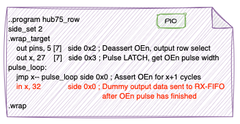

- [HUB75 DMA-Based Driver](#hub75-dma-based-driver)
  - [Documentation and References](#documentation-and-references)
  - [Achievements of the Revised Driver](#achievements-of-the-revised-driver)
  - [Motivation](#motivation)
  - [Evolution of Pico HUB75 Drivers](#evolution-of-pico-hub75-drivers)
    - [Raspberry Pi Pico HUB75 Example](#raspberry-pi-pico-hub75-example)
    - [Pimoroni HUB75 Driver](#pimoroni-hub75-driver)
  - [Eliminating `hub75_wait_tx_stall`](#eliminating-hub75_wait_tx_stall)
    - [Original `hub75_wait_tx_stall` Implementation](#original-hub75_wait_tx_stall-implementation)
    - [Alternative Approach](#alternative-approach)
  - [DMA Chains and PIO State Machines in the Revised HUB75 Driver](#dma-chains-and-pio-state-machines-in-the-revised-hub75-driver)
    - [Overview](#overview)
    - [Step-by-Step Breakdown](#step-by-step-breakdown)
    - [Refresh Rate Performance](#refresh-rate-performance)
    - [Key Benefits of this Approach](#key-benefits-of-this-approach)
  - [Conclusion for DMA and PIO based Approach](#conclusion-for-dma-and-pio-based-approach)
  - [Improved Colour Perception](#improved-colour-perception)
    - [Increased Perceptual Colour Depth (Temporal Dithering) - Experimental ⚠️](#increased-perceptual-colour-depth-temporal-dithering---experimental-️)
    - [✅ Advantages](#-advantages)
    - [⚠️ Trade-offs](#️-trade-offs)
  - [Brightness Control](#brightness-control)
    - [API Functions](#api-functions)
    - [How it Works](#how-it-works)
    - [Default Settings](#default-settings)
    - [Practical Notes](#practical-notes)
  - [Demo Effects](#demo-effects)
  - [How to Use This Project in VSCode](#how-to-use-this-project-in-vscode)
  - [Next Steps](#next-steps)
- [Prerequisites for the Hub75 Driver](#prerequisites-for-the-hub75-driver)
  - [Wiring Details](#wiring-details)
    - [Colour Data Pins](#colour-data-pins)
    - [Address (Row Select) Pins](#address-row-select-pins)
    - [Control Pins](#control-pins)
    - [One Glance Mapping HUB75 Connector → Pico GPIOs](#one-glance-mapping-hub75-connector--pico-gpios)
  - [Allowed Deviations  ](#allowed-deviations--)
    - [Example: Custom Pin Mapping](#example-custom-pin-mapping)
- [Configuring Your HUB75 LED Matrix Panel](#configuring-your-hub75-led-matrix-panel)
  - [Step 1 — Panel Dimensions](#step-1--panel-dimensions)
    - [Wiring](#wiring)
  - [Step 2 — Scan Rate and Rows Lit Simultaneously](#step-2--scan-rate-and-rows-lit-simultaneously)
    - [Rule](#rule)
    - [Examples](#examples)
      - [Panel with 64×64 height and width, 1/32 scan (-32S-), 5 Address lines (A, B, C, D, E) -\> (2 rows lit)](#panel-with-6464-height-and-width-132-scan--32s--5-address-lines-a-b-c-d-e---2-rows-lit)
      - [Panel with 32×64 height and width, 1/16 scan (-16S-), 4 Address lines (A, B, C, D) -\> (2 rows lit)](#panel-with-3264-height-and-width-116-scan--16s--4-address-lines-a-b-c-d---2-rows-lit)
  - [Step 3 — Panel Pixel Mapping Type](#step-3--panel-pixel-mapping-type)
    - [How to Configure](#how-to-configure)
  - [Step 4 — Panel Driver Chip Type](#step-4--panel-driver-chip-type)
    - [How to choose](#how-to-choose)
  - [Step 5 — Strobe Polarity (`INVERTED_STB`)](#step-5--strobe-polarity-inverted_stb)
  - [Step 6 — State Machine Clock Divider (`SM_CLOCKDIV`)](#step-6--state-machine-clock-divider-sm_clockdiv)
  - [Step 8 — Temporal Dithering (Optional)](#step-8--temporal-dithering-optional)
    - [Pixel Mapping](#pixel-mapping)
    - [Practical Notes](#practical-notes-1)
- [Troubleshooting](#troubleshooting)
  - [1. Panel Stays Completely Dark](#1-panel-stays-completely-dark)
    - [Check the obvious first](#check-the-obvious-first)
    - [Configuration checks](#configuration-checks)
  - [2. Panel Lights Up, But Only Shows Noise or Garbage](#2-panel-lights-up-but-only-shows-noise-or-garbage)
    - [What to check](#what-to-check)
    - [Typical symptoms](#typical-symptoms)
  - [3. Image Looks Correct, But Rows Are Missing or Repeated](#3-image-looks-correct-but-rows-are-missing-or-repeated)
    - [Check](#check)
    - [Rule reminder](#rule-reminder)
  - [4. Image Is Correct but Flickers or Shows Ghosting](#4-image-is-correct-but-flickers-or-shows-ghosting)
    - [Things to try](#things-to-try)
    - [Also check](#also-check)
  - [5. Panel Updates Sporadically or Only Every Few Frames](#5-panel-updates-sporadically-or-only-every-few-frames)
  - [6. Colors Look Wrong or Are Too Dim / Too Bright](#6-colors-look-wrong-or-are-too-dim--too-bright)
    - [Check](#check-1)
    - [How to verify](#how-to-verify)
  - [7. Problems While Using TEMPORAL\_DITHERING](#7-problems-while-using-temporal_dithering)
    - [If you see:](#if-you-see)
  - [8. When Nothing Makes Sense Anymore 😄](#8-when-nothing-makes-sense-anymore-)

# HUB75 DMA-Based Driver

<https://github.com/user-attachments/assets/7c41193c-c724-4fae-8823-af36d70fcedd>

*Demo video: Colours are much brighter and more brilliant in reality*

## Documentation and References

This project is based on:

- [Raspberry Pi's pico-examples/pio/hub75](https://github.com/raspberrypi/pico-examples)
- [Pimoroni's HUB75 driver](https://github.com/pimoroni/pimoroni-pico/tree/main/drivers/hub75)

To understand how RGB matrix panels work, refer to the article **[Everything You Didn't Want to Know About RGB Matrix Panels](https://news.sparkfun.com/2650)**.
For details on Binary Coded Modulation (BCM), see **[LED Dimming Using Binary Code Modulation](https://www.ti.com/lit/an/slva377a/slva377a.pdf)**.

---

## Achievements of the Revised Driver

The modifications to the Pimoroni HUB75 driver result in the following improvements:

- **Offloading Work**: Moves processing from the CPU to DMA and PIO co-processors.
- **Performance Boost**: Implements self-paced, interlinked DMA and PIO processes.
- **Eliminates Synchronization Delays**: No need for `hub75_wait_tx_stall`, removing blocking synchronization.
- **Optimized Interrupt Handling**: Reduces code complexity in the interrupt handler.

These enhancements lead to significant performance improvements. In tests up to a **250 MHz system clock**, no ghost images were observed.

---

## Motivation

As part of a private project, I sought to gain deeper knowledge of the Raspberry Pi Pico microcontroller. I highly recommend **[Raspberry Pi Pico Lectures 2022 by Hunter Adams](https://youtu.be/CAMTBzPd-WI?feature=shared)**—they provide excellent insights!

If you are specifically interested in **PIO (Programmable Input/Output)**, start with [Lecture 14: Introducing PIO](https://youtu.be/BVdaw56Ln8s?feature=shared) and [Lecture 15: PIO Overview and Examples](https://youtu.be/wet9CYpKZOQ).

Inspired by Adams' discussion on **[DMA](https://youtu.be/TGjUHChO1kM?feature=shared&t=1475) and PIO co-processors**, I optimized the HUB75 driver as a self-assigned challenge.

😊 **[Raspberry Pi Pico Lectures 2025 by Hunter Adams](https://youtu.be/a4uLrfqHZQU?feature=shared")** is available now!

---

## Evolution of Pico HUB75 Drivers

### Raspberry Pi Pico HUB75 Example

The **Pico HUB75 example** demonstrates connecting an **HUB75 LED matrix panel** using PIO. This educational example prioritizes clarity and ease of understanding.

- The color palette is generated by modulating the **Output Enable (OE)** signal.
- **Binary Coded Modulation (BCM)** is applied row-by-row, modulating all color bits before advancing to the next row.
- Synchronization depends on `hub75_wait_tx_stall`.
- **No DMA is used**, leading to lower performance.

### Pimoroni HUB75 Driver

The **Pimoroni HUB75 driver** improves performance by:

- Switching from **row-wise** to **plane-wise** modulation handling.
- Using **DMA** to transfer pixel data to the PIO state machine.
- Still relying on `hub75_wait_tx_stall` for synchronization.


*Picture 1: Pimoroni's Hub75 Driver DMA Section*

---

## Eliminating `hub75_wait_tx_stall`

Both the **Raspberry Pi and Pimoroni** implementations use `hub75_wait_tx_stall`, which ensures:

- The state machine **stalls** on an empty TX FIFO.
- The system **waits** until the OEn pulse has finished.

However, this blocking method **prevents an efficient DMA-based approach**.

### Original `hub75_wait_tx_stall` Implementation

```c
static inline void hub75_wait_tx_stall(PIO pio, uint sm) {
    uint32_t txstall_mask = 1u << (PIO_FDEBUG_TXSTALL_LSB + sm);
    pio->fdebug = txstall_mask;
    while (!(pio->fdebug & txstall_mask)) {
        tight_loop_contents();
    }
}
```

### Alternative Approach

Instead of waiting for TX FIFO stalling, we can:

1. Modify the **PIO program** to emit a signal once the OEn pulse completes.
2. Set up a **DMA channel** to listen for this signal.
3. Establish an **interrupt handler** to trigger once the signal is received.

This approach allows fully **chained DMA execution** without CPU intervention.



*Picture 2: Modified hub75_row Program*

---

## DMA Chains and PIO State Machines in the Revised HUB75 Driver

### Overview

The following diagram illustrates the interactions between **DMA channels** and **PIO state machines**:

```
[ Pixel Data DMA ] -> [ hub75_data_rgb888 PIO ]
       |
       |--> [ Dummy Pixel Data DMA ] -> [ hub75_data_rgb888 PIO ]
                  |
                  |--> [ OEn Data DMA ] -> [ hub75_row PIO ]
                           |
                           |--> [ OEn Finished DMA ] (Triggers interrupt)
```

### Step-by-Step Breakdown

1. **Pixel Data Transfer**
   - Pixel data is streamed via **DMA** to the **hub75_rdata_gb888** PIO state machine.
   - This handles shifting pixel data into the LED matrix.

2. **Dummy Pixel Handling**
   - A secondary **dummy pixel DMA channel** adds additional pixel data.
   - This ensures correct clocking of the final piece of genuine data.

3. **OEn Pulse Generation**
   - The **OEn data DMA channel** sends 32-bit words - 5 bit address information (row select) and 27 bit puls width - to the **hub75_row** PIO state machine.
   - This output enable signal switches on those LEDs in the current row with bit set in the current bitplane for the specified number of cycles.

4. **Interrupt-Driven Synchronization**
   - A final **OEn finished DMA channel** listens for the end of the pulse.
   - An **interrupt handler** (`oen_finished_handler`) resets DMA for the next cycle.


*Picture 3: Chained DMA Channels and assigned PIOs*

---

### Refresh Rate Performance

With a **bit-depth of 10**, the HUB75 driver achieves the following refresh rates for a 64 x 64 matrix depending on the system clock:

| System Clock | Refresh Rate |
|--------------|---------------|
| 100 MHz      | 179 Hz        |
| 150 MHz      | 268 Hz        |
| 200 MHz      | 358 Hz        |
| 250 MHz      | 448 Hz        |

These results demonstrate stable operation and high-performance display rendering across a wide range of system clocks.

### Key Benefits of this Approach

✅ Fully **automated** data transfer using **chained DMA channels**.

✅ Eliminates **CPU-intensive** busy-waiting (`hub75_wait_tx_stall`).

✅ Ensures **precise timing** without unnecessary stalling.

---

## Conclusion for DMA and PIO based Approach

By offloading tasks to **DMA and PIO**, the revised HUB75 driver achieves **higher performance**, **simpler interrupt handling**, and **better synchronization**. This approach significantly reduces CPU overhead while eliminating artifacts like **ghosting** at high clock speeds.

If you're interested in optimizing **RGB matrix panel drivers**, this implementation serves as a valuable reference for efficient DMA-based rendering.

---

## Improved Colour Perception

The graphics system for the demo effects operates in **RGB888** format (8 bits per channel, 24 bits per pixel). To better match human vision, colours are mapped using the [CIE 1931 lightness curve](https://jared.geek.nz/2013/02/linear-led-pwm/). This mapping effectively expands the usable range to **10 bits per channel**.

The HUB75 driver takes advantage of this: its PIO/DMA pipeline packs each pixel as a **32-bit word** with 10 bits for red, 10 bits for green, and 10 bits for blue.

---

### Increased Perceptual Colour Depth (Temporal Dithering) - Experimental ⚠️
To go beyond native 10-bit precision without changing the data format, the driver employs  **temporal dithering** (an accumulator-based technique):

- Each pixel maintains a high-precision accumulator (e.g. 12 bits).  
- On every refresh, the top 10 bits are sent to the panel, while the lower bits remain stored.  
- Over successive frames, these residuals accumulate, averaging out to produce smoother gradients.  

This results in a perceived colour depth equivalent to **12 bits per channel**.

### ✅ Advantages

- Noticeable improvement in gradients and subtle colour transitions.  
- Minimal CPU overhead (shifts and adds only).  

### ⚠️ Trade-offs

- Requires additional RAM for accumulators.  
  For a 64×64 panel: `64 × 64 × 3 × sizeof(uint32_t) ≈ 48 KB`.

## Brightness Control

In addition to bitplane modulation, the driver supports **software-based brightness regulation**. This allows easy adjustment of overall panel brightness without hardware changes.

### API Functions

```cpp
// Set the baseline brightness scaling factor (default = 6, range 1–255).
// Larger values increase brightness but also raise OEn frequency.
void setBasisBrightness(uint8_t factor);

// Set fine-grained brightness intensity as a fraction [0.0 – 1.0].
void setIntensity(float intensity);
```

### How it Works

- <code>setBasisBrightness(basis)</code>

  Defines the top brightness.

  Example: <code>setBasisBrightness(6)</code> → default brightness range for typical 64×64 panels. \
  Larger factors give more headroom for brightness but consume more **Binary Coded Modulation (BCM)** time slices.

- <code>setIntensity(intensity)</code>
  
  Fine-grained adjustment from 0.0 (dark/off) to 1.0 (full brightness).\
  This function scales the effective duty cycle within the current baseline brightness range.

```cpp
// Example: brighten the panel, then dim at runtime
setBasisBrightness(8); // Start with baseline factor 8 for a brighter panel
setIntensity(0.5f);    // Show at 50% of that baseline
```

### Default Settings

- <code>basis_factor = 6u</code>
- <code>intensity = 1.0f</code>
  (full brightness within the baseline)

This corresponds to the same brightness as earlier driver revisions without adjustment.

### Practical Notes

- Increasing the basis factor may increase peak current consumption.
- For indoor use, values between 4–8 are usually sufficient.
- For dimmer environments, you can keep the baseline factor low (e.g. 4) and rely on setIntensity() for smooth runtime control.
- Both functions are non-blocking and can be called during normal operation.

## Demo Effects

⚠️ The examples contained in hub75_lvgl.cpp have been tested with a Raspberry Pi Pico 2 microcontroller (RP2350). For a RP2040 processor you might have to comment out some demo effects due to minor memory capabilities. Ask if you need support 🙂.

## How to Use This Project in VSCode

You can easily use this project with VSCode, especially with the **Raspberry Pi Pico plugin** installed. Follow these steps:

1. **Open VSCode and start a new window**.
2. **Clone the repository**:
   - Press `Ctrl+Shift+P` and select `Git: Clone`.
   - Paste the URL: `https://github.com/JuPfu/hub75`

      

   - Choose a local directory to clone the repository into.

      

3. **Project Import Prompt**:
   - Consent to open the project.

      

   - When prompted, "Do you want to import this project as Raspberry Pi Pico project?", click **Yes** or wait a few seconds until the dialog prompt disappears by itself.

4. **Configure Pico SDK Settings**:
   - A settings page will open automatically.
   - Use the default settings unless you have a specific setup.

      

   - Click **Import** to finalize project setup.
   - Switch the board-type to your Pico model.

      

5. **Wait for Setup Completion**:
   - VSCode will download required tools, the Pico SDK, and any plugins.

6. **Connect the Hardware**:
   - Make sure the HUB75 LED matrix is properly connected to the Raspberry Pi Pico.
   - Attach the Rasberry Pi Pico USB cable to your computer

7. **Build and Upload**:
   - Compiling the project can be done without a Pico attached to the computer.

      

   - Click the **Run** button in the bottom taskbar.
   - VSCode will compile and upload the firmware to your Pico board.

> 💡 If everything is set up correctly, your matrix should come to life with the updated HUB75 DMA driver.

---

## Next Steps

- **Add another chained DMA channel** to further reduce calls to the oen_finished_handler, trading memory for reduced CPU load.

- **Investigate removing the hub75_data_rgb888_set_shift method**, potentially achieving a completely DMA- and PIO-based solution with no CPU involvement.

For any questions or discussions, feel free to contribute or open an issue!

# Prerequisites for the Hub75 Driver

This driver is designed for a **64×64 LED matrix panel**. It can be adapted for **128x64, 64×32, 32×32, 32x16**, or other HUB75-compatible panels by configuring c preprocessor defines in file hub75.hpp.

The PIO implementation requires that **data pins (colours)** and **row-select pins** must be in **consecutive GPIO blocks**.

The default implementation looks like this (see hub75.cpp). An example of a valid alternative pin defintion is shown in [Allowed Deviations](#allowed_deviations_anchor)

   ```cpp
   // Default wiring of HUB75 matrix to RP2350
   #define DATA_BASE_PIN    0   // first color data pin
   #define DATA_N_PINS      6   // number of color data pins (R0,G0,B0,R1,G1,B1)
   #define ROWSEL_BASE_PIN  6   // first row-select (address) pin
   #define ROWSEL_N_PINS    5   // number of row-select pins (A0–A4)
   #define CLK_PIN          11  // clock
   #define STROBE_PIN       12  // latch (LAT)
   #define OEN_PIN          13  // output enable (OE)
   ```

## Wiring Details

### Colour Data Pins

- `DATA_BASE_PIN` = **GPIO 0** (first in a consecutive block)
- `DATA_N_PINS` = **6** (for R0, G0, B0, R1, G1, B1)

| Hub75 Colour Bit   | connected to      | Pico GPIO |
|:-------------------|-------------------|:-----:|
| R0                 |                   | 0    |
| G0                 |                   | 1    |
| B0                 |                   | 2    |
| R1                 |                   | 3    |
| G1                 |                   | 4    |
| B1                 |                   | 5    |

### Address (Row Select) Pins

- `ROWSEL_BASE_PIN` = **GPIO 6**
- `ROWSEL_N_PINS` = **5** (A0–A4)

- **Consecutiveness is required** by the PIO program.

| Address bit |  connected to      | Pico GPIO |
| ----------- |--------------------|:---------:|
| A0          |                    | 6    |
| A1          |                    | 7    |
| A2          |                    | 8    |
| A3          |                    | 9    |
| A4          |                    | 10   |

### Control Pins

- **CLK** (clock): GPIO 11
- **LAT** (strobe/latch): GPIO 12
- **OE** (output enable): GPIO 13

### One Glance Mapping HUB75 Connector → Pico GPIOs

The diagram shows the default mapping as defined in the hub75.cpp file.
  


## Allowed Deviations  <a id='allowed_deviations_anchor'></a>

The **only strict requirement** is that **data pins** and **row-select pins** must be in **consecutive GPIO blocks**.
Clock, Latch, and OE pins may be freely chosen.

### Example: Custom Pin Mapping

```cpp
#define ROWSEL_BASE_PIN  15  // Row select pins moved to GPIO 15–19
#define ROWSEL_N_PINS    5   // number of row-select pins (A0–A4)

#define DATA_BASE_PIN    3   // Color data pins starting at GPIO 3
#define DATA_N_PINS      6   // number of color data pins (R0,G0,B0,R1,G1,B1)

// Control pins assigned to arbitrarily GPIO pins
#define CLK_PIN          0
#define STROBE_PIN       1
#define OEN_PIN          2
```

---


# Configuring Your HUB75 LED Matrix Panel

All panel-specific configuration is done in **`hub75.hpp`**.
The goal is to describe your panel’s **geometry**, **scan method**, and **electronics** so the driver can map pixels correctly and drive the panel reliably.

This section walks you through the configuration **step by step**, starting from the most obvious parameters (panel size) to the more subtle ones (scan rate, driver chip quirks).

---

## Step 1 — Panel Dimensions

Every configuration starts with the **physical size** of your panel:

```cpp
#define MATRIX_PANEL_WIDTH  64
#define MATRIX_PANEL_HEIGHT 64
```

These values determine the memory usage of the frame buffer.

---

### Wiring

The physical wiring is essentially identical for most HUB75 panels. In file **hub75.hpp** the `ROWSEL_N_PINS` definition must be adapted to the number of address lines of your board. 

   ```cpp
   // Default wiring of HUB75 matrix to RP2350
   #define DATA_BASE_PIN    0   // first color data pin
   #define DATA_N_PINS      6   // number of color data pins (R0,G0,B0,R1,G1,B1)
   #define ROWSEL_BASE_PIN  6   // first row-select (address) pin
   #define ROWSEL_N_PINS    5   // ADAPT TO THE NUMBER OF ROW-SELECT ADDRESS PINS ON YOUR PANEL
   #define CLK_PIN          11  // clock
   #define STROBE_PIN       12  // latch (LAT)
   #define OEN_PIN          13  // output enable (OE)
   ```

The value in **ROWSEL_N_PINS** defines the number of address lines defined as output pins. These output pins receive the address information of the current row that is to be updated. Internally, this value is passed to the PIO state machine to control how many address bits are output per row. It might help to have a look at the configuration examples below if the documentation is to vague or unclear with respect to this topic.

## Step 2 — Scan Rate and Rows Lit Simultaneously

HUB75 panels are multiplexed: **not all rows are lit at once**. The matrix panel name usually contains a segment which reads something like *-32S-*, *-16S-*, *-8S-*, etc. as in **P3-64x64-32S-V2.0**.

Internally, the driver works with the concept of **multiplexed rows**:
this is the number of physical rows that are driven simultaneously for one row address.

The hub75 driver deduces the number of multiplexed rows from the following rule.

### Rule

> $multiplexed\_rows=MATRIX\_PANEL\_HEIGHT/2^{ROWSEL\_N\_PINS}$

### Examples

#### Panel with 64×64 height and width, 1/32 scan (-32S-), 5 Address lines (A, B, C, D, E) -> (2 rows lit)

> $multiplexed\_rows=MATRIX\_PANEL\_HEIGHT/2^{ROWSEL\_N\_PINS}$

> $multiplexed\_rows=64/2^{5}$ = 64/32 = 2

#### Panel with 32×64 height and width, 1/16 scan (-16S-), 4 Address lines (A, B, C, D) -> (2 rows lit)

> $multiplexed\_rows=MATRIX\_PANEL\_HEIGHT/2^{ROWSEL\_N\_PINS}$

> $multiplexed\_rows=32/2^{4}$ = 64/16 = 2

So, the number of multiplexed lines in both examples is $2$, even though the scan parameters (-32S- and -16S-) differ. Internally, the driver uses the number of multiplexed rows to resolve this ambiguity.

In both examples you should choose **HUB75_MULTIPLEX_2_ROWS** 

```c
#define HUB75_MULTIPLEX_2_ROWS
```

For panels **HUB75_P10_3535_16X32_4S** the calculation looks like this (the number of rows can easily be counted on the panel 😊):

> $multiplexed\_rows=MATRIX\_PANEL\_HEIGHT/2^{ROWSEL\_N\_PINS}$

> $multiplexed\_rows=16/2^{2}$ = 16/4 = 4

In summary, the number of address lines on this board is $2$ which corresponds to $4$ rows being multiplexed.

> ⚠️ The multiplexing define (e.g. `HUB75_MULTIPLEX_2_ROWS`) does **two things**:
> 
> 1. it defines how many rows are multiplexed **and** 
> 
> 2. selects the corresponding pixel mapping
> 
> The same applies to `HUB75_P10_3535_16X32_4S` and `HUB75_P3_1415_16S_64X64_S31`.

---

## Step 3 — Panel Pixel Mapping Type

Different panels wire pixels differently internally.
This driver provides **predefined mapping modes** for known layouts.

Select **exactly one**:

```cpp
#define HUB75_MULTIPLEX_2_ROWS
// #define HUB75_P10_3535_16X32_4S
// #define HUB75_P3_1415_16S_64X64_S31
```

If unsure:

* start with `HUB75_MULTIPLEX_2_ROWS`
* if the image looks scrambled, try another mapping

---

### How to Configure

All configuration (C pre-processor defines) must be done in **hub75.hpp**.

In your build, define the scan rate that matches your panel. 

```cpp
// Example for a 64×64 panel (1/32 scan) - 2 rows lit simultaneously
#define MATRIX_PANEL_WIDTH 64
#define MATRIX_PANEL_HEIGHT 64

#define HUB75_MULTIPLEX_2_ROWS
// Set the number of address lines - 2 rows lit simultaneously leaves 32 rows to be adressed via row select.
// That is 32 = 2 to the power of 5 - we need 5 row select pins  
#define ROWSEL_N_PINS 5


// Example for a 64×32 panel (1/16 scan) - 2 rows lit simultaneously
#define MATRIX_PANEL_WIDTH 64
#define MATRIX_PANEL_HEIGHT 32

#define HUB75_MULTIPLEX_2_ROWS
// Set the number of address lines - 2 rows lit simultaneously leaves 16 rows to be adressed via row select.
// That is 16 equals 2 to the power of 4 - we need 4 row select pins  
#define ROWSEL_N_PINS 4


// Example for a 32×16 panel (1/8 scan) - 2 rows lit simultaneously
#define MATRIX_PANEL_WIDTH 32
#define MATRIX_PANEL_HEIGHT 16
#define HUB75_MULTIPLEX_2_ROWS
// Set the number of address lines - 2 rows lit simultaneously leaves 8 rows to be adressed via row select.
// That is 8 equals 2 to the power of 3 - we need 3 row select pins  
#define ROWSEL_N_PINS 3


// Example for a 64×64 panels (1/16 scan) - 4 rows lit simultaneously
#define MATRIX_PANEL_WIDTH 64
#define MATRIX_PANEL_HEIGHT 64

#define HUB75_P3_1415_16S_64X64_S31
// Set the number of address lines - 4 rows lit simultaneously leaves 16 rows to be adressed via row select.
// That is 16 equals = 2 to the power of 4 - we need 4 row select pins  
#define ROWSEL_N_PINS 4


// Example for a 32×16 panel (1/4 scan) - 4 rows lit simultaneously
#define MATRIX_PANEL_WIDTH 32
#define MATRIX_PANEL_HEIGHT 16

#define HUB75_P10_3535_16X32_4S
// Set the number of address lines - 4 rows lit simultaneously leaves 4 rows to be adressed via row select.
// That is 4 equals 2 to the power of 2 -> we need 2 row select pins  
#define ROWSEL_N_PINS 2
``` 

Note that the panel name usually does not encode the internal pixel wiring or the driver IC type.
These must be determined visually or experimentally.
But sometimes the name of the panel gives you a lot of information how the configuration has to be done.
Here an example for a **P3-64*64-32S-V2.0** panel.

```c
// Width and height are encoded in the panel name 
#define MATRIX_PANEL_WIDTH 64
#define MATRIX_PANEL_HEIGHT 64

// The 32S in the panel name refers to (1/32 scan) - 2 rows lit simultaneously 
// We can try the standard pixel mapping - maybe we are lucky and the pixel mapping fits
#define HUB75_MULTIPLEX_2_ROWS
// Set the number of address lines - 2 rows lit simultaneously leaves 32 rows to be adressed via row select.
// That is 32 equals 2 to the power of 5 -> we need 5 row select pins (as might be printed on the panel backside - A, B, C, D, E)
#define ROWSEL_N_PINS 5
// Look at the back of the panel. If you detect a chip which is labeled RUL6024 then define the appropriate panel type
#define PANEL_TYPE PANEL_RUL6024
```

---

## Step 4 — Panel Driver Chip Type

Some panels contain special driver ICs that require an **initialization sequence**.

```cpp
#define PANEL_GENERIC  0
#define PANEL_FM6126A  1
#define PANEL_RUL6024  2

#define PANEL_TYPE PANEL_GENERIC
```

### How to choose

* Look at the **back of the panel**
* If you see a chip labeled **FM6126A** or **RUL6024**, select it
* Otherwise, use `PANEL_GENERIC`

---

## Step 5 — Strobe Polarity (`INVERTED_STB`)

Most panels use a **non-inverted latch signal**, but some boards invert it.

```cpp
#define INVERTED_STB false
```

If:

* the panel flickers,
* or only updates sporadically,

try:

```cpp
#define INVERTED_STB true
```

---

## Step 6 — State Machine Clock Divider (`SM_CLOCKDIV`)

By default, the driver runs the PIO state machine at full speed.

Some panels benefit from a slower clock to reduce:

* ghosting
* flicker
* brightness artifacts

```cpp
#define SM_CLOCKDIV 0 // 0 = disabled
#if SM_CLOCKDIV != 0
// To prevent flicker or ghosting it might be worth a try to reduce state machine speed.
// For panels with height less or equal to 16 rows try a factor of 8.0f
// For panels with height less or equal to 32 rows try a factor of 2.0f or 4.0f
#define SM_CLOCKDIV 1.0f
#endif
```

---

## Step 8 — Temporal Dithering (Optional)

> ⚠️ TEMPORAL_DITHERING is experimental - development is still in progress!

To activate TEMPORAL_DITHERING switch from 

```cpp
#undef TEMPORAL_DITHERING
```

to

```cpp
#define TEMPORAL_DITHERING
```


**Use it if:**

* you want smoother gradients
* you accept slightly higher CPU usage

**Do not use it if:**

* you need maximum refresh stability
* you are debugging mapping issues

> This feature is experimental!

---


### Pixel Mapping

Each panel type has it's own pixel mapping. 

***HUB75_MULTIPLEX_2_ROWS Mapping***

Generic hub75 led matrix panels with 2 rows lit simultaneously. Five address lines.

The **HUB75_MULTIPLEX_2_ROWS** defines the most common pixel mapping.

Pixels from the source-data (**src**) are copied in alternating sequence (first **src[j]** then **src[j + offset]**) into the shift register of the matrix panel. Prior to this **offset** had been set to <em>MATRIX_PANEL_WIDTH * MATRIX_PANEL_HEIGHT / 2</em>. Additionally colour perception is improved by mapping colours via a look-up table (**lut**). This mapping effectively expands the usable range to **10 bits per channel**. For details see [CIE 1931 lightness curve](https://jared.geek.nz/2013/02/linear-led-pwm/).

```c
   constexpr size_t pixels = MATRIX_PANEL_WIDTH * MATRIX_PANEL_HEIGHT;
   constexpr size_t offset = pixels / 2;
   for (size_t fb_index = 0, j = 0; fb_index < pixels; fb_index += 2, ++j) {
      frame_buffer[fb_index] = LUT_MAPPING(j, src[j]);
      frame_buffer[fb_index + 1] = LUT_MAPPING(j + offset, src[j + offset]);
   }
```

***HUB75_P10_3535_16X32_4S Mapping***

Outdoor led matrix panel with 16 rows and 32 pixels per row. 4 rows lit simultaneously. So only two address lines needed to address a quarter of rows (0, 1, 2, 3). This is also mirrored in the available address lines (A, B) on the matrix panel board.

**ToDo** Describe pixel mapping in detail!

```c
   int line = 0;
   int counter = 0;

   constexpr int COLUMN_PAIRS = MATRIX_PANEL_WIDTH >> 1;
   constexpr int HALF_PAIRS = COLUMN_PAIRS >> 1;

   constexpr int PAIR_HALF_BIT = HALF_PAIRS;
   constexpr int PAIR_HALF_SHIFT = __builtin_ctz(HALF_PAIRS);

   constexpr int ROW_STRIDE = MATRIX_PANEL_WIDTH;
   constexpr int ROWS_PER_GROUP = MATRIX_PANEL_HEIGHT / SCAN_GROUPS;
   constexpr int GROUP_ROW_OFFSET = ROWS_PER_GROUP * ROW_STRIDE;
   constexpr int HALF_PANEL_OFFSET = (MATRIX_PANEL_HEIGHT >> 1) * ROW_STRIDE;

   constexpr int total_pairs = (MATRIX_PANEL_WIDTH * MATRIX_PANEL_HEIGHT) >> 1;

   // Example: HUB75 panel, 32×16 pixels, 1/4 scan (2 address lines)
   //
   // Geometry:
   //   COLUMN_PAIRS  = 32 / 2 = 16
   //   HALF_PAIRS    = 16 / 2 = 8
   //   PAIR_HALF_BIT = 8
   //   PAIR_HALF_SHIFT = ctz(8) = 3
   //
   // Vertical scan:
   //   SCAN_GROUPS     = 1 << ROWSEL_N_PINS = 4
   //   ROWS_PER_GROUP  = 16 / 4 = 4
   //   GROUP_ROW_OFFSET = 4 × 32 = 128
   //   HALF_PANEL_OFFSET = (16 / 2) × 32 = 256
   //
   // Resulting source index:
   //   index = (j & 8) == 0
   //         ? j - (line << 3)
   //         : 128 + j - ((line + 1) << 3)
   //
   // j advances in column pairs.
   // One scan group consists of COLUMN_PAIRS iterations.
   // Bit PAIR_HALF_BIT selects the first or second half of the column pairs within the current scan group.
   //
   // (j & PAIR_HALF_BIT) == 0 → first half of column pairs
   //                          → quarters 1 (upper) + 3 (lower)
   // (j & PAIR_HALF_BIT) != 0 → second half of column pairs
   //                          → quarters 2 (upper) + 4 (lower)
   // Note: The selector bit in j depends only on panel width (column pairing), not on HUB75 scan rate.

   for (int j = 0, fb_index = 0; j < total_pairs; ++j, fb_index += 2) {
      int32_t index = !(j & PAIR_HALF_BIT) ? j - (line << PAIR_HALF_SHIFT)
                                             : GROUP_ROW_OFFSET + j - ((line + 1) << PAIR_HALF_SHIFT);

      frame_buffer[fb_index] = LUT_MAPPING(index, src[index]);
      frame_buffer[fb_index + 1] = LUT_MAPPING(index + HALF_PANEL_OFFSET, src[index + HALF_PANEL_OFFSET]);

      if (++counter >= COLUMN_PAIRS)
      {
            counter = 0;
            ++line;
      }
   }
```

***HUB75_P3_1415_16S_64X64_S31 Mapping***

Outdoor led matrix panel with 64 rows and each row has 64 pixels. 16S means 64 / 16 = 4 rows lit simultaneously. Four address lines (A, B, C, D) are available on the led matrix panel board, which confirms this calculation.

Driving ICs are MBI5253 / ICND2055 / ICDN2065 / ICND2153S / CFD325 / MBI5264 / CFD555 / ICND2165.

The shift-buffer is filled in alternating sequence with pixels from a line from second and fourth quarter of the panel 
followed by an alternating sequence of the corresponding line from the first and third quarter.

```c
   constexpr uint total_pixels = MATRIX_PANEL_WIDTH * MATRIX_PANEL_HEIGHT;
   constexpr uint line_offset = 2 * MATRIX_PANEL_WIDTH;

   constexpr uint quarter = total_pixels >> 2;

   uint quarter1 = 0 * quarter;
   uint quarter2 = 1 * quarter;
   uint quarter3 = 2 * quarter;
   uint quarter4 = 3 * quarter;

   uint p = 0; // per line pixel counter

   // Number of logical rows processed
   uint line = 0;

   // Framebuffer write pointer
   volatile uint32_t *dst = frame_buffer;

   // Each iteration processes 4 physical rows (2 scan-row pairs)
   while (line < (height >> 2)) {
      // even src lines
      dst[0] = LUT_MAPPING(quarter2, src[quarter2]); quarter2++;
      dst[1] = LUT_MAPPING(quarter4, src[quarter4]); quarter4++;
      // odd src lines
      dst[line_offset + 0] = LUT_MAPPING(quarter1, src[quarter1]); quarter1++;
      dst[line_offset + 1] = LUT_MAPPING(quarter3, src[quarter3]); quarter3++;

      dst += 2; // move to next output pixels
      p++;

      // End of logical row
      if (p == width) {
            p = 0;
            line++;
            dst += line_offset; // advance to next scan-row pair
      }
   }
```

### Practical Notes

Not all of the demo effects will show correctly for matrix panels with a format different to 64x64 pixels. The first two demo effects use image data for a 64x64 layout. You will see some output, but it will look weird.

The `bouncing balls` effect will not show the complete text as the position is hard coded. The `fire_effect` and the `rotator`might look as they should be.

Have fun with adapting the source code or with implementing your own effects.

Do not hesitate to contact me - I will gladly answer your questions!

---

# Troubleshooting

If your panel does not behave as expected, do **not** change multiple configuration options at once.
Most issues can be isolated by checking **one dimension at a time**.

The sections below are ordered from **most common** to **least common** problems.

---

## 1. Panel Stays Completely Dark

### Check the obvious first

* Is the panel powered with the **correct voltage** (usually 5 V)?
* Is the power supply strong enough (HUB75 panels can draw several amps)?
* Is `OEN_PIN` wired correctly and not permanently disabling output?

### Configuration checks

* Verify `MATRIX_PANEL_WIDTH` and `MATRIX_PANEL_HEIGHT`
* Verify `ROWSEL_N_PINS` matches the number of address pins on the panel (A, B, C, …)

If `ROWSEL_N_PINS` is too large or too small, **no rows will be selected correctly**.

---

## 2. Panel Lights Up, But Only Shows Noise or Garbage

This usually indicates a **pixel mapping mismatch**.

### What to check

* Try a different mapping define:

  ```cpp
  #define HUB75_MULTIPLEX_2_ROWS
  // #define HUB75_P10_3535_16X32_4S
  // #define HUB75_P3_1415_16S_64X64_S31
  ```

### Typical symptoms

| Symptom                       | Likely cause                     |
| ----------------------------- | -------------------------------- |
| Completely scrambled image    | Wrong mapping define             |
| Image mirrored or interleaved | Wrong internal wiring assumption |
| Repeating blocks or patterns  | Mapping partially correct        |

> 💡 If the image is *stable but wrong*, the scan rate is likely correct and only the mapping needs adjustment.

---

## 3. Image Looks Correct, But Rows Are Missing or Repeated

This usually points to a **row addressing issue**.

### Check

* `ROWSEL_N_PINS`
* Panel height (`MATRIX_PANEL_HEIGHT`)

### Rule reminder

```
multiplexed_rows = MATRIX_PANEL_HEIGHT / 2^ROWSEL_N_PINS
```

If this value does not match the panel’s actual multiplexing, rows will be:

* skipped
* duplicated
* shifted

---

## 4. Image Is Correct but Flickers or Shows Ghosting

This is typically a **timing issue**.

### Things to try

1. Enable and tune `SM_CLOCKDIV`:

   ```cpp
   #define SM_CLOCKDIV 1.0f
   ```

2. Increase the divider if necessary:

   * ≤ 16 rows → try `8.0f`
   * ≤ 32 rows → try `2.0f` or `4.0f`

### Also check

* Power supply quality
* Cable length and signal integrity
* Ground connection between MCU and panel

---

## 5. Panel Updates Sporadically or Only Every Few Frames

This often indicates **strobe polarity mismatch**.

Try

```cpp
#define INVERTED_STB true
```

If the panel suddenly becomes stable, the latch signal is inverted on your board.

---

## 6. Colors Look Wrong or Are Too Dim / Too Bright

### Check

* Panel driver chip type:

  ```cpp
  #define PANEL_TYPE PANEL_GENERIC
  // #define PANEL_FM6126A
  // #define PANEL_RUL6024
  ```

If the panel contains an FM6126A or RUL6024 chip and is not initialized correctly:

* brightness may be wrong
* colors may look distorted
* output may be unstable

### How to verify

* Inspect the **back of the panel**
* Look for chip markings (FM6126A, RUL6024)

---

## 7. Problems While Using TEMPORAL_DITHERING

Temporal dithering increases perceived color depth but also increases complexity.

### If you see:

* flicker
* unstable brightness
* strange artifacts

Disable it first:

```cpp
#undef TEMPORAL_DITHERING
```

> ⚠️ Always debug **mapping and scan issues first**, then enable temporal dithering later.

---

## 8. When Nothing Makes Sense Anymore 😄

Follow this **minimal recovery procedure**:

1. Use the simplest known-good configuration:

   ```cpp
   #define HUB75_MULTIPLEX_2_ROWS
   #define PANEL_TYPE PANEL_GENERIC
   #undef TEMPORAL_DITHERING
   #define SM_CLOCKDIV 0
   ```

2. Verify:

   * correct width and height
   * correct `ROWSEL_N_PINS`

3. Use a **simple test pattern**:

   * solid colors
   * vertical and horizontal stripes

4. Change **one parameter at a time**

---


